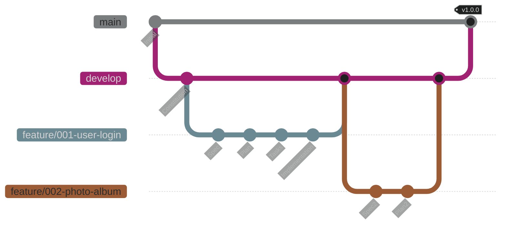

# Spec-Kit 使用教學手冊

> **版本**: 1.0  
> **最後更新**: 2025年10月29日  
> **適用於**: Spec-Kit v0.0.79+
> **Created by**: Eric Cheng

---

## 📚 目錄

### [前言](#前言)
- [目的與適用對象](#目的與適用對象)
- [背景說明:為何採用 SDD + Spec-Kit → AI 助手流程](#背景說明為何採用-sdd--spec-kit--ai-助手流程)
- [本手冊使用假設](#本手冊使用假設)

### [第一章:概念理解](#第一章概念理解)
- [1.1 SDD 是什麼?](#11-sdd-是什麼)
- [1.2 Spec-Kit 概覽](#12-spec-kit-概覽)
- [1.3 SDD 中的關鍵 artefacts(工件)](#13-sdd-中的關鍵-artefacts工件)
- [1.4 流程概覽:SDD 的階段/步驟](#14-流程概覽sdd-的階段步驟)
- [1.5 為什麼這對我們團隊/共用平台開發特別有價值](#15-為什麼這對我們團隊共用平台開發特別有價值)

### [第二章:環境準備](#第二章環境準備)
- [2.1 前置條件](#21-前置條件)
- [2.2 安裝 Spec-Kit CLI](#22-安裝-spec-kit-cli)
- [2.3 建立專案與初始化](#23-建立專案與初始化)
- [2.4 建立團隊守則 (Constitution)](#24-建立團隊守則-constitution)
- [2.5 模板與提示文件說明](#25-模板與提示文件說明)
- [2.6 GitHub 倉庫分支與版本控制建議](#26-github-倉庫分支與版本控制建議)

### [第三章:使用流程詳細說明](#第三章使用流程詳細說明)
- [3.1 Step 1:撰寫 Spec (/speckit.specify)](#31-step-1撰寫-spec-speckitspecify)
- [3.2 Step 1a:澄清模糊需求 (/speckit.clarify)](#32-step-1a澄清模糊需求-speckitclarify)
- [3.3 Step 2:撰寫 Plan (/speckit.plan)](#33-step-2撰寫-plan-speckitplan)
- [3.4 Step 3:拆分 Tasks (/speckit.tasks)](#34-step-3拆分-tasks-speckittasks)
- [3.5 Step 4:預實作檢查 (/speckit.analyze + /speckit.checklist)](#35-step-4預實作檢查-speckitanalyze--speckitchecklist)
- [3.6 Step 5:實作 (/speckit.implement)](#36-step-5實作-speckitimplement)
- [3.7 Step 6:迭代維護](#37-step-6迭代維護)

### [第四章:實務案例與應用指引](#第四章實務案例與應用指引)
- [4.1 案例一:Greenfield 開發 - 新建交易記錄微服務](#41-案例一greenfield-開發---新建交易記錄微服務)
- [4.2 案例二:Brownfield 整合 - 為既有系統新增功能](#42-案例二brownfield-整合---為既有系統新增功能)
- [4.3 團隊協作:多人開發](#43-團隊協作多人開發)
- [4.4 AI 助手最佳實踐](#44-ai-助手最佳實踐)
- [4.5 平台導入建議](#45-平台導入建議)

### [第五章:常見問題與陷阱](#第五章常見問題與陷阱)
- [5.1 常見問題(FAQ)](#51-常見問題faq)
- [5.2 常見陷阱與避免方法](#52-常見陷阱與避免方法)

### [第六章:附錄](#第六章附錄)
- [6.1 完整模板範例](#61-完整模板範例)
- [6.2 檢查清單](#62-檢查清單)
- [6.3 參考資源](#63-參考資源)
- [6.4 術語表](#64-術語表)
- [6.5 快速指令參考](#65-快速指令參考)

### [結語](#結語)

---

## 前言

### 目的與適用對象

本手冊旨在幫助開發團隊快速掌握 **Spec-Driven Development (SDD)** 方法論,並透過 **Spec-Kit** 工具組與 AI 助手協作,建立高品質、可維護的軟體系統。

**適用對象:**

- **新進開發人員** - 希望了解現代化規格驅動開發流程
- **專案經理/產品負責人** - 需要建立清晰的需求與技術溝通橋樑
- **架構師/技術領導** - 希望建立團隊統一的開發規範與最佳實務
- **DevOps/測試工程師** - 需要理解從規格到實作的完整流程
- **AI 輔助開發推廣者** - 希望讓 AI 工具發揮更大價值的團隊

### 背景說明:為何採用 SDD + Spec-Kit → AI 助手流程

#### 傳統開發的痛點

在傳統軟體開發中,**程式碼一直是王道**。我們撰寫需求文件(PRD)、設計文件、架構圖來「指導」開發,但這些文件往往:

- ❌ **很快過時** - 程式碼改了,文件沒更新
- ❌ **規格與實作脫節** - 開發人員按自己理解實作,與原始意圖偏離
- ❌ **溝通成本高** - PM、架構師、開發者之間需要大量會議對齊
- ❌ **難以追蹤決策** - 為什麼當初這樣設計?沒人記得清楚
- ❌ **AI 助手效果不佳** - 給 AI 模糊指令,產出品質不穩定

#### SDD 的核心改變:規格即真相

**Spec-Driven Development 反轉了這個權力結構**:

```
傳統:需求文件 → 設計文件 → 程式碼(真相)
SDD: 規格(真相)→ 實作計畫 → 程式碼(生成產物)
```

核心理念:
- ✅ **規格是可執行的** - 不只是文件,而是可以產生程式碼的「藍圖」
- ✅ **規格與程式碼同步** - 改規格就重新產生,沒有脫節問題
- ✅ **AI 助手更有效** - 有結構化規格,AI 產出品質更穩定
- ✅ **決策可追溯** - 每個技術選擇都關聯回需求
- ✅ **團隊協作更順暢** - 用自然語言描述「意圖」,而非直接寫程式碼

#### 為什麼現在是導入的最佳時機

三大趨勢讓 SDD 變得不僅可行,而且必要:

1. **AI 能力突破**  
   現代 AI(如 GitHub Copilot、Claude、Gemini)已能理解複雜規格並產生高品質程式碼。這不是取代開發者,而是將機械性翻譯自動化,讓開發者專注創造力與關鍵思考。

2. **系統複雜度爆炸**  
   現代應用整合數十個服務、框架、依賴項(如你管理的共用平台:多資料庫、微服務、微前端、批次工作、SFTP/FTPS...)。透過手動流程保持對齊越來越困難。SDD 提供系統化的對齊機制。

3. **變更速度加快**  
   需求變更不再是例外,而是常態。SDD 讓需求變更從「破壞性重寫」變成「系統化重新生成」:
   - 改變核心需求 → 實作計畫自動更新
   - 修改 User Story → 對應 API 自動重新產生
   - 支援「What-if」實驗:「如果業務要轉型賣 T-shirt,技術怎麼調整?」

#### Spec-Kit 的角色

**Spec-Kit** 是 GitHub 開源的工具組,提供:

- 📝 **結構化模板** - 確保規格完整、無歧義
- 🤖 **AI 整合指令** - `/speckit.*` 指令與 AI 助手無縫協作
- 🎯 **品質把關機制** - 透過 Constitution(守則)、Checklist 確保輸出品質
- 🔄 **完整工作流程** - 從規格 → 計畫 → 任務 → 實作的端對端流程

### 本手冊使用假設

閱讀本手冊前,假設你已具備:

#### 基礎能力
- ✅ 基本軟體開發流程(需求分析、設計、開發、測試)
- ✅ 版本控制系統使用經驗(Git、GitHub)
- ✅ 命令列介面(CLI)基本操作
- ✅ 至少一種程式語言開發經驗

#### 團隊準備度
- ✅ 團隊有意願導入 AI 輔助開發
- ✅ 可存取 AI 編碼助手(GitHub Copilot / Claude / Gemini / Cursor 等)
- ✅ 有基本的 CI/CD 流程(或準備建立)
- ✅ 願意調整既有工作流程

#### 技術環境
- ✅ Windows / macOS / Linux 作業系統
- ✅ 已安裝或可安裝:Python 3.11+、Git、uv 套件管理工具
- ✅ 網路可連接 GitHub 與 AI 服務

#### 不需要具備(但有會更好)
- ⚪ 深入的 AI/ML 知識
- ⚪ 特定框架專家(SDD 與技術棧無關)
- ⚪ 大型企業開發經驗

---

**✨ 提示**:本手冊採用漸進式教學,從概念→環境→實作→案例→進階,建議依序閱讀。每章結尾都有實務建議與注意事項,可作為快速參考。

---

## 第一章:概念理解

### 1.1 SDD 是什麼?

#### 傳統開發 vs Spec-Driven 開發的差異

**傳統開發流程 (Code-First)**


在傳統開發中:

- 📄 **文件服務於程式碼** - PRD、設計文件是「指南」,程式碼才是「真相」
- ⚠️ **規格與實作分離** - 開發者按自己理解實作,容易偏離原意
- 🔄 **變更成本高** - 需求改變時,需手動更新文件→設計→程式碼
- 📉 **文件衰退** - 程式碼持續演進,文件很少同步更新

**Spec-Driven 開發流程 (Spec-First)**


在 SDD 中:

- 🎯 **程式碼服務於規格** - 規格是「真相」,程式碼是「表達」
- ✅ **規格即可執行** - 規格精確到可以直接產生工作程式碼
- 🚀 **變更成本低** - 改規格→重新產生,幾分鐘完成
- 📈 **持續同步** - 規格與程式碼永遠對齊,因為程式碼「來自」規格

#### 核心差異對照表

| 層面 | 傳統開發 | Spec-Driven 開發 |
|------|---------|------------------|
| **主要工件** | 程式碼 | 規格文件 |
| **文件角色** | 指南(常過時) | 可執行的藍圖 |
| **維護焦點** | 修改程式碼 | 演化規格 |
| **除錯方式** | 找程式碼 bug | 修正規格中的錯誤定義 |
| **重構定義** | 改善程式結構 | 重組規格以更清晰 |
| **變更流程** | 文件→設計→程式碼(手動) | 規格→重新產生(自動) |
| **AI 角色** | 程式碼補全助手 | 規格理解與實作引擎 |
| **真相來源** | Git 中的程式碼 | 版本控制的規格 |

#### 為何在 AI 助手輔助開發中更重要

**問題:傳統 AI 輔助的困境**

當你對 AI 說:「幫我做一個使用者登入功能」

❌ AI 可能產生:
- 使用 email/password(你想要的是 SSO)
- 沒有 MFA 雙因子驗證
- 存明文密碼(安全災難!)
- 不符合公司的身份驗證標準

**原因**:AI 在「猜測」你的意圖,而非基於明確規格。

**解決:SDD + AI 的協同效應**

```mermaid
%%{init: {'theme':'dark'}}%%
graph TD
    A[明確規格] --> B[AI 理解上下文]
    B --> C[遵循 Constitution]
    C --> D[產生符合標準的程式碼]
    D --> E[可預測的高品質輸出]
    
    F[模糊指令] --> G[AI 自由發揮]
    G --> H[不一致的輸出]
    H --> I[需要大量修改]
    
    style A fill:#2d5016,stroke:#4a7c23,color:#fff
    style E fill:#2d5016,stroke:#4a7c23,color:#fff
    style F fill:#6b1f2d,stroke:#a02f45,color:#fff
    style I fill:#6b1f2d,stroke:#a02f45,color:#fff
```



**SDD 讓 AI 助手發揮的關鍵**:

1. **結構化輸入** → AI 有清晰上下文,不需猜測
2. **守則約束** → 透過 Constitution 確保架構一致性
3. **模板引導** → 強制 AI 考慮所有必要面向(安全、效能、測試...)
4. **可驗證產出** → 規格定義驗收標準,AI 產出可自動驗證

**實例對比**

| 傳統 AI 互動 | SDD + AI 互動 |
|-------------|--------------|
| 「做一個聊天功能」 | `/speckit.specify` 定義:即時訊息、歷史記錄、已讀狀態、離線訊息 |
| AI 自由發揮技術選擇 | `/speckit.plan` 明確:WebSocket、PostgreSQL、Redis |
| 結果:可能不符預期 | 結果:可預測、可重現、符合團隊標準 |

---

### 1.2 Spec-Kit 概覽

#### Spec-Kit 的定位

**Spec-Kit** 是 GitHub 開源的工具組,旨在:

- 🎯 **標準化 SDD 流程** - 提供從規格到實作的端對端工作流程
- 🤖 **與 AI 助手無縫整合** - 透過 `/speckit.*` 指令與多種 AI 工具協作
- 📋 **確保品質一致性** - 透過模板、守則、檢查清單強制最佳實務
- 🔄 **支援迭代演進** - 從 Greenfield(全新開發)到 Brownfield(既有系統)

#### 工具組成

**1. Specify CLI (命令列工具)**

```bash
# 安裝 Spec-Kit CLI
uv tool install specify-cli --from git+https://github.com/github/spec-kit.git

# 初始化專案
specify init my-project --ai copilot

# 檢查環境
specify check
```

**功能**:
- 專案初始化與目錄結構生成
- 檢查系統前置條件(Git、AI 工具)
- 整合多種 AI 助手的設定

**2. 結構化模板**

Spec-Kit 提供五大核心模板:

| 模板 | 檔案 | 用途 |
|------|-----|------|
| **規格模板** | `spec-template.md` | 定義「什麼」和「為什麼」 |
| **計畫模板** | `plan-template.md` | 定義「如何」做(技術選擇) |
| **任務模板** | `tasks-template.md` | 拆分可執行工作單元 |
| **檢查清單模板** | `checklist-template.md` | 品質檢查與一致性驗證 |
| **Agent 檔案模板** | `agent-file-template.md` | AI 代理配置與指引 |

**3. AI 整合指令 (Slash Commands)**

核心指令:

```bash
/speckit.constitution  # 建立專案守則
/speckit.specify       # 創建功能規格
/speckit.plan          # 產生實作計畫
/speckit.tasks         # 拆分任務清單
/speckit.implement     # 執行實作
```

輔助指令:

```bash
/speckit.clarify       # 澄清模糊需求
/speckit.analyze       # 一致性分析
/speckit.checklist     # 產生品質檢查清單
```

**4. 品質把關機制**

- **Constitution(守則)** - 定義不可違反的開發原則
- **Pre-Implementation Gates** - 實作前的檢查點
- **Checklist 驗證** - 確保規格完整性

#### 支援的 AI 助手 / 智能代理

Spec-Kit 支援多種主流 AI 編碼助手:

| AI 助手 | 支援狀態 | 說明 |
|---------|---------|------|
| **GitHub Copilot** | ✅ 完整支援 | VS Code 整合,企業級支援 |
| **Claude Code** | ✅ 完整支援 | Anthropic Claude,推理能力強 |
| **Cursor** | ✅ 完整支援 | AI-first 編輯器 |
| **Windsurf** | ✅ 完整支援 | 新興 AI 編碼工具 |
| **Gemini CLI** | ✅ 完整支援 | Google Gemini 命令列版 |
| **Qwen Code** | ✅ 完整支援 | 阿里雲通義千問 |
| **Amazon Q Developer** | ⚠️ 部分支援 | 不支援自訂參數 |

**選擇建議**:
- 🏢 **企業環境** → GitHub Copilot(已整合至企業工具鏈)
- 🧠 **複雜推理** → Claude Code(理解力最強)
- 🚀 **快速開發** → Cursor(專為 AI 設計的編輯器)

---

### 1.3 SDD 中的關鍵 artefacts(工件)

在 SDD 流程中,有五個核心工件,每個工件都有明確角色:

```mermaid
%%{init: {'theme':'dark'}}%%
graph TD
    A[Constitution 守則] --> B[Spec 規格]
    B --> C[Plan 計畫]
    C --> D[Tasks 任務]
    D --> E[Implementation 實作]
    
    A -.約束.-> C
    A -.約束.-> D
    A -.約束.-> E
    
    style A fill:#6b5419,stroke:#ffd966,stroke-width:3px,color:#fff
    style B fill:#1a4d5c,stroke:#66b3ff,stroke-width:3px,color:#fff
    style C fill:#2d5016,stroke:#7fff00,stroke-width:3px,color:#fff
    style D fill:#4a2d5c,stroke:#da70d6,stroke-width:3px,color:#fff
    style E fill:#6b5d19,stroke:#ffed4e,stroke-width:3px,color:#fff
```



#### 1. Constitution (項目守則)

**定義**:專案的「憲法」,定義不可違反的開發原則與架構約束。

**內容包含**:
- 🏗️ **架構原則** - Library-First、CLI 介面強制要求
- 🧪 **測試策略** - TDD 強制、測試優先順序
- 📦 **技術約束** - 允許的技術棧、框架選擇
- 🔒 **安全要求** - 身份驗證、授權、資料保護標準
- 📏 **程式碼品質** - 風格指南、複雜度限制

**範例片段**:

```markdown
## Article I: Library-First Principle
每個功能必須先實作為獨立函式庫,禁止直接在應用程式碼中實作。

## Article III: Test-First Imperative  
非協商條款:所有實作必須遵循嚴格的 TDD
1. 先寫單元測試
2. 測試經用戶批准
3. 確認測試失敗(Red Phase)
4. 才能寫實作程式碼
```

**為何重要**:
- 確保不同 AI 產出的程式碼遵循相同架構原則
- 防止過度工程化(over-engineering)
- 建立團隊共同語言

#### 2. Spec (規格:什麼要做 & 為什麼)

**定義**:描述「要建立什麼」以及「為什麼需要」,專注於業務需求與使用者場景。

**核心原則**:
- ✅ 描述 **WHAT**(做什麼)和 **WHY**(為何做)
- ❌ 不描述 **HOW**(怎麼做,那是 Plan 的職責)

**內容結構**:

```markdown
# Feature Specification

## 1. Overview
簡短摘要與目標

## 2. User Stories  
- 作為[角色],我希望[功能],以便[價值]

## 3. Acceptance Criteria
- [ ] 使用者可以...
- [ ] 系統應該...

## 4. Success Metrics
如何衡量成功?(KPI、性能指標)

## 5. Out of Scope
明確排除的項目

## 6. [NEEDS CLARIFICATION]
標記模糊或未定義的部分
```

**實例**:

```markdown
# User Story: 照片相簿管理

## Overview
使用者需要組織照片到相簿中,相簿按日期分組,可拖放重新排序。

## Acceptance Criteria
- [ ] 使用者可在主頁面看到所有相簿(預覽圖+日期)
- [ ] 使用者可拖放相簿改變順序
- [ ] 相簿內照片以瓷磚介面顯示
- [ ] 相簿不能巢狀(扁平結構)

## Out of Scope
- ❌ 照片上傳到雲端(僅本機)
- ❌ 相簿分享功能
```

**注意事項**:
- 🚫 **不要提前決定技術** - 不要寫「使用 React 實作」
- 🔍 **使用 `[NEEDS CLARIFICATION]`** - 遇到模糊處必須標記
- 📏 **可測試** - 每個需求都應可驗證

#### 3. Plan (如何做/技術規劃)

**定義**:將 Spec 翻譯成技術實作方案,定義「如何」實現需求。

**內容包含**:
- 🛠️ **技術棧選擇** - 語言、框架、函式庫
- 🏛️ **架構設計** - 系統結構、模組劃分
- 💾 **資料模型** - 資料庫 schema、實體關係
- 🔌 **介面契約** - API 規格、事件定義
- 🚦 **非功能需求** - 效能、安全、可擴展性

**Plan 的階段劃分**:

```markdown
## Phase -1: Pre-Implementation Gates
實作前檢查點:
- [ ] Simplicity Gate: 使用 ≤3 個專案?
- [ ] Anti-Abstraction Gate: 直接使用框架?
- [ ] Integration-First Gate: 契約已定義?

## Phase 0: Environment Setup
環境準備

## Phase 1: Core Implementation  
核心功能實作

## Phase 2: Integration
整合與測試

## Phase 3: Production Readiness
上線準備
```

**實例**:

```markdown
# Implementation Plan: 照片相簿管理

## Technology Stack
- **Frontend**: Vite + Vanilla JS(最小化依賴)
- **Database**: SQLite(本機存儲)
- **File System**: 直接存取,無上傳

## Data Model
\`\`\`sql
CREATE TABLE albums (
  id INTEGER PRIMARY KEY,
  name TEXT NOT NULL,
  date TEXT NOT NULL,
  sort_order INTEGER
);

CREATE TABLE photos (
  id INTEGER PRIMARY KEY,
  album_id INTEGER,
  file_path TEXT NOT NULL,
  FOREIGN KEY (album_id) REFERENCES albums(id)
);
\`\`\`

## Architecture
- 單頁應用(SPA)
- IndexedDB 快取 metadata
- 拖放使用 HTML5 Drag & Drop API
```

**與 Spec 的對應**:
- Spec 說「相簿可拖放排序」 → Plan 說「使用 HTML5 Drag & Drop API」
- Spec 說「按日期分組」 → Plan 說「albums.date 欄位 + ORDER BY」

#### 4. Tasks (可執行工作單元)

**定義**:將 Plan 拆解成開發者可逐項執行的具體任務。

**任務特性**:
- 🎯 **原子性** - 每個任務獨立完成一個小目標
- ⏱️ **可估時** - 通常 2-8 小時可完成
- ✅ **可驗證** - 有明確的完成標準
- 🔗 **依賴明確** - 標示哪些任務必須先完成

**任務結構**:

```markdown
## Task 1: [P] 建立資料庫 Schema
**Depends on**: 無  
**Parallel Safe**: 是

**Description**:
建立 SQLite 資料庫與 tables

**Acceptance**:
- [ ] albums 與 photos tables 創建成功
- [ ] 可執行基本 CRUD 操作
- [ ] Schema 版本控制已建立

**Estimated**: 3 hours
```

**並行標記 `[P]`**:
- `[P]` = 可與其他 `[P]` 任務並行
- 無標記 = 必須依序執行

**實例任務清單**:

```markdown
# Tasks: 照片相簿管理

## Phase 0: Setup
- [P] Task 1: 初始化 Vite 專案
- [P] Task 2: 建立資料庫 Schema
- Task 3: 設定開發環境

## Phase 1: Core Features  
- Task 4: 實作相簿列表顯示
- [P] Task 5: 實作拖放排序
- [P] Task 6: 實作照片瓷磚顯示

## Phase 2: Integration
- Task 7: 整合測試
- Task 8: 效能優化
```

#### 5. Implementation (實作)

**定義**:根據 Tasks 產生的實際程式碼、測試、配置檔。

**遵循原則**:
- 📝 **Test-First** - 先寫測試,後寫實作
- 🔍 **Contract-First** - API 契約優先定義
- 🧩 **Incremental** - 逐任務完成,持續整合

**實作產出**:
- ✅ 原始碼檔案
- ✅ 單元測試與整合測試
- ✅ API 文件
- ✅ 配置檔(database、build、deploy)
- ✅ README 與 Quickstart 指南

**品質檢查**:

```markdown
## Implementation Checklist
- [ ] 所有測試通過(Green Phase)
- [ ] 符合 Constitution 守則
- [ ] API 契約已驗證
- [ ] 無安全漏洞(依賴掃描)
- [ ] 效能符合 Plan 定義的指標
```

---

### 1.4 流程概覽:SDD 的階段/步驟

完整的 SDD 流程包含六個主要步驟:

```mermaid
%%{init: {'theme':'dark'}}%%
graph TB
    Start[開始:有一個想法] --> Step0[Step 0: Constitution<br/>建立專案守則]
    Step0 --> Step1[Step 1: Specify<br/>定義規格]
    Step1 --> Step1a{需要澄清?}
    Step1a -->|是| Clarify[Clarify<br/>澄清需求]
    Clarify --> Step1
    Step1a -->|否| Step2[Step 2: Plan<br/>技術規劃]
    Step2 --> Step3[Step 3: Tasks<br/>拆分任務]
    Step3 --> Step4[Step 4: Analyze<br/>一致性檢查]
    Step4 --> Step4a{發現問題?}
    Step4a -->|是| Fix[修正 Spec/Plan]
    Fix --> Step3
    Step4a -->|否| Step5[Step 5: Implement<br/>執行實作]
    Step5 --> Step6[Step 6: Iterate<br/>迭代優化]
    Step6 --> Step6a{需要新功能?}
    Step6a -->|是| Step1
    Step6a -->|否| End[完成]
    
    style Start fill:#2d5016,stroke:#4a7c23,color:#fff
    style Step0 fill:#6b5419,stroke:#a08028,color:#fff
    style Step1 fill:#1a4d5c,stroke:#2d7a8f,color:#fff
    style Step2 fill:#2d5016,stroke:#4a7c23,color:#fff
    style Step3 fill:#4a2d5c,stroke:#6f4389,color:#fff
    style Step5 fill:#6b5d19,stroke:#a08f28,color:#fff
    style End fill:#2d5016,stroke:#4a7c23,color:#fff
```



#### 各階段詳細說明

| 階段 | 指令 | 主要產出 | 參與角色 | 時間估計 |
|------|------|---------|---------|---------|
| **Step 0: Constitution** | `/speckit.constitution` | `constitution.md` | 架構師、技術領導 | 2-4 小時(首次) |
| **Step 1: Specify** | `/speckit.specify` | `spec.md` | PM、產品負責人 | 30 分鐘-2 小時 |
| **Step 1a: Clarify** | `/speckit.clarify` | 補充的 `spec.md` | PM + AI 對話 | 15-30 分鐘 |
| **Step 2: Plan** | `/speckit.plan` | `plan.md`、`data-model.md`、`contracts/` | 架構師、資深開發 | 1-3 小時 |
| **Step 3: Tasks** | `/speckit.tasks` | `tasks.md` | 開發領導 | 30 分鐘-1 小時 |
| **Step 4: Analyze** | `/speckit.analyze` | 分析報告 | 品質保證 | 15 分鐘 |
| **Step 5: Implement** | `/speckit.implement` | 程式碼、測試 | 開發團隊 + AI | 依任務量 |
| **Step 6: Iterate** | 回到 Step 1 | 更新的工件 | 全團隊 | 持續進行 |

#### 人員與 AI 角色互動

**人員角色**:
- 🎯 **定義意圖** - 明確表達「要做什麼」和「為什麼」
- 🔍 **審查品質** - 確保 AI 產出符合需求與標準
- 💡 **關鍵決策** - 架構選擇、技術取捨、優先順序
- 🧪 **驗證結果** - 測試、代碼審查、使用者驗收

**AI 角色**:
- 📝 **結構化產出** - 根據模板生成完整文件
- 🤖 **程式碼生成** - 將規格翻譯成可執行程式碼
- 🔍 **一致性檢查** - 分析 Spec ↔ Plan ↔ Tasks 是否對齊
- 💡 **建議與補充** - 提出技術選項、識別遺漏項目

**協作模式**:

```text
人員:「我要做照片相簿功能」
    ↓
AI: 產生結構化 Spec(包含 User Stories、Acceptance Criteria)
    ↓
人員:審查、補充、澄清模糊處
    ↓
AI: 根據 Spec 產生 Plan(技術選擇、架構設計)
    ↓
人員:確認技術選擇符合團隊標準
    ↓
AI: 拆分 Tasks、生成程式碼
    ↓
人員:代碼審查、測試驗證
```

---

### 1.5 為什麼這對我們團隊/共用平台開發特別有價值

根據您的背景(多系統、多資料庫、多模組、微前端+後端、AI 輔助開發),SDD 特別適合解決以下挑戰:

#### 挑戰 1:多系統、多資料庫的複雜性

**問題**:
- 共用平台需支援多個資料庫(Oracle、SQL Server、PostgreSQL...)
- 不同子系統有各自的資料模型與整合點
- 開發者難以掌握全貌,容易做出不一致的設計

**SDD 解決方案**:

```markdown
## Constitution(守則)中定義
### 資料存取標準
- 所有資料庫存取必須透過統一的 Repository 層
- 多資料庫切換透過策略模式
- 禁止在業務邏輯中直接寫 SQL

## Plan 中明確
### Data Model
- 定義跨資料庫的統一介面
- 標註各資料庫的特殊處理(如 Oracle 的分頁)
```

**價值**:
- ✅ 新進開發者透過 Spec 快速理解資料存取規範
- ✅ AI 產生的程式碼自動遵循統一標準
- ✅ 架構演進時,更新 Constitution 即可影響所有新功能

#### 挑戰 2:微前端 + 微服務架構維護

**問題**:
- 前端模組獨立開發,容易出現 UI/UX 不一致
- 微服務間的 API 契約容易偏離
- 整合測試成本高

**SDD 解決方案**:

```markdown
## Constitution 定義
### UI 一致性原則
- 所有微前端必須使用共用設計系統
- 路由命名規範:/{module}/{feature}/{action}

### API 契約優先
- 微服務間通訊必須先定義 OpenAPI 規格
- 契約變更需版本化(v1、v2...)

## Plan 產生
### contracts/ 目錄
- api-gateway.yaml (API Gateway 契約)
- event-schema.json (事件訊息格式)
- service-dependencies.md (服務依賴圖)
```

**價值**:
- ✅ 契約先行,前後端並行開發不阻塞
- ✅ 微前端自動遵循設計系統(透過 Constitution 強制)
- ✅ 整合測試基於契約自動產生

#### 挑戰 3:批次工作、SFTP/FTPS 等複雜整合

**問題**:
- 批次作業邏輯散落各處,難以維護
- SFTP/FTPS 連線設定不一致
- 錯誤處理與重試機制各自實作

**SDD 解決方案**:

```markdown
## Spec 明確定義
### Batch Job: 日終對帳
**Trigger**: 每日 23:00  
**Input**: SFTP 下載 /reconciliation/*.csv  
**Processing**: 比對交易記錄  
**Output**: 產生差異報告至資料庫  
**Error Handling**: 失敗重試 3 次,間隔 5 分鐘

## Plan 技術實作
### Batch Framework
- 使用 Spring Batch
- SFTP 設定統一管理於 application.yml
- 重試策略:ExponentialBackoffRetryPolicy

### 監控
- 每個 Job 必須記錄執行時間、成功/失敗狀態
- 失敗時觸發告警(Email + Slack)
```

**價值**:
- ✅ 批次作業規格化,新增作業有標準範本
- ✅ SFTP 連線設定集中管理
- ✅ 錯誤處理統一,可靠性提升

#### 挑戰 4:團隊協作與知識傳承

**問題**:
- 新進成員需要數週才能上手
- 資深成員離職,知識流失
- 不同開發者風格差異大

**SDD 解決方案**:

**透過 Constitution 建立團隊共同語言**:

```markdown
## 專案守則(constitution.md)

### Article: 程式碼品質標準
- 每個 public method 必須有 Javadoc
- 複雜度(Cyclomatic Complexity)不得超過 10
- 測試覆蓋率最低 80%

### Article: 技術棧約束
- 後端:Spring Boot 3.x + Java 17
- 前端:Vue 3 + TypeScript
- 資料庫:優先使用 JPA,複雜查詢用 MyBatis
```

**透過 Spec/Plan 記錄決策脈絡**:

```markdown
## Plan: 為何選擇 Redis 作為 Session Store

### 決策理由
1. 需支援分散式部署(多個應用伺服器)
2. Session 資料量小(< 1KB),適合記憶體存儲
3. 團隊已有 Redis 維運經驗

### 替代方案
- ❌ Database: 效能不足(每個請求都查 DB)
- ❌ Sticky Session: 不利於擴展與容錯
```

**價值**:
- ✅ 新進成員讀 Constitution 即了解團隊標準
- ✅ 讀 Spec/Plan 就能理解「為什麼這樣設計」
- ✅ AI 助手基於相同守則,產出風格一致

#### 挑戰 5:AI 輔助開發的可信度提升

**問題**:
- AI 產生的程式碼品質不穩定
- 難以確保 AI 遵循公司安全政策
- 審查 AI 程式碼耗時

**SDD 解決方案**:

**1. 透過 Constitution 約束 AI 行為**:

```markdown
## Article: 安全開發生命週期(SSDLC)

### 強制要求
- 所有用戶輸入必須驗證與消毒(防 SQL Injection、XSS)
- 敏感資料(密碼、身份證號)必須加密
- API 必須有身份驗證與授權檢查

### AI 產出檢查點
- [ ] 是否有用戶輸入驗證?
- [ ] 是否有 SQL Injection 防護?
- [ ] 敏感資料是否加密?
```

**2. 透過 Checklist 系統化審查**:

```bash
/speckit.checklist
```

產生:

```markdown
## Security Checklist
- [ ] 所有 API endpoint 有授權檢查
- [ ] 密碼使用 bcrypt 加密(成本因子 ≥ 12)
- [ ] 無硬編碼的憑證
- [ ] HTTPS 強制啟用

## Performance Checklist  
- [ ] 資料庫查詢有索引
- [ ] 大型列表有分頁(max 100 筆)
- [ ] 快取策略已定義
```

**價值**:
- ✅ AI 產出自動遵循安全標準
- ✅ 審查時按 Checklist 逐項驗證,效率提升
- ✅ 可追溯:若出現安全問題,檢討 Constitution 是否完善

#### 總結:SDD 為共用平台帶來的價值

| 維度 | 傳統方式 | 使用 SDD |
|------|---------|---------|
| **架構一致性** | 依賴 Code Review | Constitution 自動約束 |
| **知識傳承** | 文件 + 口頭傳授 | Spec/Plan 完整記錄脈絡 |
| **整合複雜度** | 手動維護契約 | Contract-First,自動驗證 |
| **AI 輔助品質** | 不穩定,需大量審查 | 結構化輸入,可預測產出 |
| **變更速度** | 慢(手動更新多處) | 快(改 Spec 重新產生) |
| **新人上手** | 2-4 週 | 1 週(讀 Constitution + Specs) |

---

**🎯 第一章重點回顧**

1. **SDD 反轉權力結構** - 規格是真相,程式碼是產物
2. **Spec-Kit 提供工具組** - CLI、模板、AI 指令、品質把關
3. **五大核心工件** - Constitution → Spec → Plan → Tasks → Implementation
4. **六步驟流程** - Constitution → Specify → Plan → Tasks → Analyze → Implement → Iterate
5. **特別適合複雜系統** - 多資料庫、微服務、批次作業、團隊協作、AI 輔助

**📌 實務建議**

- ✅ **先建立 Constitution** - 這是所有品質的基礎
- ✅ **Spec 保持技術無關** - 不要在 Spec 階段決定技術細節
- ✅ **充分利用 AI 對話** - 用 `/speckit.clarify` 澄清模糊需求
- ✅ **Plan 要可執行** - 技術選擇必須具體,不要「待評估」
- ✅ **持續迭代** - SDD 不是瀑布式,而是迭代演進

**⚠️ 常見陷阱**

- ❌ 跳過 Constitution,直接開始寫 Spec(缺乏約束基礎)
- ❌ Spec 寫得太技術化(那應該在 Plan 階段)
- ❌ 沒有用 `[NEEDS CLARIFICATION]` 標記模糊處
- ❌ Plan 太抽象,無法直接產生 Tasks
- ❌ 把 AI 產出當「真理」,沒有審查

---

**下一章預告**:第二章將帶你完成環境準備,包括安裝 Spec-Kit CLI、建立首個 Constitution、理解模板結構。

---

## 第二章:環境準備

### 2.1 前置條件

在開始使用 Spec-Kit 之前,請確認您的開發環境符合以下要求:

#### 作業系統需求

支援的作業系統:

| 作業系統 | 版本要求 | Shell 支援 |
|---------|---------|-----------|
| **Windows** | Windows 10/11 | PowerShell 5.1+ 或 PowerShell Core 7+ |
| **macOS** | macOS 10.15+ | bash、zsh |
| **Linux** | Ubuntu 20.04+、Debian、RHEL、CentOS | bash、zsh |

#### 必要軟體清單

**1. Python 3.11 或更高版本**

檢查 Python 版本:

```bash
python --version
# 或
python3 --version
```

如未安裝,請至 [Python 官網](https://www.python.org/downloads/) 下載安裝。

**2. Git 版本控制**

檢查 Git 版本:

```bash
git --version
```

需要 Git 2.30+ 版本。下載:[Git 官網](https://git-scm.com/downloads)

**3. uv 套件管理工具**

uv 是現代化的 Python 套件管理工具,比 pip 快 10-100 倍。

**安裝 uv (Windows - PowerShell)**:

```powershell
powershell -ExecutionPolicy ByPass -c "irm https://astral.sh/uv/install.ps1 | iex"
```

**安裝 uv (macOS/Linux)**:

```bash
curl -LsSf https://astral.sh/uv/install.sh | sh
```

驗證安裝:

```bash
uv --version
```

#### AI 編碼助手需求

至少需要以下其中一種 AI 工具:

**推薦選項**:

| AI 工具 | 取得方式 | 適合場景 |
|---------|---------|---------|
| **GitHub Copilot** | VS Code 擴充套件 | 企業環境、團隊協作 |
| **Claude Code** | [Anthropic CLI](https://docs.anthropic.com/claude/docs) | 複雜邏輯推理 |
| **Cursor** | [下載 Cursor IDE](https://cursor.sh/) | AI-first 開發體驗 |
| **Windsurf** | [下載 Windsurf](https://codeium.com/windsurf) | 新興工具 |

**企業環境建議**:
- 若公司已有 GitHub Copilot 授權 → 優先使用
- 若需要獨立部署 → 考慮 Claude Code CLI

#### 網路需求

需要存取以下服務:

- ✅ GitHub.com (下載 Spec-Kit 模板)
- ✅ AI 服務 API (GitHub Copilot / Claude / Gemini 等)
- ✅ Python 套件倉庫 (PyPI)

**企業防火牆注意事項**:
- 若公司有 Proxy,需設定環境變數:`HTTP_PROXY`、`HTTPS_PROXY`
- 若有 SSL 憑證問題,可使用 `--skip-tls` 參數(不建議)

#### 快速檢查腳本

使用以下腳本快速檢查環境:

**Windows (PowerShell)**:

```powershell
Write-Host "=== Spec-Kit 環境檢查 ===" -ForegroundColor Cyan

# 檢查 Python
if (Get-Command python -ErrorAction SilentlyContinue) {
    $pythonVer = python --version
    Write-Host "✅ Python: $pythonVer" -ForegroundColor Green
} else {
    Write-Host "❌ Python 未安裝" -ForegroundColor Red
}

# 檢查 Git
if (Get-Command git -ErrorAction SilentlyContinue) {
    $gitVer = git --version
    Write-Host "✅ Git: $gitVer" -ForegroundColor Green
} else {
    Write-Host "❌ Git 未安裝" -ForegroundColor Red
}

# 檢查 uv
if (Get-Command uv -ErrorAction SilentlyContinue) {
    $uvVer = uv --version
    Write-Host "✅ uv: $uvVer" -ForegroundColor Green
} else {
    Write-Host "❌ uv 未安裝" -ForegroundColor Red
}
```

**macOS/Linux (bash)**:

```bash
#!/bin/bash
echo "=== Spec-Kit 環境檢查 ==="

# 檢查 Python
if command -v python3 &> /dev/null; then
    echo "✅ Python: $(python3 --version)"
else
    echo "❌ Python 未安裝"
fi

# 檢查 Git
if command -v git &> /dev/null; then
    echo "✅ Git: $(git --version)"
else
    echo "❌ Git 未安裝"
fi

# 檢查 uv
if command -v uv &> /dev/null; then
    echo "✅ uv: $(uv --version)"
else
    echo "❌ uv 未安裝"
fi
```

---

### 2.2 安裝 Spec-Kit CLI

Spec-Kit CLI 提供專案初始化與環境檢查功能。

#### 安裝方式選擇

**方式一:持久安裝(推薦)**

適合:經常使用 Spec-Kit 的團隊

```bash
uv tool install specify-cli --from git+https://github.com/github/spec-kit.git
```

**優點**:
- ✅ 一次安裝,全域可用
- ✅ `specify` 指令加入 PATH
- ✅ 使用 `uv tool upgrade` 輕鬆更新

**方式二:一次性執行**

適合:試用或偶爾使用

```bash
uvx --from git+https://github.com/github/spec-kit.git specify init my-project
```

**優點**:
- ✅ 不需安裝,直接執行
- ✅ 每次使用最新版本
- ✅ 不佔用系統空間

#### 安裝步驟(持久安裝)

**Step 1: 執行安裝指令**

```bash
uv tool install specify-cli --from git+https://github.com/github/spec-kit.git
```

預期輸出:

```text
Installed 1 executable: specify
```

**Step 2: 驗證安裝**

```bash
specify --help
```

應該看到:

```text
Usage: specify [OPTIONS] COMMAND [ARGS]...

Commands:
  init   Initialize a new Specify project
  check  Check for installed tools
```

**Step 3: 檢查系統工具**

```bash
specify check
```

這會檢查:
- ✅ Git 是否安裝
- ✅ AI 工具是否可用(claude、code、cursor 等)
- ✅ Shell 環境

#### 更新 Spec-Kit

定期更新以獲得最新功能與修復:

```bash
uv tool install specify-cli --force --from git+https://github.com/github/spec-kit.git
```

`--force` 參數會覆蓋現有安裝。

#### 卸載(如需要)

```bash
uv tool uninstall specify-cli
```

---

### 2.3 建立專案與初始化

#### 初始化新專案

**基本用法**:

```bash
specify init my-project --ai copilot
```

**參數說明**:

| 參數 | 說明 | 範例 |
|------|-----|------|
| `<project-name>` | 專案名稱 | `my-project` 或 `.`(當前目錄) |
| `--ai <tool>` | 指定 AI 工具 | `copilot`、`claude`、`cursor`、`windsurf` |
| `--script <type>` | 腳本類型 | `sh`(bash/zsh)、`ps`(PowerShell) |
| `--here` | 在當前目錄初始化 | - |
| `--force` | 強制覆蓋(非空目錄) | - |
| `--no-git` | 跳過 Git 初始化 | - |

**常見使用場景**:

**場景 1:全新專案(預設)**

```bash
specify init photo-album-app --ai copilot
cd photo-album-app
```

**場景 2:在現有專案中加入 Spec-Kit**

```bash
cd existing-project
specify init . --ai copilot --force
```

**場景 3:企業環境(使用 PowerShell)**

```bash
specify init enterprise-app --ai copilot --script ps
```

**場景 4:無 Git 環境**

```bash
specify init temp-project --ai claude --no-git
```

#### 產生的目錄結構

初始化後會生成以下結構:

```text
my-project/
├── .specify/                    # Spec-Kit 配置目錄
│   ├── templates/              # 模板檔案
│   │   ├── spec-template.md   # 規格模板
│   │   ├── plan-template.md   # 計畫模板
│   │   └── tasks-template.md  # 任務模板
│   └── scripts/                # 腳本工具
│       ├── init.sh             # bash 初始化腳本
│       └── init.ps1            # PowerShell 初始化腳本
├── .github/                     # GitHub 整合(可選)
│   └── copilot-instructions.md # Copilot 指令說明
├── memory/                      # 專案記憶體(Context)
│   └── constitution.md         # 專案守則(待建立)
├── specs/                       # 規格文件目錄
│   └── .gitkeep
├── .gitignore
└── README.md
```

**關鍵目錄說明**:

- **`.specify/templates/`** - 所有模板存放處,可自訂
- **`memory/`** - AI 助手的「長期記憶」,存放 Constitution 等
- **`specs/`** - 所有功能規格、計畫、任務文件
- **`.github/`** - GitHub 相關整合(如 Copilot 設定)

#### 驗證初始化

檢查是否成功初始化:

```bash
# 確認目錄結構
ls -la

# 確認 Git 倉庫
git status

# 查看 AI 指令說明
cat .github/copilot-instructions.md  # (如使用 GitHub Copilot)
```

---

### 2.4 建立團隊守則 (Constitution)

Constitution 是 Spec-Kit 最重要的工件,定義專案的「不可違反」原則。

#### 為什麼需要 Constitution?

**沒有 Constitution 的問題**:
- ❌ AI 助手自由發揮,產出不一致
- ❌ 開發者各自解讀需求,風格混亂
- ❌ 架構決策沒有記錄,重複犯錯
- ❌ 新人不知道團隊標準

**有 Constitution 的好處**:
- ✅ AI 產出自動遵循團隊標準
- ✅ 所有決策可追溯、有依據
- ✅ 新人讀 Constitution 即了解規範
- ✅ 架構一致性自動維護

#### 使用 AI 助手建立 Constitution

在專案根目錄,啟動 AI 助手(如 VS Code 中的 GitHub Copilot Chat),執行:

```text
/speckit.constitution Create principles focused on code quality, testing standards, user experience consistency, and performance requirements
```

**或用中文描述**:

```text
/speckit.constitution 建立專案守則,重點包含:
- 程式碼品質標準(測試覆蓋率、複雜度限制)
- 技術棧約束(後端 Spring Boot、前端 Vue 3)
- 安全要求(身份驗證、資料加密)
- 效能指標(API 回應時間 < 200ms)
```

AI 會產生 `memory/constitution.md` 檔案。

#### Constitution 範本結構

一個完整的 Constitution 應包含以下章節:

```markdown
# Project Constitution

## Preamble (前言)
本守則定義專案的核心原則與開發約束,所有開發活動必須遵循。

---

## Article I: Architecture Principles (架構原則)

### Section 1.1: Modularity (模組化)
- 每個功能必須實作為獨立模組
- 模組間透過明確介面溝通
- 禁止循環依賴

### Section 1.2: Technology Stack (技術棧)
- **Backend**: Spring Boot 3.x + Java 17
- **Frontend**: Vue 3 + TypeScript + Vite
- **Database**: PostgreSQL 14+ (主要)、Redis(快取)
- **Message Queue**: RabbitMQ

---

## Article II: Code Quality Standards (程式碼品質)

### Section 2.1: Testing Requirements (測試要求)
- 單元測試覆蓋率最低 80%
- 所有 public API 必須有整合測試
- 關鍵業務邏輯必須有 E2E 測試

### Section 2.2: Code Complexity (複雜度限制)
- 單一方法 Cyclomatic Complexity ≤ 10
- 單一類別行數 ≤ 300 行
- 方法參數個數 ≤ 5 個

### Section 2.3: Documentation (文件要求)
- 所有 public method 必須有 Javadoc/JSDoc
- 複雜演算法必須有註解說明
- README 必須包含:安裝、配置、使用範例

---

## Article III: Security Requirements (安全要求)

### Section 3.1: Authentication & Authorization (身份驗證)
- 所有 API 必須有身份驗證(除公開端點)
- 使用 JWT token,有效期 1 小時
- 敏感操作需二次驗證

### Section 3.2: Data Protection (資料保護)
- 密碼使用 bcrypt 加密(cost factor ≥ 12)
- 敏感資料(身份證號、信用卡)傳輸必須加密
- 資料庫連線字串不得硬編碼

### Section 3.3: Input Validation (輸入驗證)
- 所有用戶輸入必須驗證
- 使用白名單(允許清單)而非黑名單
- 防止 SQL Injection、XSS、CSRF

---

## Article IV: Performance Standards (效能標準)

### Section 4.1: Response Time (回應時間)
- API 回應時間 P95 < 200ms
- 頁面首次載入 < 2 秒
- 資料庫查詢 < 100ms

### Section 4.2: Scalability (可擴展性)
- 系統必須支援水平擴展
- 無狀態設計(Session 存 Redis)
- 資料庫讀寫分離

---

## Article V: Development Workflow (開發流程)

### Section 5.1: Test-Driven Development (TDD)
- 非協商條款:實作前必須先寫測試
- 測試必須先失敗(Red Phase)
- 實作使測試通過(Green Phase)
- 重構優化(Refactor Phase)

### Section 5.2: Code Review (代碼審查)
- 所有程式碼必須經過至少一人 Review
- Review 檢查:功能正確性、測試完整性、安全性
- 使用 Pull Request 工作流程

### Section 5.3: Version Control (版本控制)
- 使用 Git Flow 分支策略
- Commit message 遵循 Conventional Commits
- 禁止直接 push 到 main/master

---

## Article VI: Database Standards (資料庫標準)

### Section 6.1: Schema Design (Schema 設計)
- 所有資料表必須有主鍵(Primary Key)
- 外鍵關係必須明確定義
- 敏感資料欄位必須加密

### Section 6.2: Query Optimization (查詢優化)
- 所有查詢欄位必須有適當索引
- 避免 N+1 查詢問題
- 大量資料必須分頁(max 100 筆)

---

## Article VII: Error Handling (錯誤處理)

### Section 7.1: Exception Management (例外管理)
- 使用統一的例外處理機制
- 錯誤訊息不得暴露系統資訊
- 關鍵錯誤必須記錄日誌

### Section 7.2: Logging Standards (日誌標準)
- 使用結構化日誌(JSON 格式)
- 日誌等級:ERROR、WARN、INFO、DEBUG
- 生產環境預設 INFO 等級

---

## Article VIII: API Design (API 設計)

### Section 8.1: RESTful Standards (RESTful 標準)
- 使用標準 HTTP 方法(GET、POST、PUT、DELETE)
- URL 使用名詞複數(如 /users、/orders)
- 狀態碼正確使用(200、201、400、404、500)

### Section 8.2: Versioning (版本控制)
- API 必須版本化(如 /api/v1/users)
- 向下相容至少保留兩個版本
- 廢棄 API 提前 3 個月通知

---

## Article IX: Deployment & Operations (部署與維運)

### Section 9.1: Continuous Integration (持續整合)
- 每次 push 自動執行測試
- 測試失敗禁止合併
- 自動化程式碼品質檢查(SonarQube)

### Section 9.2: Monitoring (監控)
- 所有服務必須有健康檢查端點(/health)
- 關鍵指標必須監控(CPU、記憶體、回應時間)
- 異常告警透過 Email + Slack

---

## Amendment Process (修訂流程)

本守則的修改需經過:
1. 提出修改提案(Pull Request)
2. 團隊討論與評審
3. 至少 2/3 成員同意
4. 記錄修改理由與日期
```

#### 針對共用平台的 Constitution 範例

根據您的背景(多資料庫、微服務、批次作業),可加入:

```markdown
## Article X: Multi-Database Support (多資料庫支援)

### Section 10.1: Database Abstraction (資料庫抽象)
- 所有資料存取透過 Repository 介面
- 使用策略模式支援多種資料庫(Oracle、PostgreSQL、SQL Server)
- 禁止在業務邏輯中直接寫 SQL

### Section 10.2: Connection Management (連線管理)
- 使用連線池(HikariCP)
- 連線逾時設定:30 秒
- 最大連線數:依資料庫調整(Oracle=20、PostgreSQL=50)

---

## Article XI: Batch Job Standards (批次作業標準)

### Section 11.1: Job Design (作業設計)
- 使用 Spring Batch 框架
- 所有 Job 必須可重新執行(Idempotent)
- 失敗必須記錄詳細錯誤資訊

### Section 11.2: Scheduling (排程)
- 使用 Quartz 或 Spring Scheduler
- 排程時間避開高峰時段(12:00-13:00、18:00-19:00)
- Job 執行狀態必須可查詢

### Section 11.3: SFTP/FTPS Integration (檔案傳輸)
- 連線資訊統一管理於 application.yml
- 失敗重試 3 次,間隔 5 分鐘
- 傳輸檔案必須驗證完整性(Checksum)

---

## Article XII: Microservices Standards (微服務標準)

### Section 12.1: Service Communication (服務通訊)
- 同步通訊使用 REST API
- 非同步通訊使用 Message Queue(RabbitMQ)
- 服務間呼叫必須有逾時設定(5 秒)

### Section 12.2: Contract-First (契約優先)
- 服務介面先定義 OpenAPI 規格
- 契約變更必須版本化
- 使用 Pact 進行契約測試

### Section 12.3: Resilience (韌性)
- 實作 Circuit Breaker(Resilience4j)
- 關鍵服務降級方案
- 分散式追蹤(Zipkin/Jaeger)
```

#### 實務建議

**1. 先從簡單開始**
- 初期不要寫太複雜,先涵蓋 5-7 個核心原則
- 隨團隊成熟度逐步補充

**2. 定期審視更新**
- 每季度檢視一次 Constitution
- 記錄修改歷史與原因

**3. 讓團隊參與制定**
- Constitution 不應由一人決定
- 透過工作坊或會議共同制定

**4. 連結到工具**
- 結合 SonarQube、ESLint 等工具自動檢查
- Constitution 違反應在 CI/CD 中被攔截

---

### 2.5 模板與提示文件說明

Spec-Kit 的模板是 AI 助手產生高品質文件的關鍵。

#### 模板目錄結構

```text
.specify/templates/
├── spec-template.md          # 功能規格模板
├── plan-template.md          # 實作計畫模板
├── tasks-template.md         # 任務清單模板
├── data-model-template.md    # 資料模型模板
├── api-contract-template.md  # API 契約模板
└── quickstart-template.md    # 快速開始模板
```

#### 核心模板詳解

**1. spec-template.md (規格模板)**

**用途**:定義「做什麼」和「為什麼」

**關鍵章節**:

```markdown
# Feature Specification: [Feature Name]

## Overview
簡短摘要(2-3 句話)

## User Stories
- As a [role], I want [feature], so that [value]

## Acceptance Criteria
- [ ] 可測試的驗收標準

## Success Metrics
如何衡量成功

## Out of Scope
明確不做的項目

## [NEEDS CLARIFICATION]
標記模糊處
```

**模板約束 AI 行為的方式**:

- ✅ 強制標記模糊處(`[NEEDS CLARIFICATION]`)
- ❌ 禁止描述技術實作(那是 Plan 的職責)
- ✅ 必須有可測試的驗收標準
- ✅ 必須明確排除項目(Out of Scope)

**2. plan-template.md (計畫模板)**

**用途**:定義「怎麼做」

**關鍵章節**:

```markdown
# Implementation Plan: [Feature Name]

## Phase -1: Pre-Implementation Gates
### Simplicity Gate
- [ ] 使用 ≤ 3 個專案?
- [ ] 無過度設計?

### Anti-Abstraction Gate
- [ ] 直接使用框架特性?
- [ ] 單一模型表示?

## Technology Stack
語言、框架、函式庫選擇

## Architecture Overview
系統結構、模組劃分

## Data Model
資料庫 Schema

## API Contracts
介面定義

## Non-Functional Requirements
效能、安全、可擴展性

## Phase 0-N: Implementation Phases
分階段實作計畫
```

**模板的品質把關機制**:

**Pre-Implementation Gates(實作前檢查點)**:

- **Simplicity Gate** - 防止過度複雜化
- **Anti-Abstraction Gate** - 避免過早抽象
- **Integration-First Gate** - 確保契約先定義

**3. tasks-template.md (任務模板)**

**用途**:將 Plan 拆成可執行單元

**關鍵結構**:

```markdown
# Tasks: [Feature Name]

## Task 1: [P] Task Name
**Depends on**: Task ID or None  
**Parallel Safe**: Yes/No  
**Estimated**: X hours

**Description**:
具體描述

**Acceptance Criteria**:
- [ ] 完成標準

**Implementation Notes**:
實作注意事項
```

**並行標記 `[P]`**:

- `[P]` = 可與其他 `[P]` 任務並行執行
- 幫助團隊識別可平行開發的工作

#### 自訂模板

**為何需要自訂?**

- 不同專案類型有不同需求(Web App vs 批次系統 vs API 服務)
- 團隊有特殊流程或工具
- 需要整合公司既有文件格式

**如何自訂模板?**

**Step 1: 複製原始模板**

```bash
cd .specify/templates
cp spec-template.md spec-template-custom.md
```

**Step 2: 修改模板內容**

針對共用平台加入特定章節:

```markdown
# Feature Specification: [Feature Name]

<!-- 原有章節 ... -->

## Integration Points (整合點)
### Upstream Systems
列出此功能依賴的上游系統

### Downstream Systems
列出會使用此功能的下游系統

## Database Impact (資料庫影響)
### Tables to Create
新增的資料表

### Tables to Modify
需修改的現有資料表

### Migration Plan
資料遷移計畫

## Batch Job Configuration (批次作業配置)
### Schedule
執行時間與頻率

### Dependencies
依賴的其他 Job

### Retry Policy
失敗重試策略

## SFTP/FTPS Requirements (檔案傳輸需求)
### File Format
檔案格式規範

### Transfer Schedule
傳輸時間

### Error Handling
錯誤處理方式
```

**Step 3: 更新 AI 指令**

在 `.github/copilot-instructions.md` 中告知 AI 使用自訂模板:

```markdown
## Custom Templates

When using /speckit.specify, use the custom template:
- Template file: .specify/templates/spec-template-custom.md
- Include sections: Integration Points, Database Impact, Batch Job Configuration
```

#### 模板的版本控制

**建議做法**:

1. **將模板納入 Git 版本控制**

```bash
git add .specify/templates/
git commit -m "Add custom spec template for batch jobs"
```

2. **建立模板變更日誌**

在 `.specify/templates/CHANGELOG.md` 記錄:

```markdown
# Template Changelog

## 2025-10-29
- Added "Integration Points" section to spec-template.md
- Added "Batch Job Configuration" section for batch system features

## 2025-10-15
- Initial templates from Spec-Kit v0.0.79
```

3. **團隊共享模板**

- 將自訂模板推送到共用倉庫
- 新專案從模板倉庫複製

---

### 2.6 GitHub 倉庫分支與版本控制建議

SDD 與 Git 工作流程深度整合,合理的分支策略能提升效率。

#### 推薦的分支策略

**基於 Git Flow 的 SDD 改良版**:



**分支類型**:

| 分支類型 | 命名規範 | 生命週期 | 用途 |
|---------|---------|---------|------|
| `main` | main | 永久 | 生產環境程式碼 |
| `develop` | develop | 永久 | 開發整合分支 |
| `feature/*` | feature/NNN-feature-name | 臨時 | 單一功能開發 |
| `hotfix/*` | hotfix/issue-description | 臨時 | 緊急修復 |
| `release/*` | release/v1.2.0 | 臨時 | 發布準備 |

#### Spec-Kit 自動分支管理

當使用 `/speckit.specify` 時,Spec-Kit 會自動:

1. **掃描現有規格** - 確定下一個功能編號(如 001、002、003)
2. **生成分支名稱** - 從描述產生語義化名稱
3. **建立分支** - 自動 checkout 到新分支
4. **建立目錄** - 在 `specs/NNN-feature-name/` 建立結構

**範例**:

```bash
# 在 develop 分支執行
/speckit.specify Build a photo album management system
```

自動產生:

```bash
git checkout -b feature/001-photo-album-management
mkdir -p specs/001-photo-album-management
# 產生 spec.md 於該目錄
```

#### 規格文件的目錄對應

每個功能分支對應一個規格目錄:

```text
specs/
├── 001-user-authentication/
│   ├── spec.md
│   ├── plan.md
│   ├── tasks.md
│   ├── data-model.md
│   ├── contracts/
│   │   ├── auth-api.yaml
│   │   └── user-events.json
│   ├── research.md
│   └── quickstart.md
├── 002-photo-album/
│   ├── spec.md
│   ├── plan.md
│   └── ...
└── 003-batch-reconciliation/
    └── ...
```

**命名規範**:

- `NNN-` 前綴:三位數編號,確保排序
- `feature-name`:使用 kebab-case(小寫,連字符分隔)
- 對應分支名稱:`feature/NNN-feature-name`

#### 工作流程範例

**完整的功能開發流程**:

```bash
# Step 1: 確保在 develop 分支
git checkout develop
git pull origin develop

# Step 2: 建立規格(自動建立分支)
# 在 AI 助手中執行
/speckit.specify User authentication with email and password

# 此時自動建立 feature/001-user-authentication 分支

# Step 3: 審查並完善規格
# 編輯 specs/001-user-authentication/spec.md
# 若有模糊處,使用 /speckit.clarify

# Step 4: 提交規格
git add specs/001-user-authentication/spec.md
git commit -m "spec: add user authentication specification"

# Step 5: 建立計畫
/speckit.plan Use Spring Security with JWT tokens, PostgreSQL for user storage

# Step 6: 提交計畫
git add specs/001-user-authentication/plan.md
git add specs/001-user-authentication/data-model.md
git add specs/001-user-authentication/contracts/
git commit -m "plan: add implementation plan for user auth"

# Step 7: 拆分任務
/speckit.tasks

git add specs/001-user-authentication/tasks.md
git commit -m "tasks: break down user auth into executable tasks"

# Step 8: 實作
/speckit.implement

# 實作過程中持續提交
git add src/
git add tests/
git commit -m "feat: implement user registration endpoint"
git commit -m "test: add unit tests for user service"
git commit -m "feat: implement login endpoint"

# Step 9: 完成後推送
git push origin feature/001-user-authentication

# Step 10: 建立 Pull Request
# 在 GitHub 網頁介面建立 PR: feature/001-user-authentication → develop

# Step 11: Code Review 與合併
# 經審查通過後合併到 develop
```

#### Commit Message 規範

遵循 **Conventional Commits** 規範:

**格式**:

```text
<type>(<scope>): <subject>

<body>

<footer>
```

**Type 類型**:

| Type | 說明 | 範例 |
|------|-----|------|
| `spec` | 規格相關 | `spec: add photo album specification` |
| `plan` | 計畫相關 | `plan: define database schema for albums` |
| `feat` | 新功能 | `feat: implement drag-and-drop for albums` |
| `fix` | 錯誤修復 | `fix: resolve album sorting issue` |
| `test` | 測試 | `test: add integration tests for album API` |
| `docs` | 文件 | `docs: update API documentation` |
| `refactor` | 重構 | `refactor: extract album service logic` |
| `chore` | 雜項 | `chore: update dependencies` |

**範例**:

```bash
# 規格提交
git commit -m "spec: add batch reconciliation job specification

- Define job schedule: daily at 23:00
- Add SFTP integration requirements
- Specify error handling and retry policy"

# 計畫提交
git commit -m "plan: design batch job architecture

- Use Spring Batch framework
- SFTP client: Apache Commons VFS
- Error notifications via Slack webhook"

# 實作提交
git commit -m "feat: implement reconciliation job reader

- Read CSV files from SFTP server
- Parse transaction records
- Validate data format

Closes #123"
```

#### CI/CD 整合

**在每個 PR 觸發檢查**:

```yaml
# .github/workflows/pr-check.yml
name: PR Check

on:
  pull_request:
    branches: [develop, main]

jobs:
  spec-validation:
    runs-on: ubuntu-latest
    steps:
      - uses: actions/checkout@v3
      
      - name: Check Spec Completeness
        run: |
          # 檢查規格是否有 [NEEDS CLARIFICATION] 標記
          if grep -r "\[NEEDS CLARIFICATION\]" specs/; then
            echo "❌ Specification has unresolved clarifications"
            exit 1
          fi
      
      - name: Check Constitution Compliance
        run: |
          # 使用 /speckit.analyze 檢查一致性
          # (需整合 AI CLI 工具)
          echo "Checking constitution compliance..."
  
  tests:
    runs-on: ubuntu-latest
    steps:
      - uses: actions/checkout@v3
      
      - name: Run Tests
        run: |
          ./mvnw test
      
      - name: Check Coverage
        run: |
          # 確保測試覆蓋率達標(根據 Constitution)
          ./mvnw jacoco:check
```

---

**🎯 第二章重點回顧**

1. **前置條件** - Python 3.11+、Git、uv、AI 工具
2. **安裝 Spec-Kit** - `uv tool install specify-cli`
3. **初始化專案** - `specify init project-name --ai copilot`
4. **建立 Constitution** - 定義不可違反的開發原則
5. **自訂模板** - 針對團隊需求調整模板
6. **分支策略** - 基於 Git Flow,每個功能對應一個規格目錄

**📌 實務建議**

- ✅ **Constitution 是基礎** - 第一時間建立,所有開發遵循
- ✅ **模板持續優化** - 根據團隊實際使用調整
- ✅ **規格與代碼分離** - 規格文件獨立於源碼目錄
- ✅ **充分利用自動化** - 讓 Spec-Kit 自動建立分支與目錄
- ✅ **CI/CD 檢查** - 在 PR 階段驗證規格完整性

**⚠️ 常見陷阱**

- ❌ 跳過環境檢查,導致後續問題
- ❌ Constitution 寫得太複雜,團隊無法遵循
- ❌ 模板過度客製化,失去標準化優勢
- ❌ 規格與代碼混在同一目錄,難以管理
- ❌ 沒有建立 Git workflow,團隊協作混亂

---

**下一章預告**:第三章將深入講解使用流程,從撰寫第一個 Spec 到完成實作的完整步驟。

---

## 第三章:使用流程詳細說明

本章將帶您完整走過 SDD 的六個主要步驟,從創建規格到完成實作。

### 3.1 Step 1:撰寫 Spec (/speckit.specify)

這是 SDD 流程的起點,定義「要做什麼」和「為什麼」。

#### 何時使用

- ✅ 開始新功能開發
- ✅ 需要明確需求與驗收標準
- ✅ 多個利害關係人需要對齊理解
- ✅ 準備讓 AI 助手協助實作

#### 指令格式

```bash
/speckit.specify <功能描述>
```

**範例**:

```bash
# 範例 1: 簡短描述
/speckit.specify Build a user authentication system

# 範例 2: 詳細描述
/speckit.specify Build an application that can help me organize my photos in separate photo albums. Albums are grouped by date and can be re-organized by dragging and dropping on the main page. Albums are never in other nested albums. Within each album, photos are previewed in a tile-like interface.

# 範例 3: 批次作業
/speckit.specify Create a daily reconciliation batch job that downloads transaction files from SFTP server, validates data, compares with database records, and generates discrepancy reports.

# 範例 4: 微服務整合
/speckit.specify Implement an order service that receives orders from API Gateway, validates inventory through inventory-service, processes payment via payment-service, and publishes order-confirmed events to message queue.
```

#### AI 助手會做什麼

執行 `/speckit.specify` 後,AI 會:

1. **分析您的描述** - 理解核心需求
2. **掃描現有規格** - 確定下一個功能編號(如 001、002、003)
3. **建立分支** - 自動建立 `feature/NNN-feature-name` 分支
4. **使用模板** - 複製 `spec-template.md` 到 `specs/NNN-feature-name/spec.md`
5. **填充內容** - 產生結構化規格文件,包含:
   - Overview(概述)
   - User Stories(使用者故事)
   - Acceptance Criteria(驗收標準)
   - Success Metrics(成功指標)
   - Out of Scope(排除項目)
   - 標記 `[NEEDS CLARIFICATION]`(需澄清處)

#### 產生的 Spec 結構

**範例:照片相簿管理**

```markdown
# Feature Specification: Photo Album Management

## Metadata
- **Feature ID**: 001
- **Status**: Draft
- **Created**: 2025-10-29
- **Last Updated**: 2025-10-29

## 1. Overview

### Purpose
提供使用者組織和管理照片的能力,透過相簿進行分類,支援按日期分組和拖放排序。

### Business Value
- 使用者可快速找到特定時期的照片
- 提升照片管理效率
- 改善使用者體驗

## 2. User Stories

### US-001: 建立相簿
**As a** 照片管理者  
**I want** 建立新的相簿並命名  
**So that** 我可以將相關照片組織在一起

**Acceptance Criteria**:
- [ ] 使用者可點擊「新增相簿」按鈕
- [ ] 使用者可輸入相簿名稱
- [ ] 系統自動設定相簿建立日期
- [ ] 新相簿顯示在相簿列表中

### US-002: 查看相簿列表
**As a** 照片管理者  
**I want** 在主頁面查看所有相簿  
**So that** 我可以選擇要瀏覽的相簿

**Acceptance Criteria**:
- [ ] 相簿以卡片形式顯示(縮圖 + 名稱 + 日期)
- [ ] 相簿按日期排序(最新在前)
- [ ] 顯示每個相簿的照片數量
- [ ] 空相簿顯示預設圖示

### US-003: 拖放排序相簿
**As a** 照片管理者  
**I want** 透過拖放改變相簿順序  
**So that** 我可以自訂相簿的排列方式

**Acceptance Criteria**:
- [ ] 使用者可拖動相簿卡片
- [ ] 拖動時顯示視覺回饋(半透明效果)
- [ ] 放下時相簿插入新位置
- [ ] 排序立即儲存
- [ ] 重新整理頁面後順序保持

### US-004: 瀏覽相簿內照片
**As a** 照片管理者  
**I want** 點擊相簿查看內部照片  
**So that** 我可以瀏覽該相簿的所有照片

**Acceptance Criteria**:
- [ ] 點擊相簿進入照片檢視頁面
- [ ] 照片以瓷磚介面顯示(Grid Layout)
- [ ] 每張照片顯示縮圖
- [ ] 支援響應式佈局(不同螢幕尺寸)

## 3. Functional Requirements

### FR-001: 相簿管理
- 相簿必須有唯一識別碼
- 相簿名稱長度限制:1-50 字元
- 相簿只能有一層(不支援巢狀相簿)
- 刪除相簿時需要確認對話框

### FR-002: 照片顯示
- 縮圖尺寸:200x200px
- 載入優化:使用 Lazy Loading
- 支援圖片格式:JPG、PNG、WEBP
- [NEEDS CLARIFICATION: 是否支援 RAW 格式?]

### FR-003: 拖放功能
- 使用 HTML5 Drag & Drop API
- 僅在桌面裝置啟用拖放(行動裝置使用替代方案)
- [NEEDS CLARIFICATION: 行動裝置的排序方式?長按?編輯模式?]

## 4. Non-Functional Requirements

### NFR-001: Performance(效能)
- 相簿列表載入時間 < 500ms
- 照片縮圖載入時間 < 100ms(每張)
- 支援至少 1000 個相簿
- 單一相簿支援至少 10,000 張照片

### NFR-002: Usability(可用性)
- 拖放操作必須直覺,不需教學
- 響應式設計支援桌面、平板、手機
- 提供視覺回饋(hover、拖動、載入中)

### NFR-003: Data Integrity(資料完整性)
- 照片檔案不上傳,僅記錄本機路徑
- 相簿排序變更必須持久化
- [NEEDS CLARIFICATION: 如何處理照片檔案被移動或刪除?]

## 5. Success Metrics

### 定量指標
- 使用者可在 30 秒內建立第一個相簿
- 拖放排序操作成功率 > 95%
- 照片載入失敗率 < 1%

### 定性指標
- 使用者反饋操作直覺易懂
- 無需查看說明文件即可使用

## 6. Out of Scope

明確不在此功能範圍內:

- ❌ 照片上傳到雲端
- ❌ 照片編輯功能(裁切、濾鏡)
- ❌ 相簿分享給其他使用者
- ❌ 照片自動分類(AI 辨識)
- ❌ 相簿密碼保護
- ❌ 支援影片檔案

## 7. Constraints & Assumptions

### Constraints(約束)
- 照片必須存在於本機檔案系統
- 僅支援現代瀏覽器(Chrome 90+、Firefox 88+、Safari 14+)
- 資料存儲於本機(SQLite)

### Assumptions(假設)
- 使用者有基本電腦操作能力
- 使用者照片已存在於電腦中
- 使用者不需要多裝置同步

## 8. Dependencies

### External Dependencies
- 無外部系統依賴

### Internal Dependencies
- 需要本機檔案系統存取權限
- 需要瀏覽器 IndexedDB 支援

## 9. Risks & Mitigations

| 風險 | 影響 | 可能性 | 緩解措施 |
|------|-----|--------|---------|
| 照片檔案被移動 | 高 | 中 | 提供「重新連結」功能 |
| 瀏覽器相容性問題 | 中 | 低 | 明確標示支援瀏覽器版本 |
| 大量照片效能問題 | 高 | 中 | 實作虛擬滾動、分頁載入 |

## 10. Open Questions

- [ ] [NEEDS CLARIFICATION] 是否支援 RAW 格式照片?
- [ ] [NEEDS CLARIFICATION] 行動裝置如何進行排序操作?
- [ ] [NEEDS CLARIFICATION] 照片檔案移動或刪除時如何處理?
- [ ] [NEEDS CLARIFICATION] 是否需要相簿匯出功能?
- [ ] [NEEDS CLARIFICATION] 最大相簿數量限制?

## 11. Approval

| 角色 | 姓名 | 日期 | 簽核 |
|------|-----|------|------|
| 產品負責人 | | | [ ] |
| 技術架構師 | | | [ ] |
| 開發團隊代表 | | | [ ] |

---

**Note**: 此規格需經所有利害關係人審閱並簽核後才能進入 Plan 階段。
```

#### Spec 應包含的核心要素

**✅ 必須有的內容**:

1. **Overview** - 3-5 句話說明「是什麼」和「為何需要」
2. **User Stories** - 從使用者角度描述功能,格式:`As a [角色], I want [功能], So that [價值]`
3. **Acceptance Criteria** - 可測試的驗收標準,使用 Checkbox 格式
4. **Success Metrics** - 如何衡量成功(定量 + 定性)
5. **Out of Scope** - 明確排除的項目,避免範疇蔓延
6. **[NEEDS CLARIFICATION]** - 標記所有模糊或未決定的部分

**❌ 不應該有的內容**:

- ❌ 技術選擇(「使用 React」、「採用 PostgreSQL」)
- ❌ 實作細節(「建立 UserService 類別」)
- ❌ 程式碼範例
- ❌ 資料庫 Schema

#### 審查 Spec 的檢查清單

使用以下清單審查 AI 產生的 Spec:

```markdown
## Spec Quality Checklist

### 完整性
- [ ] 有明確的 Overview
- [ ] 至少有 3 個 User Stories
- [ ] 每個 User Story 有驗收標準
- [ ] 定義了 Success Metrics
- [ ] 明確列出 Out of Scope

### 清晰性
- [ ] 所有 User Story 清楚易懂
- [ ] 驗收標準可測試(不模糊)
- [ ] 沒有技術術語(或有解釋)
- [ ] 模糊處已標記 [NEEDS CLARIFICATION]

### 技術中立性
- [ ] 沒有提及具體技術棧
- [ ] 沒有實作細節
- [ ] 專注於「什麼」和「為什麼」,而非「如何」

### 可行性
- [ ] 範圍合理(不會太大)
- [ ] 有明確約束與假設
- [ ] 識別了主要風險
- [ ] 依賴關係清楚

### 利害關係人對齊
- [ ] PM/產品負責人已審閱
- [ ] 使用者代表已確認需求
- [ ] 技術團隊理解需求
```

#### 實務建議

**1. 一次專注一個功能**

```bash
# ✅ 好:範圍明確
/speckit.specify Build user login with email and password

# ❌ 不好:範圍太大
/speckit.specify Build complete user management system with login, registration, password reset, profile editing, role management, and audit logging
```

建議:將大功能拆分成多個 Spec

**2. 充分利用對話澄清**

當 AI 產生的 Spec 有 `[NEEDS CLARIFICATION]` 標記時:

```bash
# 繼續與 AI 對話
Q: 關於行動裝置的排序方式,我們採用「編輯模式」,使用者點擊「編輯」按鈕後可透過上下箭頭調整順序。

# AI 會更新 Spec,移除 [NEEDS CLARIFICATION] 並補充細節
```

**3. 使用具體範例**

```bash
# ❌ 模糊
/speckit.specify Build a reporting feature

# ✅ 具體
/speckit.specify Build a monthly sales report that shows revenue by product category, top 10 customers, and year-over-year growth comparison. Users can export to PDF and Excel.
```

**4. 明確非功能需求**

```bash
/speckit.specify Build a product search API that must:
- Handle 1000 requests per second
- Return results within 200ms (P95)
- Support fuzzy matching
- Return relevance-ranked results
```

#### 常見錯誤與修正

| 錯誤 | 問題 | 修正 |
|------|-----|------|
| 「使用 Vue 3 建立介面」 | 過早決定技術 | 「建立響應式使用者介面」 |
| 「建立 UserRepository」 | 描述實作細節 | 「系統能儲存和檢索使用者資料」 |
| 「要很快」 | 不可測試 | 「API 回應時間 < 200ms (P95)」 |
| 「要好用」 | 太模糊 | 「使用者可在 30 秒內完成註冊」 |

---

### 3.2 Step 1a:澄清模糊需求 (/speckit.clarify)

這是選擇性步驟,當 Spec 有太多 `[NEEDS CLARIFICATION]` 標記時使用。

#### 何時使用

- ✅ Spec 有多處 `[NEEDS CLARIFICATION]`
- ✅ 利害關係人對需求有不同理解
- ✅ 技術團隊需要更多資訊才能規劃
- ✅ 進入 Plan 階段前想確保需求明確

#### 指令格式

```bash
/speckit.clarify
```

(不需參數,AI 會讀取當前 Spec 並詢問問題)

#### AI 助手會做什麼

1. **掃描 Spec** - 找出所有 `[NEEDS CLARIFICATION]` 標記
2. **分析模糊處** - 識別可能的歧義或遺漏
3. **提出問題** - 以問答形式澄清需求

**範例對話**:

```text
AI: 我在 Spec 中發現以下需要澄清的項目:

1. [NEEDS CLARIFICATION: 是否支援 RAW 格式照片?]
   Q: 系統是否需要支援 RAW 格式(如 .CR2, .NEF, .ARW)?
   - RAW 檔案通常很大(20-50MB),可能影響載入效能
   - 需要額外的解碼函式庫

您的決定:
```

**人員回應**:

```text
A: 初版不支援 RAW 格式,僅支援 JPG、PNG、WEBP。
   RAW 格式列入 v2.0 考慮。
```

**AI 更新 Spec**:

```markdown
### FR-002: 照片顯示
- 支援圖片格式:JPG、PNG、WEBP
- RAW 格式(CR2、NEF、ARW)不在初版支援範圍
- 未來版本考慮支援(列入產品 Roadmap)
```

#### 澄清流程

```mermaid
%%{init: {'theme':'dark'}}%%
graph TD
    A[執行 /speckit.clarify] --> B[AI 掃描 Spec]
    B --> C[識別所有 NEEDS CLARIFICATION]
    C --> D[AI 逐項提問]
    D --> E[人員回答]
    E --> F{還有未澄清項目?}
    F -->|是| D
    F -->|否| G[AI 更新 Spec]
    G --> H[移除 NEEDS CLARIFICATION 標記]
    H --> I[補充明確說明]
    I --> J[Spec 完成,可進入 Plan]
```



#### 實務建議

**1. 分批澄清**

如果有很多 `[NEEDS CLARIFICATION]`,不要試圖一次全部解決:

```text
第一輪:澄清核心功能的模糊處
第二輪:澄清非功能需求
第三輪:澄清邊界條件與例外處理
```

**2. 記錄決策理由**

不只回答「是」或「否」,要說明原因:

```text
❌ 不好:「不支援 RAW 格式」
✅ 好:「不支援 RAW 格式,因為:
     1. 增加實作複雜度(需要解碼庫)
     2. 影響效能(檔案大)
     3. 使用者需求優先度低(使用者調查顯示 < 5% 需要)
     4. v2.0 再評估」
```

**3. 涉及利害關係人**

某些問題需要特定角色回答:

- **產品問題** → PM/產品負責人
- **技術問題** → 架構師/資深開發
- **使用者行為** → UX 設計師/使用者代表
- **安全/合規** → 資安/法務

**4. 更新 Spec 並提交**

澄清完畢後:

```bash
# 確認 Spec 無 [NEEDS CLARIFICATION]
grep -r "NEEDS CLARIFICATION" specs/001-photo-album/

# 提交更新
git add specs/001-photo-album/spec.md
git commit -m "spec: clarify photo format support and mobile UX"
```

---

### 3.3 Step 2:撰寫 Plan (/speckit.plan)

Plan 將 Spec 翻譯成技術實作方案,定義「如何」實現。

#### 何時使用

- ✅ Spec 已完成且所有 `[NEEDS CLARIFICATION]` 已解決
- ✅ 準備進入技術規劃階段
- ✅ 需要定義技術棧、架構、資料模型

#### 指令格式

```bash
/speckit.plan <技術棧與架構選擇>
```

**範例**:

```bash
# 範例 1: Web 應用
/speckit.plan The application uses Vite with minimal number of libraries. Use vanilla HTML, CSS, and JavaScript as much as possible. Images are not uploaded anywhere and metadata is stored in a local SQLite database.

# 範例 2: 企業應用
/speckit.plan Use Spring Boot 3.x with Java 17 for backend. Frontend is Vue 3 with TypeScript. Database is PostgreSQL 14. Use Redis for caching. Message queue is RabbitMQ. Follow microservices architecture with API Gateway.

# 範例 3: 批次作業
/speckit.plan Use Spring Batch framework. SFTP integration with Apache Commons VFS. Database is Oracle 19c. Scheduling with Quartz. Error notifications via Slack webhook.

# 範例 4: 微服務
/speckit.plan Implement as a RESTful microservice using Spring Boot. Use OpenAPI 3.0 for API specification. Database per service pattern with PostgreSQL. Event-driven communication via Kafka. Containerized with Docker.
```

#### AI 助手會做什麼

1. **讀取 Spec** - 理解功能需求與約束
2. **檢查 Constitution** - 確保符合專案守則
3. **套用模板** - 使用 `plan-template.md`
4. **產生 Plan** - 包含:
   - Technology Stack(技術棧)
   - Architecture Overview(架構概述)
   - Data Model(資料模型)
   - API Contracts(介面契約)
   - Phase Gates(檢查點)
   - Implementation Phases(實作階段)
5. **產生支援文件**:
   - `data-model.md` - 詳細資料模型
   - `contracts/*.yaml` - API 規格
   - `research.md` - 技術選擇研究
   - `quickstart.md` - 快速驗證指南

#### 產生的 Plan 結構

**範例:照片相簿管理 Plan**

```markdown
# Implementation Plan: Photo Album Management

## Metadata
- **Feature ID**: 001
- **Spec Version**: 1.0
- **Plan Version**: 1.0
- **Created**: 2025-10-29

---

## Phase -1: Pre-Implementation Gates

### Simplicity Gate (Article VII: Simplicity)
- [ ] **使用 ≤ 3 個專案?** ✅ 是(單一 Vite 專案)
- [ ] **無過度設計?** ✅ 是(最小化依賴)
- [ ] **避免未來預留?** ✅ 是(僅實作當前需求)

**Justification**: 採用單一 Vite 專案,Vanilla JS + SQLite,符合簡單原則。

### Anti-Abstraction Gate (Article VIII: Anti-Abstraction)
- [ ] **直接使用框架特性?** ✅ 是(使用原生 Drag & Drop API)
- [ ] **單一模型表示?** ✅ 是(Album 與 Photo 直接對應資料表)
- [ ] **避免過早抽象?** ✅ 是(無額外抽象層)

**Justification**: 使用瀏覽器原生 API,資料模型直接映射,無不必要抽象。

### Integration-First Gate (Article IX: Integration-First)
- [ ] **契約已定義?** ✅ 是(IndexedDB Schema 已定義)
- [ ] **整合點已識別?** ✅ 是(檔案系統存取)
- [ ] **測試策略已規劃?** ✅ 是(見測試章節)

**Complexity Tracking**: 無需記錄複雜度,符合所有 Gates。

---

## Technology Stack

### Frontend
| Component | Technology | Version | Justification |
|-----------|-----------|---------|--------------|
| **Build Tool** | Vite | 5.x | 快速開發、HMR、最小化配置 |
| **語言** | JavaScript (ES6+) | - | 符合 Vanilla JS 要求 |
| **CSS** | Vanilla CSS | - | 無需預處理器,保持簡單 |
| **UI Framework** | 無 | - | 使用原生 DOM API |

### Storage
| Component | Technology | Version | Justification |
|-----------|-----------|---------|--------------|
| **Metadata** | IndexedDB | - | 瀏覽器原生,支援複雜查詢 |
| **檔案存取** | File System Access API | - | 讀取本機照片 |

### Development Tools
| Tool | Purpose |
|------|---------|
| **ESLint** | 程式碼品質檢查 |
| **Prettier** | 程式碼格式化 |
| **Vitest** | 單元測試 |
| **Playwright** | E2E 測試 |

### Browser Requirements
- Chrome 90+
- Firefox 88+
- Safari 14+

---

## Architecture Overview

### System Architecture

```
┌─────────────────────────────────────┐
│         User Interface              │
│  ┌───────────┐    ┌──────────────┐ │
│  │  Album    │    │   Photo      │ │
│  │  List     │    │   Grid       │ │
│  │  View     │    │   View       │ │
│  └─────┬─────┘    └──────┬───────┘ │
└────────┼──────────────────┼─────────┘
         │                  │
         ▼                  ▼
┌─────────────────────────────────────┐
│      Application Layer              │
│  ┌────────────┐    ┌─────────────┐ │
│  │  Album     │    │   Photo     │ │
│  │  Manager   │    │   Manager   │ │
│  └──────┬─────┘    └──────┬──────┘ │
└─────────┼──────────────────┼────────┘
          │                  │
          ▼                  ▼
┌─────────────────────────────────────┐
│       Storage Layer                 │
│  ┌────────────┐    ┌─────────────┐ │
│  │ IndexedDB  │    │  File       │ │
│  │ (Metadata) │    │  System     │ │
│  └────────────┘    └─────────────┘ │
└─────────────────────────────────────┘
```

### Module Structure

```text
src/
├── index.html          # 主頁面
├── main.js             # 應用入口
├── styles/
│   ├── main.css        # 全域樣式
│   ├── album.css       # 相簿樣式
│   └── photo.css       # 照片樣式
├── modules/
│   ├── album-manager.js    # 相簿管理邏輯
│   ├── photo-manager.js    # 照片管理邏輯
│   ├── drag-drop.js        # 拖放功能
│   └── storage.js          # IndexedDB 封裝
└── utils/
    ├── image-loader.js     # 圖片載入優化
    └── file-utils.js       # 檔案操作工具
```

---

## Data Model

### IndexedDB Schema

```javascript
// Database: PhotoAlbumDB, Version: 1

// Object Store: albums
{
  keyPath: 'id',
  autoIncrement: true,
  indexes: [
    { name: 'sortOrder', keyPath: 'sortOrder', unique: false },
    { name: 'createdAt', keyPath: 'createdAt', unique: false }
  ]
}

// Object Store: photos
{
  keyPath: 'id',
  autoIncrement: true,
  indexes: [
    { name: 'albumId', keyPath: 'albumId', unique: false },
    { name: 'filePath', keyPath: 'filePath', unique: true }
  ]
}
```

### Entity Definitions

**Album Entity**:

```javascript
{
  id: number,              // Auto-increment
  name: string,            // 1-50 characters
  createdAt: string,       // ISO 8601 format
  sortOrder: number,       // User-defined order
  thumbnailPath: string,   // Path to first photo or default icon
  photoCount: number       // Computed field
}
```

**Photo Entity**:

```javascript
{
  id: number,              // Auto-increment
  albumId: number,         // Foreign key to albums
  filePath: string,        // Absolute path to image file
  fileName: string,        // File name with extension
  fileSize: number,        // Size in bytes
  width: number,           // Image width in pixels
  height: number,          // Image height in pixels
  addedAt: string,         // ISO 8601 format
  thumbnailDataUrl: string // Base64 encoded thumbnail (200x200)
}
```

詳細資料模型請參閱:[data-model.md](./data-model.md)

---

## API Contracts

### Internal API (JavaScript Modules)

**AlbumManager API**:

```javascript
class AlbumManager {
  /**
   * 建立新相簿
   * @param {string} name - 相簿名稱
   * @returns {Promise<Album>}
   * @throws {ValidationError} 名稱無效
   */
  async createAlbum(name) {}

  /**
   * 取得所有相簿
   * @returns {Promise<Album[]>}
   */
  async getAllAlbums() {}

  /**
   * 更新相簿排序
   * @param {number[]} albumIds - 新的排序陣列
   * @returns {Promise<void>}
   */
  async updateAlbumOrder(albumIds) {}

  /**
   * 刪除相簿
   * @param {number} albumId
   * @returns {Promise<void>}
   */
  async deleteAlbum(albumId) {}
}
```

**PhotoManager API**:

```javascript
class PhotoManager {
  /**
   * 新增照片到相簿
   * @param {number} albumId
   * @param {File[]} files - 圖片檔案
   * @returns {Promise<Photo[]>}
   * @throws {ValidationError} 檔案格式不支援
   */
  async addPhotos(albumId, files) {}

  /**
   * 取得相簿的所有照片
   * @param {number} albumId
   * @returns {Promise<Photo[]>}
   */
  async getPhotosByAlbum(albumId) {}

  /**
   * 產生縮圖
   * @param {string} filePath
   * @returns {Promise<string>} Data URL
   */
  async generateThumbnail(filePath) {}
}
```

詳細契約定義請參閱:[contracts/](./contracts/)

---

## Non-Functional Requirements Implementation

### Performance Optimization

**NFR-001: 相簿列表載入 < 500ms**

**策略**:
- IndexedDB 索引優化(sortOrder index)
- 縮圖預先產生並快取
- 虛擬滾動(若相簿數 > 100)

**實作**:
```javascript
// 使用 index 加速查詢
const albums = await db.albums.index('sortOrder').getAll();

// 分批載入縮圖
const loadThumbnails = async (albums) => {
  for (let i = 0; i < albums.length; i += 10) {
    const batch = albums.slice(i, i + 10);
    await Promise.all(batch.map(loadThumbnail));
    renderBatch(batch);
  }
};
```

**NFR-002: 照片縮圖載入 < 100ms**

**策略**:
- Lazy Loading(Intersection Observer)
- 縮圖儲存為 Data URL(200x200)
- 使用 Web Worker 產生縮圖

**實作**:
```javascript
// Intersection Observer for lazy loading
const observer = new IntersectionObserver((entries) => {
  entries.forEach(entry => {
    if (entry.isIntersecting) {
      loadImage(entry.target);
      observer.unobserve(entry.target);
    }
  });
});
```

### Security

**檔案系統存取控制**:
- 使用 File System Access API(需要使用者明確授權)
- 僅讀取權限,不修改原始檔案
- 驗證檔案類型(MIME type checking)

```javascript
// 驗證圖片類型
const ALLOWED_TYPES = ['image/jpeg', 'image/png', 'image/webp'];

function validateFile(file) {
  if (!ALLOWED_TYPES.includes(file.type)) {
    throw new ValidationError(`不支援的檔案類型: ${file.type}`);
  }
  if (file.size > 50 * 1024 * 1024) { // 50MB
    throw new ValidationError('檔案大小超過限制(50MB)');
  }
}
```

### Error Handling

**錯誤類型**:
1. **ValidationError** - 輸入驗證失敗
2. **StorageError** - IndexedDB 操作失敗
3. **FileAccessError** - 檔案存取失敗

**錯誤處理策略**:
```javascript
try {
  await albumManager.createAlbum(name);
} catch (error) {
  if (error instanceof ValidationError) {
    showUserMessage('相簿名稱無效,請檢查後重試');
  } else if (error instanceof StorageError) {
    showUserMessage('儲存失敗,請確認瀏覽器支援');
    logError(error);
  } else {
    showUserMessage('未預期的錯誤,請重新整理頁面');
    logError(error);
  }
}
```

---

## Testing Strategy

### Test Pyramid

```
        ┌─────────┐
        │   E2E   │  (10%)
        │  Tests  │
     ┌──┴─────────┴──┐
     │  Integration  │  (30%)
     │     Tests     │
  ┌──┴───────────────┴──┐
  │    Unit Tests       │  (60%)
  │                     │
  └─────────────────────┘
```

### Unit Tests (Vitest)

**測試範圍**:
- AlbumManager 所有方法
- PhotoManager 所有方法
- Drag & Drop 邏輯
- Storage 操作

**範例**:
```javascript
// album-manager.test.js
describe('AlbumManager', () => {
  it('should create album with valid name', async () => {
    const album = await albumManager.createAlbum('Vacation 2024');
    expect(album.name).toBe('Vacation 2024');
    expect(album.sortOrder).toBeDefined();
  });

  it('should throw ValidationError for empty name', async () => {
    await expect(albumManager.createAlbum('')).rejects.toThrow(ValidationError);
  });
});
```

### Integration Tests

**測試範圍**:
- IndexedDB 整合
- File System Access API 整合
- UI 與邏輯層整合

### E2E Tests (Playwright)

**測試場景**:
- 使用者建立第一個相簿
- 使用者新增照片到相簿
- 使用者拖放排序相簿
- 使用者刪除相簿

**範例**:
```javascript
// e2e/album-management.spec.js
test('user can create and sort albums', async ({ page }) => {
  await page.goto('/');
  
  // 建立相簿
  await page.click('[data-testid="create-album"]');
  await page.fill('[data-testid="album-name"]', 'Vacation');
  await page.click('[data-testid="confirm"]');
  
  // 驗證相簿出現
  await expect(page.locator('[data-testid="album-card"]')).toContainText('Vacation');
  
  // 拖放排序
  await page.dragAndDrop(
    '[data-testid="album-1"]',
    '[data-testid="album-2"]'
  );
  
  // 重新載入驗證排序保持
  await page.reload();
  // ... 驗證排序
});
```

---

## Implementation Phases

### Phase 0: Environment Setup (1 day)

**Tasks**:
- [ ] 初始化 Vite 專案
- [ ] 設定 ESLint + Prettier
- [ ] 建立基礎目錄結構
- [ ] 設定 Vitest
- [ ] 設定 Playwright

**Deliverables**:
- 可執行的開發環境
- 通過的 linting
- 測試框架就緒

### Phase 1: Storage Layer (2 days)

**Tasks**:
- [ ] 實作 IndexedDB wrapper
- [ ] 建立 Album 與 Photo stores
- [ ] 實作 CRUD 操作
- [ ] 撰寫單元測試

**Deliverables**:
- `storage.js` 模組
- 單元測試覆蓋率 > 80%

### Phase 2: Album Management (3 days)

**Tasks**:
- [ ] 實作 AlbumManager
- [ ] 實作相簿列表 UI
- [ ] 實作建立/刪除相簿
- [ ] 實作拖放排序
- [ ] 撰寫測試

**Deliverables**:
- 完整的相簿管理功能
- UI 符合設計
- 測試覆蓋率 > 80%

### Phase 3: Photo Management (3 days)

**Tasks**:
- [ ] 實作 PhotoManager
- [ ] 實作照片上傳(檔案選擇)
- [ ] 實作縮圖產生
- [ ] 實作照片網格顯示
- [ ] 實作 Lazy Loading
- [ ] 撰寫測試

**Deliverables**:
- 完整的照片管理功能
- 效能符合 NFR
- 測試覆蓋率 > 80%

### Phase 4: Integration & Optimization (2 days)

**Tasks**:
- [ ] 整合測試
- [ ] 效能優化
- [ ] 錯誤處理完善
- [ ] E2E 測試

**Deliverables**:
- 所有測試通過
- 效能達標
- 完整的錯誤處理

### Phase 5: Documentation & Deployment (1 day)

**Tasks**:
- [ ] 撰寫 README
- [ ] API 文件
- [ ] 使用者指南
- [ ] 建立生產構建

**Deliverables**:
- 完整文件
- 可部署的產出物

---

## Risk Mitigation

| 風險 | 緩解措施 | 負責人 |
|------|---------|-------|
| 瀏覽器相容性 | 使用 Polyfill,明確標示支援版本 | 前端開發 |
| 大量照片效能 | 虛擬滾動、分頁、Web Worker | 前端開發 |
| IndexedDB 配額 | 提醒使用者、提供清理工具 | 前端開發 |
| 檔案被移動/刪除 | 錯誤偵測、重新連結功能 | 前端開發 |

---

## Dependencies

### External Libraries

```json
{
  "dependencies": {},
  "devDependencies": {
    "vite": "^5.0.0",
    "vitest": "^1.0.0",
    "@playwright/test": "^1.40.0",
    "eslint": "^8.50.0",
    "prettier": "^3.0.0"
  }
}
```

**Note**: 刻意最小化依賴,符合專案守則。

---

## Monitoring & Observability

雖為本機應用,仍需基本監控:

**Client-Side Logging**:
```javascript
// 記錄關鍵操作與錯誤
logger.info('Album created', { albumId, name });
logger.error('Photo load failed', { photoId, error });
```

**Performance Metrics**:
- 相簿列表載入時間
- 照片載入時間
- 拖放操作延遲

**儲存於 localStorage** 供開發者檢視。

---

## Quickstart Validation

快速驗證實作是否符合 Spec,參閱:[quickstart.md](./quickstart.md)

**核心驗證場景**:
1. 建立相簿成功
2. 新增照片成功
3. 拖放排序成功
4. 刪除相簿成功
5. 效能符合 NFR

---

**Plan 審核檢查清單**:
- [ ] 所有技術選擇有明確理由
- [ ] 符合專案 Constitution
- [ ] 資料模型完整定義
- [ ] API 契約清晰
- [ ] 測試策略完善
- [ ] 風險已識別並有緩解措施
- [ ] 實作階段合理可行
```

#### Plan 的關鍵元素

**✅ 必須包含**:

1. **Phase -1 Gates** - 確保符合 Constitution
2. **Technology Stack** - 明確且有理由
3. **Architecture Diagram** - 視覺化系統結構
4. **Data Model** - 完整的實體定義
5. **API Contracts** - 介面規格
6. **Testing Strategy** - 測試金字塔
7. **Implementation Phases** - 分階段計畫
8. **Risk Mitigation** - 風險與應對

**❌ 避免**:

- ❌ 過度詳細的程式碼(應在 implementation-details/ 中)
- ❌ 未經評估的技術選擇
- ❌ 違反 Constitution 且未記錄例外
- ❌ 模糊的階段定義(「Phase 1: 實作核心功能」太籠統)

#### 實務建議

**1. Constitution Compliance 是強制的**

Plan 必須通過所有 Pre-Implementation Gates,若無法通過:

```markdown
### Simplicity Gate
- [ ] 使用 ≤ 3 個專案? ❌ 否(需要 5 個微服務)

**Exception Justification**:
因為需要支援 10 個既有系統整合,單體架構無法滿足:
1. 獨立部署需求
2. 不同團隊維護
3. 技術棧多樣性

已記錄於 Complexity Tracking,經架構師核准。
```

**2. 技術選擇要有對比**

不要只列選擇,要說明「為何選這個而非那個」:

```markdown
### Database Selection

**Selected**: PostgreSQL

**Alternatives Considered**:
| Option | Pros | Cons | Decision |
|--------|------|------|----------|
| MySQL | 團隊熟悉 | JSON 支援較弱 | ❌ |
| MongoDB | 彈性 schema | 事務支援有限 | ❌ |
| PostgreSQL | JSONB + 強事務 | 學習曲線 | ✅ |
```

**3. 架構圖要清晰**

使用 ASCII art 或 Mermaid:

```mermaid
%%{init: {'theme':'dark'}}%%
graph LR
    A[前端] --> B[API Gateway]
    B --> C[Auth Service]
    B --> D[Order Service]
    D --> E[(PostgreSQL)]
    D --> F[Message Queue]
```



**4. Phase 要有明確產出物**

```markdown
### Phase 2: User Management (5 days)

**Tasks**:
- [ ] 實作 UserService
- [ ] 實作註冊 API
- [ ] 實作登入 API
- [ ] 撰寫單元測試

**Deliverables**:
- [ ] UserService.java (含測試覆蓋率 > 80%)
- [ ] POST /api/v1/users (註冊)
- [ ] POST /api/v1/auth/login (登入)
- [ ] API 文件(OpenAPI 規格)

**Acceptance**:
- [ ] 所有測試通過
- [ ] API 回應時間 < 200ms
- [ ] Code review 完成
```

---

### 3.4 Step 3:拆分 Tasks (/speckit.tasks)

將 Plan 拆解成可執行的具體任務。

#### 何時使用 Tasks

- ✅ Plan 已完成並經審查
- ✅ 準備開始實作
- ✅ 需要分配工作給團隊成員
- ✅ 需要估算時間與追蹤進度

#### 指令格式

```bash
/speckit.tasks
```

(不需參數,AI 會讀取當前功能的 Plan 與相關文件)

#### AI 助手會做什麼

1. **讀取 Plan** - 分析 Implementation Phases
2. **讀取支援文件** - data-model.md、contracts/ 等
3. **拆分任務** - 將每個 Phase 拆成具體 Task
4. **識別依賴** - 標記任務間的依賴關係
5. **標記並行** - 使用 `[P]` 標記可並行任務
6. **產生 tasks.md** - 結構化任務清單

#### 產生的 Tasks 結構

**範例:照片相簿管理 Tasks(節錄)**

```markdown
# Tasks: Photo Album Management

## Metadata
- **Feature ID**: 001
- **Total Estimated**: 12 days
- **Dependencies**: 見各任務說明

---

## Phase 0: Environment Setup

### Task 1: [P] 初始化 Vite 專案
**ID**: T001  
**Depends on**: None  
**Parallel Safe**: Yes  
**Estimated**: 2 hours  
**Assignee**: TBD

**Description**:
建立 Vite 專案,設定基礎配置

**Acceptance Criteria**:
- [ ] `npm create vite@latest` 執行成功
- [ ] 開發伺服器可啟動(`npm run dev`)
- [ ] 可訪問 http://localhost:5173
- [ ] Hot Module Replacement(HMR)正常運作

**Implementation Notes**:
```bash
npm create vite@latest photo-album -- --template vanilla
cd photo-album
npm install
npm run dev
```

---

### Task 2: [P] 設定程式碼品質工具
**ID**: T002  
**Depends on**: None  
**Parallel Safe**: Yes  
**Estimated**: 2 hours  
**Assignee**: TBD

**Description**:
設定 ESLint、Prettier 確保程式碼品質

**Acceptance Criteria**:
- [ ] ESLint 設定完成(`.eslintrc.json`)
- [ ] Prettier 設定完成(`.prettierrc`)
- [ ] `npm run lint` 指令可執行
- [ ] `npm run format` 指令可執行
- [ ] VS Code 整合正常

---

## Phase 2: Album Management

### Task 7: [P] 實作 AlbumManager 核心邏輯
**ID**: T007  
**Depends on**: T006  
**Parallel Safe**: Yes (與 T008 並行)  
**Estimated**: 4 hours  
**Assignee**: TBD

**Description**:
實作相簿管理業務邏輯

**Acceptance Criteria**:
- [ ] AlbumManager 類別建立
- [ ] createAlbum() 方法實作
- [ ] getAllAlbums() 方法實作
- [ ] updateAlbumOrder() 方法實作
- [ ] deleteAlbum() 方法實作
- [ ] 輸入驗證完整
- [ ] 單元測試覆蓋率 > 80%

**Testing**:
- 測試建立相簿(正常 + 異常)
- 測試取得相簿列表
- 測試更新排序
- 測試刪除相簿

---

### Task 8: [P] 實作相簿列表 UI
**ID**: T008  
**Depends on**: T003  
**Parallel Safe**: Yes (與 T007 並行)  
**Estimated**: 6 hours  
**Assignee**: TBD

**Description**:
實作相簿列表顯示介面

**Acceptance Criteria**:
- [ ] HTML 結構建立
- [ ] CSS 樣式符合設計
- [ ] 相簿卡片元件
- [ ] 響應式佈局(桌面/平板/手機)
- [ ] 載入狀態顯示
- [ ] 空狀態顯示

---

## Task Summary

### By Phase
- **Phase 0**: 4 tasks, 8 hours
- **Phase 1**: 2 tasks, 8 hours
- **Phase 2**: 5 tasks, 23 hours
- **Phase 3**: 5 tasks, 24 hours
- **Phase 4**: 3 tasks, 18 hours
- **Phase 5**: 2 tasks, 6 hours

### Total
- **Tasks**: 21
- **Estimated**: ~87 hours (~11 工作天)
- **Parallel Tasks**: 10 (標記 [P])

### Critical Path
T001 → T004 → T005 → T006 → T007 → T009 → T011 → T016 → T017 → T018 → T019

### Parallel Opportunities

**Group 1: Environment Setup (可同時進行)**
- T001: 初始化專案
- T002: 設定工具
- T004: 設定測試

**Group 2: UI Development (可同時進行)**
- T008: 相簿列表 UI
- T014: 照片網格 UI

**Group 3: Core Logic (可同時進行)**
- T007: AlbumManager
- T012: PhotoManager
- T013: 縮圖產生器
```

#### Tasks 的品質標準

**✅ 好的 Task 特徵**:

1. **原子性** - 單一任務,單一目標
2. **可估時** - 2-8 小時可完成
3. **可驗證** - 明確的 Acceptance Criteria
4. **依賴清楚** - 知道哪些任務必須先完成
5. **可分配** - 一個人可獨立完成

**❌ 避免的 Task**:

- ❌ 「實作所有功能」(太大)
- ❌ 「優化效能」(不明確)
- ❌ 「修 bug」(非計畫性)
- ❌ 沒有 Acceptance Criteria

#### 並行任務規劃

**識別可並行任務**:

```markdown
## Parallel Group 1: Phase 0 Setup
可同時由不同人執行:
- [P] T001: 初始化專案
- [P] T002: 設定工具
- [P] T003: 建立目錄
- [P] T004: 設定測試

建議:4 人 2 小時內完成所有 Setup
```

**好處**:
- 縮短總開發時間
- 團隊成員可平行作業
- 提升效率

#### 實務建議

**1. Task ID 編號系統**

```markdown
T001-T099: Phase 0-1 (基礎建設)
T100-T199: Phase 2 (核心功能)
T200-T299: Phase 3 (進階功能)
T300-T399: Phase 4 (整合優化)
T400-T499: Phase 5 (文件部署)
```

**2. 估時技巧**

- 使用斐波那契數列:1、2、3、5、8、13 小時
- 若超過 8 小時,考慮拆分
- 預留 20% buffer(計畫外工作)

**3. 追蹤進度**

```markdown
## Task Status Tracking

| Task | Assignee | Status | Actual Hours | Notes |
|------|----------|--------|--------------|-------|
| T001 | Alice | ✅ Done | 1.5 | - |
| T002 | Bob | 🚧 In Progress | 1.0 | - |
| T003 | Carol | ⏳ Pending | - | Waiting for T001 |
```

使用 GitHub Projects、Jira 或簡單的 Markdown 表格。

**4. 每日站會應用**

```text
昨天:完成 T005 (IndexedDB Wrapper),測試覆蓋率 85%
今天:開始 T007 (AlbumManager),預計下午完成
阻礙:無
```

---

### 3.5 Step 4:預實作檢查 (/speckit.analyze + /speckit.checklist)

在實作前進行一致性分析與品質檢查。

#### 何時使用

- ✅ Tasks 已完成
- ✅ 準備開始實作前
- ✅ 想確保 Spec ↔ Plan ↔ Tasks 一致
- ✅ 識別遺漏或矛盾

#### 指令 1:/speckit.analyze

**用途**:跨工件一致性分析

```bash
/speckit.analyze
```

**AI 會檢查**:

1. **Spec → Plan 對應**
   - Plan 是否涵蓋所有 User Stories?
   - Plan 的技術選擇是否支援 NFR?

2. **Plan → Tasks 對應**
   - Tasks 是否涵蓋 Plan 的所有 Phases?
   - 遺漏的實作項目?

3. **Constitution 合規**
   - Plan 是否違反專案守則?
   - Tasks 是否遵循 TDD 原則?

**輸出範例**:

```markdown
# Consistency Analysis Report

## ✅ Aligned Items (17)

### Spec US-001 → Plan Phase 2 → Tasks T007-T011
- User Story「建立相簿」完整對應
- Plan 定義 AlbumManager 實作
- Tasks 拆分為 5 個具體任務

### Spec NFR-001 → Plan Performance Section → Task T018
- NFR「相簿列表載入 < 500ms」
- Plan 定義 IndexedDB 索引優化
- Task T018 專門處理效能優化

## ⚠️ Potential Gaps (3)

### Gap 1: Mobile Drag-Drop Alternative
- **Spec**: US-003 提到行動裝置排序
- **Plan**: 僅實作桌面拖放
- **Tasks**: 無行動版本實作任務
- **Recommendation**: 新增 Task 實作行動裝置排序(如上下箭頭按鈕)

### Gap 2: Photo File Not Found Handling
- **Spec**: Risk「照片檔案被移動」
- **Plan**: 提到錯誤偵測,但無詳細設計
- **Tasks**: 無相關實作任務
- **Recommendation**: 新增錯誤處理 Task,實作重新連結功能

### Gap 3: Album Export Feature
- **Spec**: 在 Open Questions 提到可能需要
- **Plan**: 未包含
- **Tasks**: 未包含
- **Recommendation**: 若需要,補充到 Plan v2.0;若不需要,移至 Out of Scope

## ❌ Conflicts (1)

### Conflict 1: Testing Coverage Mismatch
- **Constitution**: 要求測試覆蓋率 > 80%
- **Tasks**: T007、T012 有明確測試要求
- **Tasks**: T008、T014 (UI 任務)未提及測試
- **Recommendation**: 補充 UI 測試要求(整合測試或 E2E)

## 📊 Coverage Summary

| Artifact | Coverage |
|----------|----------|
| User Stories → Plan | 100% (4/4) |
| User Stories → Tasks | 100% (4/4) |
| Plan Phases → Tasks | 100% (5/5) |
| NFRs → Plan | 100% (3/3) |
| NFRs → Tasks | 66% (2/3) |
| Constitution → Plan | 100% |
| Constitution → Tasks | 90% |

## 🎯 Recommendations

1. **High Priority**
   - 補充行動裝置排序功能
   - 補充檔案錯誤處理機制
   - 統一測試覆蓋率要求

2. **Medium Priority**
   - 澄清相簿匯出需求
   - 補充 UI 測試策略

3. **Low Priority**
   - 無

## ✅ Ready for Implementation?

**Status**: ⚠️ With Recommendations

建議先處理 High Priority 項目,再開始實作。
```

#### 指令 2:/speckit.checklist

**用途**:產生品質檢查清單

```bash
/speckit.checklist
```

**AI 會產生**:

```markdown
# Quality Checklist: Photo Album Management

## 📋 Specification Completeness

### Requirements Clarity
- [ ] ✅ 所有 User Stories 清楚易懂
- [ ] ✅ Acceptance Criteria 可測試
- [ ] ✅ 無 [NEEDS CLARIFICATION] 殘留
- [ ] ⚠️ 行動裝置 UX 需補充說明
- [ ] ⚠️ 檔案錯誤處理需明確

### Non-Functional Requirements
- [ ] ✅ 效能指標已定義(回應時間、載入時間)
- [ ] ✅ 可用性需求明確
- [ ] ✅ 安全需求涵蓋(檔案驗證)
- [ ] ✅ 相容性需求明確(瀏覽器版本)

### Boundaries
- [ ] ✅ Out of Scope 清楚列出
- [ ] ✅ 依賴關係已識別
- [ ] ✅ 風險已評估

## 🏗️ Architecture & Design

### Technology Stack
- [ ] ✅ 所有技術選擇有理由
- [ ] ✅ 符合團隊技能組合
- [ ] ✅ 無引入不必要依賴

### Architecture Principles
- [ ] ✅ 符合 Constitution Article I (Library-First)
- [ ] ✅ 符合 Article VII (Simplicity)
- [ ] ✅ 符合 Article VIII (Anti-Abstraction)
- [ ] ✅ 通過所有 Pre-Implementation Gates

### Data Model
- [ ] ✅ 實體定義完整
- [ ] ✅ 關聯關係清楚
- [ ] ✅ 索引設計合理
- [ ] ⚠️ 遷移策略需補充(未來版本)

### API Contracts
- [ ] ✅ 介面定義完整
- [ ] ✅ 參數型別明確
- [ ] ✅ 錯誤處理定義
- [ ] ✅ 範例提供

## 🧪 Testing Strategy

### Test Coverage
- [ ] ✅ 單元測試計畫完整
- [ ] ⚠️ UI 整合測試需補充
- [ ] ✅ E2E 測試場景涵蓋
- [ ] ✅ 效能測試計畫

### Test-Driven Development
- [ ] ✅ 符合 Constitution Article III (TDD)
- [ ] ✅ 測試優先順序明確
- [ ] ✅ 契約測試計畫(如適用)

## 🔒 Security

### Input Validation
- [ ] ✅ 檔案類型驗證
- [ ] ✅ 檔案大小限制
- [ ] ✅ 相簿名稱驗證

### Data Protection
- [ ] ✅ 無敏感資料傳輸(純本機)
- [ ] ✅ 使用者授權機制(File System API)

### Known Vulnerabilities
- [ ] ✅ 依賴套件安全檢查(無第三方依賴)

## ⚡ Performance

### Load Time
- [ ] ✅ 相簿列表載入目標明確(< 500ms)
- [ ] ✅ 照片載入目標明確(< 100ms/張)
- [ ] ✅ 優化策略定義

### Scalability
- [ ] ✅ 大量資料測試計畫(1000 相簿、10000 照片)
- [ ] ✅ 效能瓶頸識別
- [ ] ✅ 優化備案(虛擬滾動)

## 📱 Usability & Accessibility

### User Experience
- [ ] ✅ 響應式設計計畫
- [ ] ⚠️ 行動裝置互動需補充
- [ ] ✅ 載入狀態視覺回饋
- [ ] ✅ 錯誤訊息友善

### Accessibility (可選)
- [ ] ⚪ ARIA 標籤(本版本未要求)
- [ ] ⚪ 鍵盤導航(本版本未要求)

## 📦 Deployment & Operations

### Build Process
- [ ] ✅ 生產構建設定
- [ ] ✅ 檔案優化策略

### Monitoring (有限)
- [ ] ✅ 客戶端日誌計畫
- [ ] ✅ 效能指標收集

## 📚 Documentation

### Developer Documentation
- [ ] ✅ README 計畫
- [ ] ✅ API 文件計畫
- [ ] ✅ 開發指南計畫

### User Documentation
- [ ] ✅ 使用者手冊計畫

## 🚀 Implementation Readiness

### Pre-Implementation
- [ ] ⚠️ 3 個 Gaps 需處理
- [ ] ⚠️ 1 個 Conflict 需解決
- [ ] ✅ 所有任務已定義
- [ ] ✅ 依賴關係清楚

### Team Readiness
- [ ] ⚪ 開發人員已分配(待分配)
- [ ] ⚪ 工具與環境就緒(待確認)
- [ ] ⚪ 時程已排定(待規劃)

---

## 📊 Overall Score: 85/100

### Breakdown
- Specification: 90/100 (需補充行動 UX)
- Architecture: 95/100 (優秀)
- Testing: 80/100 (UI 測試需補充)
- Security: 100/100 (良好)
- Performance: 90/100 (計畫完整)
- Documentation: 100/100 (計畫完整)

### Recommendation: ⚠️ **Proceed with Minor Fixes**

建議先處理以下項目再開始實作:
1. 補充行動裝置排序說明
2. 定義檔案錯誤處理機制
3. 補充 UI 測試策略

預計修正時間:2-4 小時
```

#### 實務建議

**1. 將 Analyze 視為必要步驟**

```text
在 Pull Request 模板中加入:
- [ ] 執行 /speckit.analyze,無 Critical Gaps
- [ ] 執行 /speckit.checklist,分數 > 80
```

**2. 處理 Gaps 的優先順序**

- **Critical** - 阻礙實作,必須立即處理
- **High** - 影響品質,實作前處理
- **Medium** - 可在實作中處理
- **Low** - 可延後到後續版本

**3. 團隊評審會議**

```text
議程:
1. 展示 Analyze 報告(10 分鐘)
2. 討論 Gaps 與 Conflicts(20 分鐘)
3. 決定處理方案(10 分鐘)
4. 更新 Spec/Plan/Tasks(後續)
5. 再次 Analyze 確認(後續)
```

**4. 持續追蹤**

```markdown
## Gap Resolution Tracking

| Gap ID | Description | Priority | Assignee | Status | Resolution |
|--------|-------------|----------|----------|--------|------------|
| G001 | 行動排序 | High | Alice | ✅ Done | 新增 Task T022 |
| G002 | 檔案錯誤 | High | Bob | 🚧 In Progress | 補充 Plan Section 6.3 |
| G003 | 匯出功能 | Medium | - | ⏳ Deferred | 移至 v2.0 Roadmap |
```

---

### 3.6 Step 5:實作 (/speckit.implement)

正式開始程式碼實作。

#### 何時使用

- ✅ Tasks 已拆分完成
- ✅ /speckit.analyze 無阻礙問題
- ✅ /speckit.checklist 評分合格
- ✅ 開發環境已就緒

#### 指令格式

```bash
/speckit.implement <task-id>
```

**範例**:

```bash
/speckit.implement T007
# 實作 Task T007: AlbumManager 核心邏輯
```

#### AI 助手會做什麼

1. **讀取 Task 定義** - 瞭解需求與驗收條件
2. **讀取相關 Contracts** - API 介面規格
3. **讀取 Data Model** - 資料結構定義
4. **產生測試** - 先寫測試(TDD)
5. **產生實作** - 產生程式碼
6. **驗證** - 執行測試確認

#### 實作流程(TDD)

**Step 1: 產生測試**

```bash
/speckit.implement T007 --test-only
```

AI 產生 `tests/album-manager.test.js`:

```javascript
import { describe, it, expect, beforeEach } from 'vitest';
import { AlbumManager } from '../src/modules/album-manager.js';
import { Storage } from '../src/utils/storage.js';

describe('AlbumManager', () => {
  let albumManager;
  let storage;

  beforeEach(async () => {
    storage = new Storage();
    await storage.init();
    albumManager = new AlbumManager(storage);
  });

  describe('createAlbum', () => {
    it('應該成功建立相簿', async () => {
      const album = await albumManager.createAlbum('我的相簿');
      
      expect(album).toBeDefined();
      expect(album.id).toMatch(/^[a-z0-9-]+$/);
      expect(album.name).toBe('我的相簿');
      expect(album.createdAt).toBeInstanceOf(Date);
      expect(album.order).toBe(0);
    });

    it('應該拒絕空白名稱', async () => {
      await expect(
        albumManager.createAlbum('')
      ).rejects.toThrow('相簿名稱不可為空');
    });

    it('應該拒絕過長名稱', async () => {
      const longName = 'a'.repeat(101);
      await expect(
        albumManager.createAlbum(longName)
      ).rejects.toThrow('相簿名稱不可超過 100 字元');
    });

    it('應該自動分配遞增的 order', async () => {
      const album1 = await albumManager.createAlbum('相簿 1');
      const album2 = await albumManager.createAlbum('相簿 2');
      
      expect(album1.order).toBe(0);
      expect(album2.order).toBe(1);
    });
  });

  describe('getAllAlbums', () => {
    it('應該回傳空陣列當無相簿', async () => {
      const albums = await albumManager.getAllAlbums();
      expect(albums).toEqual([]);
    });

    it('應該回傳所有相簿並依 order 排序', async () => {
      await albumManager.createAlbum('相簿 C');
      await albumManager.createAlbum('相簿 A');
      await albumManager.createAlbum('相簿 B');
      
      const albums = await albumManager.getAllAlbums();
      
      expect(albums).toHaveLength(3);
      expect(albums[0].order).toBe(0);
      expect(albums[1].order).toBe(1);
      expect(albums[2].order).toBe(2);
    });
  });

  describe('updateAlbumOrder', () => {
    it('應該成功更新相簿順序', async () => {
      const album1 = await albumManager.createAlbum('相簿 1');
      const album2 = await albumManager.createAlbum('相簿 2');
      const album3 = await albumManager.createAlbum('相簿 3');
      
      // 移動相簿 1 到位置 2
      await albumManager.updateAlbumOrder([
        album2.id,
        album3.id,
        album1.id
      ]);
      
      const albums = await albumManager.getAllAlbums();
      expect(albums[0].id).toBe(album2.id);
      expect(albums[1].id).toBe(album3.id);
      expect(albums[2].id).toBe(album1.id);
    });
  });

  describe('deleteAlbum', () => {
    it('應該成功刪除相簿', async () => {
      const album = await albumManager.createAlbum('待刪除');
      
      await albumManager.deleteAlbum(album.id);
      
      const albums = await albumManager.getAllAlbums();
      expect(albums).toHaveLength(0);
    });

    it('應該拒絕刪除不存在的相簿', async () => {
      await expect(
        albumManager.deleteAlbum('non-existent-id')
      ).rejects.toThrow('相簿不存在');
    });
  });
});
```

**Step 2: 執行測試(應該失敗)**

```bash
npm run test
# ❌ 所有測試失敗(因為還沒實作)
```

**Step 3: 產生實作**

```bash
/speckit.implement T007 --code-only
```

AI 產生 `src/modules/album-manager.js`:

```javascript
import { nanoid } from 'nanoid';

export class AlbumManager {
  constructor(storage) {
    this.storage = storage;
  }

  /**
   * 建立新相簿
   * @param {string} name - 相簿名稱
   * @returns {Promise<Album>}
   * @throws {Error} 名稱驗證失敗
   */
  async createAlbum(name) {
    // 驗證名稱
    this._validateAlbumName(name);

    // 取得目前最大 order
    const existingAlbums = await this.getAllAlbums();
    const maxOrder = existingAlbums.length > 0
      ? Math.max(...existingAlbums.map(a => a.order))
      : -1;

    // 建立相簿物件
    const album = {
      id: nanoid(),
      name,
      createdAt: new Date(),
      order: maxOrder + 1,
      photoCount: 0
    };

    // 儲存到 IndexedDB
    await this.storage.add('albums', album);

    return album;
  }

  /**
   * 取得所有相簿
   * @returns {Promise<Album[]>} 依 order 排序
   */
  async getAllAlbums() {
    const albums = await this.storage.getAll('albums');
    return albums.sort((a, b) => a.order - b.order);
  }

  /**
   * 更新相簿順序
   * @param {string[]} albumIds - 新的排序(ID 陣列)
   */
  async updateAlbumOrder(albumIds) {
    const albums = await this.storage.getAll('albums');
    
    // 建立 ID → Album 映射
    const albumMap = new Map(albums.map(a => [a.id, a]));

    // 更新 order
    for (let i = 0; i < albumIds.length; i++) {
      const album = albumMap.get(albumIds[i]);
      if (album) {
        album.order = i;
        await this.storage.update('albums', album);
      }
    }
  }

  /**
   * 刪除相簿
   * @param {string} albumId
   * @throws {Error} 相簿不存在
   */
  async deleteAlbum(albumId) {
    const album = await this.storage.get('albums', albumId);
    
    if (!album) {
      throw new Error('相簿不存在');
    }

    // TODO: 刪除相簿內的所有照片(Task T011)
    
    await this.storage.delete('albums', albumId);
  }

  /**
   * 驗證相簿名稱
   * @private
   */
  _validateAlbumName(name) {
    if (!name || name.trim() === '') {
      throw new Error('相簿名稱不可為空');
    }

    if (name.length > 100) {
      throw new Error('相簿名稱不可超過 100 字元');
    }
  }
}

/**
 * @typedef {Object} Album
 * @property {string} id - 唯一識別碼
 * @property {string} name - 相簿名稱
 * @property {Date} createdAt - 建立時間
 * @property {number} order - 顯示順序
 * @property {number} photoCount - 照片數量
 */
```

**Step 4: 執行測試(應該通過)**

```bash
npm run test

# ✅ AlbumManager
#   ✅ createAlbum
#     ✅ 應該成功建立相簿
#     ✅ 應該拒絕空白名稱
#     ✅ 應該拒絕過長名稱
#     ✅ 應該自動分配遞增的 order
#   ✅ getAllAlbums
#     ✅ 應該回傳空陣列當無相簿
#     ✅ 應該回傳所有相簿並依 order 排序
#   ✅ updateAlbumOrder
#     ✅ 應該成功更新相簿順序
#   ✅ deleteAlbum
#     ✅ 應該成功刪除相簿
#     ✅ 應該拒絕刪除不存在的相簿
#
# Test Suites: 1 passed, 1 total
# Tests: 9 passed, 9 total
# Coverage: 87.5% (7/8 branches)
```

**Step 5: Code Review & 提交**

```bash
# 檢查程式碼品質
npm run lint

# 提交
git add .
git commit -m "feat(album): implement AlbumManager (T007)

- Add AlbumManager class with CRUD methods
- Implement input validation
- Add comprehensive unit tests (9 tests, 87.5% coverage)
- Follows TDD approach

Related: T007
"
```

#### 平台特定實作範例

**範例 1:批次任務實作**

```bash
/speckit.implement T205
# Task: 實作每日帳務對帳批次

# AI 產生符合 Constitution Article XI 的實作:
```

```java
package com.example.batch.reconciliation;

import org.springframework.batch.core.Job;
import org.springframework.batch.core.Step;
import org.springframework.batch.core.job.builder.JobBuilder;
import org.springframework.batch.core.step.builder.StepBuilder;
import org.springframework.context.annotation.Bean;
import org.springframework.context.annotation.Configuration;

/**
 * 每日帳務對帳批次
 * 符合 Constitution Article XI: Batch Job Requirements
 */
@Configuration
public class DailyReconciliationJobConfig {

    @Bean
    public Job dailyReconciliationJob(
        Step extractTransactionsStep,
        Step reconcileStep,
        Step generateReportStep
    ) {
        return new JobBuilder("dailyReconciliationJob", jobRepository)
            .start(extractTransactionsStep)
            .next(reconcileStep)
            .next(generateReportStep)
            // Article XI: 必須支援重啟與跳過失敗記錄
            .listener(new ReconciliationJobListener())
            .build();
    }

    @Bean
    public Step extractTransactionsStep(
        ItemReader<Transaction> oracleReader,
        ItemWriter<Transaction> stagingWriter
    ) {
        return new StepBuilder("extractTransactions", jobRepository)
            .<Transaction, Transaction>chunk(1000, transactionManager)
            .reader(oracleReader)
            .writer(stagingWriter)
            // Article XI: 必須記錄詳細執行日誌
            .listener(new StepLoggingListener())
            .build();
    }

    // ... 其他 Steps
}
```

**範例 2:微服務整合**

```bash
/speckit.implement T312
# Task: 實作使用者服務與訂單服務整合

# AI 產生符合 Constitution Article XII 的實作:
```

```java
package com.example.order.service;

import com.example.user.client.UserServiceClient;
import org.springframework.stereotype.Service;
import org.springframework.retry.annotation.Retryable;
import io.github.resilience4j.circuitbreaker.annotation.CircuitBreaker;

/**
 * 訂單服務
 * 符合 Constitution Article XII: Microservice Integration
 */
@Service
public class OrderService {

    private final UserServiceClient userServiceClient;
    private final OrderRepository orderRepository;

    // Article XII: 必須使用 Circuit Breaker
    @CircuitBreaker(name = "userService", fallbackMethod = "createOrderWithoutUserValidation")
    @Retryable(maxAttempts = 3, backoff = @Backoff(delay = 1000))
    public Order createOrder(CreateOrderRequest request) {
        // 驗證使用者(呼叫 User Service)
        User user = userServiceClient.getUserById(request.getUserId());
        
        if (!user.isActive()) {
            throw new BusinessException("使用者未啟用");
        }

        // 建立訂單
        Order order = Order.builder()
            .userId(user.getId())
            .items(request.getItems())
            .totalAmount(calculateTotal(request.getItems()))
            .build();

        return orderRepository.save(order);
    }

    // Article XII: 必須提供降級方案
    private Order createOrderWithoutUserValidation(
        CreateOrderRequest request,
        Exception ex
    ) {
        log.warn("User Service unavailable, creating order without validation", ex);
        
        // 建立訂單,但標記為需要後續驗證
        Order order = Order.builder()
            .userId(request.getUserId())
            .items(request.getItems())
            .totalAmount(calculateTotal(request.getItems()))
            .status(OrderStatus.PENDING_VALIDATION)
            .build();

        return orderRepository.save(order);
    }
}
```

#### 實務建議

**1. 一次實作一個 Task**

不要貪心同時進行多個 Task,確保每個 Task:
- ✅ 測試通過
- ✅ Code Review 完成
- ✅ 提交到 Git

**2. 遵循 TDD 紅綠重構循環**

```text
🔴 Red: 寫測試 → 執行(失敗)
🟢 Green: 寫實作 → 執行(通過)
🔵 Refactor: 重構程式碼 → 執行(仍通過)
```

**3. 使用語意化 Commit 訊息**

```text
feat(module): 新功能
fix(module): 修 Bug
test(module): 新增測試
refactor(module): 重構
docs(module): 文件
chore: 雜項(工具設定)
```

**4. 即時更新 Task 狀態**

```markdown
### Task 7: AlbumManager 核心邏輯
**Status**: ✅ Done  
**Actual Hours**: 3.5 (estimated 4)  
**Commit**: abc1234  
**Notes**: 測試覆蓋率達 87.5%,符合標準
```

**5. 實作與文件同步**

若實作過程發現 Plan 錯誤或遺漏:
1. 先完成當前 Task
2. 記錄發現的問題
3. 更新 Plan 文件
4. 告知團隊

---

### 3.7 Step 6:迭代維護

功能完成後的持續改進與版本管理。

#### 何時使用

- ✅ 所有 Tasks 完成
- ✅ 功能已部署
- ✅ 需要新增功能或修正問題
- ✅ 需要重構或優化

#### 迭代情境

**情境 1:新增功能到現有 Spec**

使用者提出新需求:「相簿應支援標籤功能」

**Step 1: 更新 Spec**

```bash
/speckit.specify
# 在 spec.md 新增 User Story:

## US-005: 標籤管理

**As a** 使用者  
**I want to** 為相簿新增標籤  
**So that** 我可以依主題分類與搜尋相簿

### Acceptance Criteria
1. 可為相簿新增多個標籤
2. 標籤可重複使用於不同相簿
3. 可依標籤過濾相簿列表
4. 標籤名稱限制 20 字元

### Priority
Medium

### Estimated Effort
5 days
```

**Step 2: 更新 Plan**

```bash
/speckit.plan
# AI 會分析現有 Plan,建議新增:

## Phase 6: Tag System (NEW)

**6.1 Database Schema Update**
- 新增 `tags` Object Store
- 新增 `album_tags` 關聯表

**6.2 Tag Manager**
- TagManager 類別
- CRUD 操作
- 標籤搜尋

**6.3 UI Integration**
- 標籤輸入元件
- 標籤過濾器
- 標籤雲顯示
```

**Step 3: 產生新 Tasks**

```bash
/speckit.tasks
# AI 產生新任務:

### Task 22: [NEW] 實作 Tag Schema
**Depends on**: None (獨立)
**Estimated**: 2 hours

### Task 23: [NEW] 實作 TagManager
**Depends on**: T022
**Estimated**: 4 hours

### Task 24: [NEW] 實作標籤 UI
**Depends on**: T023
**Estimated**: 6 hours
```

**Step 4: 實作 & 部署**

按照正常 SDD 流程執行。

---

**情境 2:重構現有實作**

效能測試發現:「載入 1000 相簿時超過 500ms」

**Step 1: 記錄問題**

```markdown
## Issue #42: Performance Degradation with Large Albums

**Type**: Performance Bug  
**Severity**: High  
**Related**: NFR-001 (相簿列表載入 < 500ms)

### Observation
- 100 相簿:150ms ✅
- 500 相簿:380ms ✅
- 1000 相簿:750ms ❌

### Root Cause Analysis
`getAllAlbums()` 一次載入所有資料到記憶體,未使用分頁。
```

**Step 2: 更新 Plan**

在 Plan 的「Performance Optimization」區段新增:

```markdown
### Optimization 2: Virtual Scrolling

**Problem**: 載入大量相簿效能不佳

**Solution**:
- 實作虛擬滾動(僅渲染可視區域)
- IndexedDB 使用 cursor 分頁查詢
- 每次載入 50 筆

**Expected Improvement**:
- 1000 相簿載入時間 < 200ms
- 記憶體使用減少 80%
```

**Step 3: 建立重構 Task**

```bash
/speckit.tasks
# 產生:

### Task 25: [REFACTOR] 實作虛擬滾動
**Type**: Performance Optimization  
**Depends on**: None (改善現有實作)  
**Estimated**: 8 hours  
**Breaking Change**: No (API 相容)
```

**Step 4: 實作 & 驗證**

```bash
/speckit.implement T025

# 重構完成後:
npm run test        # 確保所有測試仍通過
npm run perf-test   # 驗證效能改善

# 提交:
git commit -m "perf(album): implement virtual scrolling (T025)

- Reduce initial load time from 750ms to 180ms for 1000 albums
- Implement cursor-based pagination in IndexedDB
- Add virtual scrolling with 50-item buffer
- Maintain API compatibility

Closes #42
Related: NFR-001, T025
"
```

---

**情境 3:跨功能決策追蹤**

團隊討論後決定:「不支援相簿匯出功能(v1.0)」

**記錄於 Decisions Log**

在專案根目錄建立 `decisions/` 資料夾:

```markdown
# decisions/002-no-album-export-v1.md

## Decision: No Album Export in v1.0

**Date**: 2025-10-29  
**Status**: Accepted  
**Deciders**: Alice (PM), Bob (Tech Lead), Carol (Dev)

### Context
Spec 的 Open Questions 提到可能需要相簿匯出功能(ZIP 下載)。

### Decision
v1.0 不實作相簿匯出,延後至 v2.0。

### Rationale
1. **時程壓力**: v1.0 需在 2 週內交付
2. **使用頻率低**: 訪談顯示僅 5% 使用者需要
3. **技術複雜度**: 需處理大檔案壓縮與下載
4. **替代方案**: 使用者可手動複製檔案

### Consequences
- ✅ v1.0 可如期交付
- ✅ 專注核心功能
- ❌ 部分進階使用者需求未滿足
- 📝 需在 v2.0 Roadmap 加入此功能

### Related
- Spec: Open Questions #3
- Roadmap: v2.0 Features
```

**更新 Spec**

```markdown
## Out of Scope (v1.0)

### Deferred Features
- [ ] 相簿匯出為 ZIP (移至 v2.0)
  - **Reason**: 時程與優先序考量
  - **Decision**: decisions/002-no-album-export-v1.md
```

---

#### 版本管理策略

**語意化版本(Semantic Versioning)**

```text
v1.0.0 - 初始版本
  └─ v1.1.0 - 新增標籤功能(向後相容)
      └─ v1.1.1 - 修正標籤搜尋 Bug
      └─ v1.2.0 - 新增匯出功能
  └─ v2.0.0 - 重構 IndexedDB 結構(Breaking Change)
```

**Git 分支策略(搭配 SDD)**

```text
main (生產)
  └─ develop (開發主線)
      ├─ feature/us-005-tags (新功能)
      │   └─ 包含完整 Spec → Plan → Tasks → Implementation
      ├─ bugfix/issue-42-performance (修 Bug)
      └─ refactor/virtual-scrolling (重構)
```

**每個 Feature 分支結構**:

```text
feature/us-005-tags/
├── .speckit/
│   ├── spec.md (更新版)
│   ├── plan.md (新增 Phase 6)
│   └── tasks.md (新增 T022-T024)
├── src/
│   └── modules/
│       └── tag-manager.js (新實作)
└── tests/
    └── tag-manager.test.js (新測試)
```

**Pull Request 檢查清單**

```markdown
## PR Checklist: US-005 Tags

### Specification
- [ ] Spec 已更新(US-005)
- [ ] Plan 已更新(Phase 6)
- [ ] Tasks 已建立(T022-T024)
- [ ] /speckit.analyze 無 Critical Gaps

### Implementation
- [ ] 所有 Tasks 完成
- [ ] 單元測試通過(覆蓋率 > 80%)
- [ ] E2E 測試通過
- [ ] 效能測試符合 NFR

### Documentation
- [ ] README 更新
- [ ] API 文件更新
- [ ] CHANGELOG 更新

### Review
- [ ] Code Review 完成
- [ ] 符合 Constitution
- [ ] 無引入不必要依賴
```

---

#### 實務建議

**1. 定期執行 /speckit.analyze**

每個 Sprint 或版本迭代前:

```bash
/speckit.analyze
# 確保累積的變更仍然一致
```

**2. 維護 Roadmap**

```markdown
# roadmap.md

## v1.0 (2025-11)
- [x] US-001: 建立相簿
- [x] US-002: 新增照片
- [x] US-003: 拖放排序
- [x] US-004: 相簿刪除

## v1.1 (2025-12)
- [ ] US-005: 標籤管理
- [ ] US-006: 搜尋功能
- [ ] Performance: 虛擬滾動

## v2.0 (2026-Q1)
- [ ] US-007: 相簿匯出
- [ ] US-008: 多人協作
- [ ] Architecture: 遷移至 Web Worker
```

**3. 定期回顧 Constitution**

每季檢視 Constitution 是否需要更新:

```markdown
## Constitution Review Meeting (2025-Q4)

### Proposed Changes
1. **Article III (TDD)**: 放寬 UI 測試要求?
   - 討論:UI 整合測試成本高
   - 決議:維持原則,但允許 E2E 替代部分整合測試

2. **Article X (Multi-Database)**: 新增 MongoDB 支援?
   - 討論:新專案需要 NoSQL
   - 決議:新增 MongoDB 相關規範

### Updated
- Constitution v1.1 (2025-11-01)
```

**4. 文件即程式碼**

將 Spec、Plan、Tasks 視為程式碼的一部分:

```bash
# 所有文件變更都需要 Code Review
git add .speckit/
git commit -m "docs(spec): add US-005 tag management

- Define tag system requirements
- Update plan with Phase 6
- Generate tasks T022-T024

Related: US-005
"
```

---

## 第三章小結

經過 6 個步驟,你已經完整走過一個 SDD 循環:

| 步驟 | 工具 | 產出 | 驗證 |
|------|------|------|------|
| 1. 撰寫 Spec | /speckit.specify | spec.md | 需求明確性 |
| 1a. 澄清需求 | /speckit.clarify | (更新 spec.md) | 消除模糊 |
| 2. 撰寫 Plan | /speckit.plan | plan.md | Constitution 合規 |
| 3. 拆分 Tasks | /speckit.tasks | tasks.md | 可執行性 |
| 4. 預實作檢查 | /speckit.analyze, /speckit.checklist | 分析報告 | 一致性 |
| 5. 實作 | /speckit.implement | 程式碼 + 測試 | 測試通過 |
| 6. 迭代 | (重複 1-5) | 新版本 | 持續改進 |

**關鍵觀念**:

- 📝 **Spec 是源頭** - 所有實作追溯到需求
- 🏗️ **Plan 是藍圖** - 技術決策需有依據
- ✅ **Tasks 是執行單元** - 可估時、可驗證
- 🔍 **Analyze 是守門員** - 確保一致性
- 🔧 **Implementation 是展現** - TDD 保證品質
- 🔄 **Iteration 是常態** - 擁抱變化

**下一章預告**:

第四章將透過實務案例,展示如何將 SDD 應用在真實的企業平台開發場景中,包括:
- 🆕 Greenfield 開發(新微服務)
- 🏢 Brownfield 整合(既有系統)
- 👥 團隊協作(多人開發)
- 🤖 AI 助手最佳實踐

---

## 第四章:實務案例與應用指引

本章透過實際案例,展示如何在企業共用平台情境下應用 SDD 方法論。

### 4.1 案例一:Greenfield 開發 - 新建交易記錄微服務

#### 背景

平台需要新建一個獨立的交易記錄微服務,用於追蹤所有系統間的交易流水。

**需求**:
- 記錄來自多個微服務的交易資訊
- 支援交易查詢與統計
- 提供 REST API 與事件訂閱介面
- 需與現有 Oracle 資料庫整合
- 預計 3 週完成

**團隊**:
- 1 名產品經理(PM)
- 1 名後端工程師(Backend Dev)
- 1 名 DBA

#### Step 1: PM 撰寫 Spec

**PM 使用 GitHub Copilot Chat:**

```text
@workspace 我需要為交易記錄微服務撰寫規格,請使用 /speckit.specify 產生初始 Spec。

需求摘要:
- 記錄交易(訂單、支付、退款)
- 提供查詢 API(依訂單號、使用者 ID、日期範圍)
- 提供統計 API(每日交易量、金額統計)
- 事件驅動:訂閱其他微服務的交易事件
- 資料庫:Oracle(平台標準)
- 效能:查詢 < 500ms,寫入 < 200ms
```

**AI 產生 `specs/transaction-log-service/spec.md`**:

```markdown
# Spec: Transaction Log Service

## Overview
統一的交易記錄微服務,追蹤平台所有交易活動。

## User Stories

### US-001: 記錄交易事件
**As a** 微服務(訂單服務、支付服務)  
**I want to** 發送交易事件到記錄服務  
**So that** 所有交易被統一追蹤

**Acceptance Criteria**:
1. 支援三種交易類型:ORDER, PAYMENT, REFUND
2. 必填欄位:transactionId, type, userId, amount, timestamp
3. 選填欄位:orderId, metadata
4. 事件寫入後立即持久化
5. 寫入失敗需重試機制(最多 3 次)

**Priority**: High  
**Estimated Effort**: 5 days

---

### US-002: 查詢交易記錄
**As a** 客服人員  
**I want to** 依條件查詢交易記錄  
**So that** 我可以追蹤使用者交易歷史

**Acceptance Criteria**:
1. 支援查詢條件:
   - 依 transactionId(精確查詢)
   - 依 userId + 日期範圍
   - 依 orderId
2. 結果依時間倒序排列
3. 支援分頁(預設 20 筆/頁,最多 100 筆)
4. 查詢回應時間 < 500ms

**Priority**: High  
**Estimated Effort**: 3 days

---

### US-003: 統計交易數據
**As a** 營運分析師  
**I want to** 取得交易統計數據  
**So that** 我可以分析業務趨勢

**Acceptance Criteria**:
1. 提供每日交易統計:
   - 交易筆數(依類型分組)
   - 交易總金額(依類型分組)
   - 成功率
2. 支援日期範圍查詢(最多 90 天)
3. 結果快取 1 小時

**Priority**: Medium  
**Estimated Effort**: 4 days

## Non-Functional Requirements

### NFR-001: Performance
- 寫入 TPS: > 1000
- 寫入延遲: < 200ms (P95)
- 查詢延遲: < 500ms (P95)

### NFR-002: Reliability
- 可用性: 99.9%
- 事件不遺失(至少一次語意)
- 資料保留: 2 年

### NFR-003: Scalability
- 支援水平擴展
- 日交易量: 100 萬筆

## Technical Constraints

### Database
- **必須使用**: Oracle 19c (平台標準)
- **Schema**: TRANS_LOG(平台既有)
- **連線池**: HikariCP

### Messaging
- **必須使用**: Kafka (平台標準)
- **Topics**: 
  - `order-events`(訂閱)
  - `payment-events`(訂閱)
  - `refund-events`(訂閱)

### API
- **風格**: RESTful
- **版本**: v1
- **認證**: OAuth2(平台標準)

## Dependencies

### Upstream Services
- **訂單服務**: 提供訂單事件
- **支付服務**: 提供支付事件
- **退款服務**: 提供退款事件

### Downstream Services
- **無** (本服務不依賴其他服務的同步呼叫)

### Infrastructure
- **服務註冊**: Eureka
- **配置中心**: Spring Cloud Config
- **日誌收集**: ELK Stack

## Risks & Mitigation

| Risk | Impact | Probability | Mitigation |
|------|--------|-------------|------------|
| Oracle 效能瓶頸 | High | Medium | 1. 建立適當索引<br>2. 使用分區表<br>3. 讀寫分離 |
| Kafka 消費延遲 | Medium | Low | 1. 增加 Consumer 數量<br>2. 批次寫入資料庫 |
| 磁碟空間不足 | High | Low | 1. 實作資料歸檔<br>2. 監控磁碟使用率 |

## Out of Scope

### Current Version (v1.0)
- [ ] 即時交易監控儀表板(未來功能)
- [ ] 交易異常偵測(未來功能)
- [ ] 匯出為 Excel(低優先序)

## Open Questions

1. **[NEEDS CLARIFICATION]** 交易失敗記錄是否也要保存?
2. **[NEEDS CLARIFICATION]** 是否需要支援交易狀態更新(如訂單取消)?
3. **[DECISION NEEDED]** 歷史資料是否需要遷移到此服務?
```

**PM 使用 /speckit.clarify 澄清問題:**

```text
/speckit.clarify

AI 識別模糊需求:
1. "交易失敗記錄" - 定義不明確
2. "狀態更新" - 影響資料模型設計
3. "歷史資料遷移" - 影響時程估算

建議補充:
- 失敗記錄處理策略
- 交易狀態機定義
- 資料遷移範圍與時程
```

**PM 更新 Spec:**

```markdown
## Open Questions (已解決)

### Q1: 交易失敗記錄處理
**Decision**: 失敗記錄也需保存,但標記為 FAILED 狀態

### Q2: 交易狀態更新
**Decision**: v1.0 不支援狀態更新(Append-Only 設計)
- 如需更新,發送新的補償交易事件
- 保持事件溯源(Event Sourcing)特性

### Q3: 歷史資料遷移
**Decision**: v1.0 不遷移歷史資料
- 僅記錄上線後的新交易
- 歷史資料查詢仍使用舊系統(平行運作 1 個月)
```

#### Step 2: Backend Dev 撰寫 Plan

**Backend Dev 使用 AI:**

```text
/speckit.plan

AI 讀取 spec.md 與 Constitution,產生實作計畫...
```

**產生 `specs/transaction-log-service/plan.md` (節錄)**:

```markdown
# Plan: Transaction Log Service

## Phase -1: Pre-Implementation Gates

### Simplicity Gate
- [ ] 使用 ≤ 3 個專案? ✅ 是(單一 Spring Boot 應用)
- [ ] 避免微框架? ✅ 是(使用 Spring Boot)
- [ ] 避免微前端? ✅ 是(無前端)

### Library-First Gate
- [ ] 優先使用現有程式庫? ✅ 是
  - Spring Boot Starter Data JPA
  - Spring Kafka
  - HikariCP
  - Spring Security OAuth2

### Test-Driven Development Gate
- [ ] 測試策略完整? ✅ 是(見 Section 7)
- [ ] 測試覆蓋率目標 > 80%? ✅ 是

### Anti-Abstraction Gate
- [ ] 避免過度抽象? ✅ 是
  - 直接使用 JPA Repository
  - 簡單的 Service 層(無 DDD 過度設計)

### Dependency Management Gate
- [ ] 依賴最小化? ✅ 是(僅必要依賴)
- [ ] 無循環依賴? ✅ 是(分層架構)

### Database Complexity Gate
- [ ] 使用 ≤ 2 個資料庫? ✅ 是(僅 Oracle)

### Constitution Article X (Multi-Database) Gate
- [ ] N/A (本專案僅使用單一資料庫)

### Constitution Article XI (Batch Jobs) Gate
- [ ] 批次任務設計? ⚠️ 需要(資料歸檔任務)
  - 任務:每月歸檔 > 1 年的交易
  - 使用 Spring Batch
  - 支援重啟與失敗處理

### Constitution Article XII (Microservices) Gate
- [ ] 服務邊界清楚? ✅ 是(單一職責:交易記錄)
- [ ] 使用 Circuit Breaker? ✅ 是(Resilience4j)
- [ ] 健康檢查完整? ✅ 是(Actuator)

**All Gates Passed**: ✅

---

## 1. Technology Stack

| Category | Technology | Version | Justification |
|----------|-----------|---------|---------------|
| Language | Java | 17 | 平台標準,LTS 版本 |
| Framework | Spring Boot | 3.1.x | 平台標準,成熟穩定 |
| Database | Oracle | 19c | 平台標準(Constitution Article X) |
| ORM | Spring Data JPA | - | 簡化資料存取 |
| Messaging | Spring Kafka | - | 平台標準 |
| Connection Pool | HikariCP | - | 高效能連線池 |
| Resilience | Resilience4j | - | Circuit Breaker 實作 |
| Testing | JUnit 5, Mockito, Testcontainers | - | 完整測試支援 |
| Build | Maven | 3.9.x | 平台標準 |

---

## 2. Architecture

### High-Level Architecture

```
┌─────────────────┐
│  Order Service  │──┐
└─────────────────┘  │
                     ├──> Kafka Topics
┌─────────────────┐  │
│ Payment Service │──┤
└─────────────────┘  │
                     │
┌─────────────────┐  │
│ Refund Service  │──┘
└─────────────────┘
         │
         ▼
┌─────────────────────────────────────────┐
│   Transaction Log Service               │
│                                         │
│  ┌──────────────┐  ┌─────────────────┐ │
│  │ Kafka        │  │ REST API        │ │
│  │ Consumer     │  │ Controller      │ │
│  └──────┬───────┘  └────────┬────────┘ │
│         │                   │          │
│         ▼                   ▼          │
│  ┌────────────────────────────────┐   │
│  │     Service Layer              │   │
│  │  - TransactionService          │   │
│  │  - StatisticsService           │   │
│  └───────────┬────────────────────┘   │
│              ▼                         │
│  ┌────────────────────────────────┐   │
│  │     Repository Layer           │   │
│  │  - TransactionRepository       │   │
│  └───────────┬────────────────────┘   │
└──────────────┼─────────────────────────┘
               ▼
         ┌──────────┐
         │  Oracle  │
         │   19c    │
         └──────────┘
```

### Component Responsibilities

**Kafka Consumer**:
- 訂閱交易事件 Topics
- 反序列化事件
- 呼叫 Service 層寫入

**REST API Controller**:
- 處理 HTTP 請求
- 參數驗證
- 回傳結果

**Service Layer**:
- 業務邏輯
- 交易處理
- 快取管理

**Repository Layer**:
- 資料存取
- JPA 實體對應

---

## 3. Data Model

### Entity: Transaction

```java
@Entity
@Table(name = "TRANSACTIONS", 
       indexes = {
           @Index(name = "IDX_USER_DATE", columnList = "user_id, created_at"),
           @Index(name = "IDX_ORDER", columnList = "order_id"),
           @Index(name = "IDX_CREATED", columnList = "created_at")
       })
public class Transaction {
    @Id
    @Column(name = "transaction_id", length = 64)
    private String transactionId;
    
    @Enumerated(EnumType.STRING)
    @Column(name = "type", length = 20, nullable = false)
    private TransactionType type; // ORDER, PAYMENT, REFUND
    
    @Column(name = "user_id", length = 64, nullable = false)
    private String userId;
    
    @Column(name = "amount", precision = 15, scale = 2, nullable = false)
    private BigDecimal amount;
    
    @Column(name = "order_id", length = 64)
    private String orderId;
    
    @Column(name = "status", length = 20, nullable = false)
    private String status; // SUCCESS, FAILED
    
    @Column(name = "metadata", columnDefinition = "CLOB")
    private String metadata; // JSON 格式
    
    @Column(name = "created_at", nullable = false)
    private Timestamp createdAt;
    
    @Column(name = "source_service", length = 50)
    private String sourceService;
}
```

### Database Schema

```sql
CREATE TABLE TRANSACTIONS (
    transaction_id VARCHAR2(64) PRIMARY KEY,
    type VARCHAR2(20) NOT NULL,
    user_id VARCHAR2(64) NOT NULL,
    amount NUMBER(15, 2) NOT NULL,
    order_id VARCHAR2(64),
    status VARCHAR2(20) NOT NULL,
    metadata CLOB,
    created_at TIMESTAMP NOT NULL,
    source_service VARCHAR2(50)
);

-- 索引(效能優化)
CREATE INDEX IDX_USER_DATE ON TRANSACTIONS(user_id, created_at);
CREATE INDEX IDX_ORDER ON TRANSACTIONS(order_id);
CREATE INDEX IDX_CREATED ON TRANSACTIONS(created_at);

-- 分區表(支援大量資料)
ALTER TABLE TRANSACTIONS 
MODIFY PARTITION BY RANGE (created_at) 
INTERVAL(NUMTOYMINTERVAL(1, 'MONTH'));
```

---

## 4. API Contracts

#### 4.1 POST /api/v1/transactions/query

查詢交易記錄

**Request**:
```json
{
  "userId": "user123",
  "startDate": "2025-10-01T00:00:00Z",
  "endDate": "2025-10-31T23:59:59Z",
  "type": "ORDER",
  "page": 0,
  "size": 20
}
```

**Response** (200 OK):
```json
{
  "content": [
    {
      "transactionId": "tx_abc123",
      "type": "ORDER",
      "userId": "user123",
      "amount": 1999.00,
      "orderId": "order_xyz",
      "status": "SUCCESS",
      "createdAt": "2025-10-15T10:30:00Z",
      "sourceService": "order-service"
    }
  ],
  "page": 0,
  "size": 20,
  "totalElements": 45,
  "totalPages": 3
}
```

#### 4.2 GET /api/v1/transactions/statistics

取得統計數據

**Query Parameters**:
- `startDate`: 開始日期(ISO 8601)
- `endDate`: 結束日期(ISO 8601)

**Response** (200 OK):
```json
{
  "dateRange": {
    "start": "2025-10-01",
    "end": "2025-10-31"
  },
  "summary": {
    "ORDER": {
      "count": 15000,
      "totalAmount": 29850000.00,
      "successRate": 0.98
    },
    "PAYMENT": {
      "count": 14700,
      "totalAmount": 29850000.00,
      "successRate": 0.99
    },
    "REFUND": {
      "count": 300,
      "totalAmount": 450000.00,
      "successRate": 1.0
    }
  }
}
```

---

## 5. Implementation Phases

### Phase 0: Project Setup (1 day)
**Tasks**:
- [ ] 建立 Maven 專案
- [ ] 設定 Spring Boot
- [ ] 設定 Oracle 連線
- [ ] 設定 Kafka
- [ ] 建立 CI/CD Pipeline

**Deliverables**:
- [ ] 可啟動的 Spring Boot 應用
- [ ] application.yml 設定完成
- [ ] Dockerfile

---

### Phase 1: Core Domain (3 days)
**Tasks**:
- [ ] 定義 Transaction Entity
- [ ] 實作 TransactionRepository
- [ ] 實作 TransactionService(寫入邏輯)
- [ ] 單元測試(覆蓋率 > 80%)

**Deliverables**:
- [ ] Transaction.java
- [ ] TransactionRepository.java
- [ ] TransactionService.java
- [ ] 測試類別

---

### Phase 2: Kafka Consumer (4 days)
**Tasks**:
- [ ] 定義事件 DTO(OrderEvent, PaymentEvent, RefundEvent)
- [ ] 實作 KafkaConsumerConfig
- [ ] 實作 TransactionEventListener
- [ ] 整合測試(使用 Testcontainers)
- [ ] 錯誤處理與重試機制

**Deliverables**:
- [ ] Event DTOs
- [ ] KafkaConsumerConfig.java
- [ ] TransactionEventListener.java
- [ ] 整合測試

---

### Phase 3: REST API (4 days)
**Tasks**:
- [ ] 實作 TransactionQueryController
- [ ] 實作分頁與排序
- [ ] 實作 StatisticsController
- [ ] 實作快取(Caffeine)
- [ ] API 測試(MockMvc)

**Deliverables**:
- [ ] Controllers
- [ ] Request/Response DTOs
- [ ] API 測試

---

### Phase 4: Non-Functional Features (3 days)
**Tasks**:
- [ ] 實作 OAuth2 認證
- [ ] 實作 Circuit Breaker(Resilience4j)
- [ ] 實作健康檢查(Actuator)
- [ ] 實作監控(Prometheus Metrics)
- [ ] 效能測試(JMeter)

**Deliverables**:
- [ ] Security Configuration
- [ ] Resilience Configuration
- [ ] Actuator Endpoints
- [ ] 效能測試報告

---

### Phase 5: Batch Job (2 days)
**Tasks**:
- [ ] 實作資料歸檔 Job(Spring Batch)
- [ ] 實作定時排程(每月 1 日執行)
- [ ] 實作失敗重試
- [ ] 批次測試

**Deliverables**:
- [ ] ArchiveTransactionJob.java
- [ ] Job Configuration
- [ ] 批次測試

---

### Phase 6: Documentation & Deployment (2 days)
**Tasks**:
- [ ] 撰寫 API 文件(OpenAPI)
- [ ] 撰寫 README
- [ ] 撰寫維運手冊
- [ ] 部署到測試環境
- [ ] 部署到生產環境

**Deliverables**:
- [ ] API 文件
- [ ] README.md
- [ ] 維運手冊
- [ ] 部署完成

---

## 6. Testing Strategy

### Unit Tests (80% Coverage Target)
- Service 層邏輯
- Repository 查詢
- DTO 驗證

**Tools**: JUnit 5, Mockito, AssertJ

### Integration Tests
- Kafka 消費者整合
- Oracle 資料庫整合
- API 端點測試

**Tools**: Testcontainers (Kafka, Oracle), MockMvc

### Performance Tests
- 寫入 TPS 測試(目標 > 1000)
- 查詢延遲測試(目標 < 500ms)
- 並發測試(100 concurrent users)

**Tools**: JMeter, Gatling

### Contract Tests
- 驗證事件 Schema(與上游服務)
- 驗證 API 回應格式(與下游呼叫者)

**Tools**: Spring Cloud Contract

---

## 7. Risk Mitigation

### Risk 1: Oracle 效能瓶頸
**Mitigation**:
- 使用分區表(Partitioning)
- 建立適當索引
- 實作連線池優化(HikariCP)
- 考慮讀寫分離(Oracle Active Data Guard)

### Risk 2: Kafka 消費延遲
**Mitigation**:
- 增加 Consumer Group 實例
- 使用批次寫入(減少資料庫往返)
- 監控 Consumer Lag

### Risk 3: 磁碟空間不足
**Mitigation**:
- 實作資料歸檔(Spring Batch Job)
- 設定磁碟使用率告警(80% 閾值)
- 定期清理歸檔資料(> 2 年)

---

## 8. Deployment

### Environment Variables
```properties
# Database
SPRING_DATASOURCE_URL=jdbc:oracle:thin:@//oracle-prod:1521/TRANS_LOG
SPRING_DATASOURCE_USERNAME=${DB_USER}
SPRING_DATASOURCE_PASSWORD=${DB_PASSWORD}

# Kafka
SPRING_KAFKA_BOOTSTRAP_SERVERS=kafka-prod:9092
SPRING_KAFKA_CONSUMER_GROUP_ID=transaction-log-service

# OAuth2
SPRING_SECURITY_OAUTH2_RESOURCESERVER_JWT_ISSUER_URI=https://auth.example.com
```

### Docker
```dockerfile
FROM openjdk:17-jdk-slim
COPY target/transaction-log-service.jar app.jar
EXPOSE 8080
ENTRYPOINT ["java", "-jar", "/app.jar"]
```

### Kubernetes
```yaml
apiVersion: apps/v1
kind: Deployment
metadata:
  name: transaction-log-service
spec:
  replicas: 3
  selector:
    matchLabels:
      app: transaction-log-service
  template:
    metadata:
      labels:
        app: transaction-log-service
    spec:
      containers:
      - name: app
        image: transaction-log-service:1.0.0
        ports:
        - containerPort: 8080
        env:
        - name: SPRING_PROFILES_ACTIVE
          value: "prod"
        resources:
          requests:
            memory: "512Mi"
            cpu: "500m"
          limits:
            memory: "1Gi"
            cpu: "1000m"
        livenessProbe:
          httpGet:
            path: /actuator/health/liveness
            port: 8080
          initialDelaySeconds: 30
          periodSeconds: 10
        readinessProbe:
          httpGet:
            path: /actuator/health/readiness
            port: 8080
          initialDelaySeconds: 20
          periodSeconds: 5
```

---

## Timeline Summary

| Phase | Duration | Dependencies |
|-------|----------|--------------|
| Phase 0 | 1 day | None |
| Phase 1 | 3 days | Phase 0 |
| Phase 2 | 4 days | Phase 1 |
| Phase 3 | 4 days | Phase 1 |
| Phase 4 | 3 days | Phase 2, 3 |
| Phase 5 | 2 days | Phase 1 |
| Phase 6 | 2 days | Phase 4, 5 |

**Total**: 19 working days (~4 weeks with buffer)
```

#### Step 3: Backend Dev 拆分 Tasks

```text
/speckit.tasks

產生 21 個具體任務,依 Phase 組織...
(詳細任務類似第三章範例,此處省略)
```

#### Step 4: 預實作檢查

```text
/speckit.analyze

結果:
✅ 所有 User Stories 對應到 Plan
✅ 所有 NFR 有實作計畫
✅ 通過所有 Constitution Gates
⚠️ 1 個建議:補充 API 版本升級策略

/speckit.checklist

評分:90/100
建議:可開始實作
```

#### Step 5: 實作(TDD)

**Backend Dev 開始實作 Task 1:**

```bash
/speckit.implement T001
# 產生測試 + 實作程式碼

git add .
git commit -m "feat(core): implement Transaction entity (T001)

- Add Transaction JPA entity
- Add TransactionRepository
- Add unit tests (coverage 85%)

Related: US-001, T001
"
```

**持續進行其他 Tasks...**

#### Step 6: 部署與驗收

**3 週後**:
- ✅ 所有 21 個 Tasks 完成
- ✅ 測試覆蓋率 82%
- ✅ 效能測試通過(寫入 TPS 1200, 查詢延遲 P95 420ms)
- ✅ 部署到生產環境
- ✅ PM 驗收通過

**專案成果**:
- 📝 完整文件(Spec, Plan, Tasks, API Docs)
- 🎯 需求追溯性 100%
- 🧪 高測試覆蓋率
- ⚡ 效能達標
- 📅 準時交付

---

### 4.2 案例二:Brownfield 整合 - 為既有系統新增功能

#### 背景

現有「客戶管理系統」需要新增「客戶評級」功能。

**現況**:
- 10 年老系統,Spring MVC + Oracle
- 程式碼無測試(Coverage 0%)
- 文件缺失
- 多人維護,程式碼風格不一

**需求**:
- 新增客戶評級計算(依交易歷史、信用記錄)
- 提供評級查詢 API
- 不影響既有功能

**挑戰**:
- 如何在老系統中應用 SDD?
- 如何補充測試?
- 如何避免破壞既有功能?

#### 策略:漸進式 SDD 導入

**Step 1: 為新功能撰寫 Spec**

即使系統老舊,新功能仍遵循 SDD:

```markdown
# Spec: Customer Rating Feature

## User Stories

### US-R001: 自動計算客戶評級
**As a** 系統  
**I want to** 依據交易歷史自動計算客戶評級  
**So that** 業務人員可快速評估客戶價值

**Acceptance Criteria**:
1. 評級分為 5 級:A+, A, B, C, D
2. 計算因子:
   - 累積交易金額(權重 40%)
   - 交易頻率(權重 30%)
   - 信用記錄(權重 30%)
3. 每日凌晨 2:00 批次更新
4. 手動觸發重新計算功能

**Priority**: High  
**Estimated Effort**: 8 days
```

**Step 2: 撰寫 Plan(隔離策略)**

由於既有系統缺乏測試,Plan 需要特別考慮隔離:

```markdown
# Plan: Customer Rating Feature

## Integration Strategy

### Approach: Strangler Fig Pattern
- 新功能作為獨立模組
- 最小化修改既有程式碼
- 透過介面整合

### Architecture

```
既有 CustomerService
        │
        ├──> CustomerRatingService (新模組)
        │         │
        │         ├──> RatingCalculator (新)
        │         ├──> RatingRepository (新)
        │         └──> RatingBatchJob (新)
        │
        └──> (既有功能不變)
```

### Risk Mitigation
1. **隔離變更**: 新功能獨立 Package
2. **防禦性程式設計**: 所有呼叫既有程式碼需 try-catch
3. **Feature Toggle**: 可動態開關新功能
4. **漸進式部署**: 先部署但不啟用,觀察穩定性

---

## Phase 1: Characterization Tests (特徵測試)

在修改前,為既有相關功能補充測試:

**Tasks**:
- [ ] 為 CustomerService.getCustomer() 補充測試
- [ ] 為 CustomerService.updateCustomer() 補充測試
- [ ] 建立測試資料快照

**目的**: 確保新功能不破壞既有行為

---

## Phase 2: New Module Implementation

實作新模組(完全獨立):

**Tasks**:
- [ ] 實作 RatingCalculator(純邏輯,易測試)
- [ ] 實作 RatingRepository(JPA)
- [ ] 實作 RatingService(整合層)
- [ ] 實作 RatingBatchJob(Spring Batch)
- [ ] 單元測試(目標 > 85%)

---

## Phase 3: Integration

整合新模組與既有系統:

**Tasks**:
- [ ] 在 CustomerService 新增 getRating() 方法
- [ ] 實作 Feature Toggle
- [ ] 整合測試
- [ ] 回歸測試(執行既有功能,確保無破壞)

---

## Phase 4: Deployment

分階段部署:

1. **Stage 1**: 部署但不啟用(Feature Toggle Off)
2. **Stage 2**: 小範圍啟用(10% 客戶)
3. **Stage 3**: 全面啟用
```

**Step 3: 實作(TDD + Characterization Tests)**

**首先建立特徵測試**:

```java
/**
 * Characterization Test: 記錄既有行為
 * 目的:確保新功能不破壞既有邏輯
 */
@Test
public void testGetCustomer_ExistingBehavior() {
    // Arrange
    String customerId = "CUST001";
    
    // Act
    Customer customer = customerService.getCustomer(customerId);
    
    // Assert: 記錄當前行為(即使不完美)
    assertThat(customer.getId()).isEqualTo("CUST001");
    assertThat(customer.getName()).isEqualTo("王小明");
    // ... 記錄所有欄位現狀
}
```

**然後實作新功能(TDD)**:

```java
// 新模組完全獨立,使用 TDD
@Test
public void testCalculateRating_HighValueCustomer() {
    // 高交易金額 + 高頻率 + 良好信用 = A+
    CustomerMetrics metrics = CustomerMetrics.builder()
        .totalAmount(new BigDecimal("5000000"))
        .transactionFrequency(50)
        .creditScore(95)
        .build();
    
    Rating rating = ratingCalculator.calculate(metrics);
    
    assertThat(rating).isEqualTo(Rating.A_PLUS);
}
```

**Step 4: Feature Toggle 控制**

```java
@Service
public class CustomerService {
    
    @Autowired
    private RatingService ratingService;
    
    @Value("${feature.customer-rating.enabled:false}")
    private boolean ratingFeatureEnabled;
    
    public CustomerDTO getCustomerWithRating(String customerId) {
        Customer customer = getCustomer(customerId); // 既有方法
        
        CustomerDTO dto = CustomerDTO.from(customer);
        
        // Feature Toggle 控制
        if (ratingFeatureEnabled) {
            try {
                Rating rating = ratingService.getRating(customerId);
                dto.setRating(rating);
            } catch (Exception e) {
                log.warn("Failed to get rating for customer: {}", customerId, e);
                // 降級:評級查詢失敗不影響主流程
            }
        }
        
        return dto;
    }
}
```

**Step 5: 分階段部署**

```yaml
# Stage 1: 部署但不啟用
feature:
  customer-rating:
    enabled: false

# Stage 2: 小範圍啟用(Canary)
feature:
  customer-rating:
    enabled: true
    rollout-percentage: 10  # 僅 10% 客戶啟用

# Stage 3: 全面啟用
feature:
  customer-rating:
    enabled: true
    rollout-percentage: 100
```

**成果**:
- ✅ 新功能完整遵循 SDD
- ✅ 既有功能零破壞(透過 Characterization Tests 驗證)
- ✅ 新模組測試覆蓋率 88%
- ✅ 可隨時回滾(Feature Toggle)
- 📝 完整文件(Spec, Plan, Tasks)

#### Brownfield 實務建議

**1. 優先隔離,避免大範圍重構**

```text
❌ 錯誤做法:「趁機重構整個 CustomerService」
✅ 正確做法:「新功能獨立模組,透過介面整合」
```

**2. 使用 Characterization Tests 保護既有行為**

```text
在修改前:
1. 為相關既有功能補充測試
2. 記錄當前行為(即使不完美)
3. 確保測試通過後再修改
```

**3. Feature Toggle 是必要的**

```text
好處:
- 可隨時關閉新功能
- 支援 A/B Testing
- 降低部署風險
```

**4. 漸進式文件化**

```text
不要求一次補齊所有文件:
- 新功能:完整 Spec + Plan
- 既有功能:逐步補充(優先補充經常修改的部分)
```

---

### 4.3 團隊協作:多人開發

#### 情境

3 人團隊開發「訂單管理系統」:
- Alice: 前端工程師
- Bob: 後端工程師
- Carol: 測試工程師

#### 協作流程

**Step 1: 共同撰寫 Spec(協作會議)**

```text
會議:Product Spec Review (1 小時)
參與:PM + Alice + Bob + Carol

流程:
1. PM 展示初稿 Spec
2. 團隊共同澄清需求(/speckit.clarify)
3. 識別技術挑戰
4. 確認 Acceptance Criteria
5. PM 更新 Spec

產出:
- spec.md (經團隊同意)
- 無 [NEEDS CLARIFICATION] 殘留
```

**Step 2: 分工撰寫 Plan**

```text
後端 Plan (Bob):
- 產生 backend-plan.md
- 定義 API Contracts
- 定義 Data Model
- 定義後端 Tasks

前端 Plan (Alice):
- 產生 frontend-plan.md
- 依據 API Contracts 設計 UI
- 定義前端 Tasks
- 定義元件結構

測試 Plan (Carol):
- 產生 test-plan.md
- 定義測試策略
- 定義測試案例
- 定義測試 Tasks
```

**Step 3: 同步 API Contracts(關鍵)**

```markdown
# contracts/order-api.md

## POST /api/v1/orders

**Request**:
```json
{
  "userId": "string",
  "items": [
    {
      "productId": "string",
      "quantity": number
    }
  ]
}
```

**Response** (201 Created):
```json
{
  "orderId": "string",
  "status": "PENDING",
  "createdAt": "ISO-8601"
}
```

**Error** (400 Bad Request):
```json
{
  "error": "INVALID_REQUEST",
  "message": "string",
  "details": []
}
```

---

**約定**:
- Alice 與 Bob 必須遵循此 Contract
- 任何變更需雙方同意並更新文件
- Carol 依此 Contract 撰寫測試
```

**Step 4: 平行開發**

```text
Alice (前端):
- 使用 Mock API 開發(依據 Contract)
- 實作 UI 元件
- 前端測試

Bob (後端):
- 實作 API(符合 Contract)
- 單元測試
- 整合測試

Carol (測試):
- 撰寫 Contract Tests(驗證 API 符合規格)
- 撰寫 E2E Tests
- 效能測試
```

**Step 5: 整合**

```text
當 Bob 完成 API 實作:
1. Carol 執行 Contract Tests(驗證 API 符合規格)
2. Alice 切換到真實 API(移除 Mock)
3. Carol 執行 E2E Tests
4. 整合完成
```

#### 協作工具

**Git Flow + SDD**:

```text
main
  └─ develop
      ├─ feature/US-010-order-creation
      │   ├─ .speckit/spec.md (共用)
      │   ├─ .speckit/backend-plan.md (Bob)
      │   ├─ .speckit/frontend-plan.md (Alice)
      │   ├─ .speckit/test-plan.md (Carol)
      │   ├─ .speckit/contracts/ (共用)
      │   ├─ backend/ (Bob)
      │   ├─ frontend/ (Alice)
      │   └─ tests/ (Carol)
```

**Pull Request 模板**:

```markdown
## PR Checklist

### Specification
- [ ] Spec 已審查並同意
- [ ] Plan 已完成
- [ ] Contracts 已定義並同步

### Implementation
- [ ] 後端:API 符合 Contract
- [ ] 前端:UI 符合設計稿
- [ ] 測試:Contract Tests 通過
- [ ] 測試:E2E Tests 通過

### Documentation
- [ ] API 文件更新
- [ ] README 更新

### Review
- [ ] 後端 Code Review (Bob → Alice/Carol)
- [ ] 前端 Code Review (Alice → Bob/Carol)
- [ ] 測試 Review (Carol → Bob/Alice)
```

**每日站會**:

```text
Alice:
- 昨天:完成訂單表單 UI (T015)
- 今天:整合訂單建立 API (T016)
- 阻礙:等待 Bob 的 API 部署到測試環境

Bob:
- 昨天:完成 OrderService (T008)
- 今天:部署 API 到測試環境,開始 T009
- 阻礙:無

Carol:
- 昨天:完成 Contract Tests (T020)
- 今天:開始 E2E Tests (T021)
- 阻礙:需要測試環境的測試帳號
```

#### 協作實務建議

**1. API Contracts 是協作的核心**

```text
前後端分離的關鍵:
- Contract 先行
- 前端 Mock 開發
- 後端符合 Contract
- 測試驗證 Contract
```

**2. 定期同步(Sync Meeting)**

```text
頻率:每週 2 次,每次 30 分鐘

議程:
1. 展示進度(Demo)
2. 討論阻礙
3. 同步變更(Spec/Plan/Contracts)
4. 調整計畫
```

**3. 使用共用文件庫**

```text
專案根目錄:
.speckit/
├── spec.md (共用)
├── contracts/ (共用)
│   ├── order-api.md
│   └── user-api.md
├── plans/
│   ├── backend-plan.md (Bob)
│   ├── frontend-plan.md (Alice)
│   └── test-plan.md (Carol)
└── decisions/ (共用)
    └── 001-api-versioning.md
```

**4. Contract Testing 自動化**

```java
// Carol 撰寫 Contract Test
@Test
public void testCreateOrder_ContractCompliance() {
    // 驗證 API 符合 Contract
    given()
        .contentType(ContentType.JSON)
        .body(validCreateOrderRequest())
    .when()
        .post("/api/v1/orders")
    .then()
        .statusCode(201)
        .body("orderId", notNullValue())
        .body("status", equalTo("PENDING"))
        .body("createdAt", matchesPattern(ISO_8601_PATTERN));
}
```

---

### 4.4 AI 助手最佳實踐

#### 選擇合適的 AI 助手

| AI 助手 | 優勢 | 適用場景 | Spec-Kit 支援 |
|---------|------|----------|---------------|
| **GitHub Copilot** | VS Code 整合最佳,程式碼補全強 | 日常開發,程式碼實作 | ✅ 原生支援 |
| **Claude** | 推理能力強,長文本理解佳 | Spec/Plan 撰寫,架構設計 | ✅ 支援 |
| **Cursor** | AI-first IDE,全文件理解 | 大型專案重構 | ✅ 支援 |
| **Windsurf** | 多檔案編輯,任務自動化 | 批次修改,腳本產生 | ✅ 支援 |

#### Prompt Engineering 技巧

**1. 提供充分的 Context**

❌ **不好的 Prompt**:

```text
幫我寫一個訂單服務
```

✅ **好的 Prompt**:

```text
@workspace 請使用 /speckit.plan 為訂單服務產生實作計畫。

Context:
- 已有 spec.md(請參考)
- 技術棧:Spring Boot 3.1 + PostgreSQL
- 必須符合 Constitution(請參考 .speckit/constitution.md)
- 需整合既有的 UserService 與 PaymentService
- 效能要求:API 回應時間 < 300ms

請特別注意:
1. 通過所有 Pre-Implementation Gates
2. 定義清楚的 API Contracts
3. 包含完整的測試策略
```

**2. 迭代式提問**

```text
第一輪:
"請產生訂單服務的 Data Model"

第二輪(基於產生的結果):
"這個 Data Model 缺少訂單狀態轉換邏輯,請補充狀態機定義"

第三輪:
"狀態機設計很好,但請考慮併發情況下的樂觀鎖機制"
```

**3. 使用 Spec-Kit 指令**

```text
# 明確使用 Spec-Kit 指令,AI 會遵循 SDD 方法論
/speckit.specify
/speckit.plan
/speckit.tasks
/speckit.analyze
/speckit.implement T007
```

**4. 角色扮演**

```text
你是一位資深的微服務架構師,負責設計高可用的交易系統。
請為「交易記錄服務」撰寫實作計畫(使用 /speckit.plan)。

考慮以下挑戰:
- 日交易量 100 萬筆
- 需支援 2 年歷史資料查詢
- 99.9% 可用性要求
- 事件不能遺失

請在 Plan 中詳細說明:
1. 如何設計分區策略
2. 如何優化查詢效能
3. 如何確保事件不遺失
4. 如何處理大量歷史資料
```

#### 程式碼審查提示詞

**審查 Spec**:

```text
請審查以下 Spec,識別潛在問題:

[貼上 spec.md 內容]

請檢查:
1. User Stories 是否清楚且可測試?
2. Acceptance Criteria 是否明確?
3. NFR 是否可量化?
4. 是否有遺漏的邊界條件?
5. 是否有模糊的需求([NEEDS CLARIFICATION])?
6. Out of Scope 是否清楚?
```

**審查 Plan**:

```text
請審查以下 Plan,確保符合 Constitution:

[貼上 plan.md 內容]

[貼上 constitution.md 內容]

請檢查:
1. 是否通過所有 Pre-Implementation Gates?
2. 技術選擇是否有充分理由?
3. 架構是否過度複雜?
4. 測試策略是否完整?
5. 是否有違反 Constitution 的設計?
6. Risk Mitigation 是否合理?
```

**審查程式碼**:

```text
請審查以下程式碼,確保符合 SDD 原則:

[貼上程式碼]

請檢查:
1. 是否符合 Task 的 Acceptance Criteria?
2. 是否有對應的測試?
3. 測試覆蓋率是否足夠?
4. 是否遵循 SOLID 原則?
5. 是否有潛在的效能問題?
6. 錯誤處理是否完整?
7. 是否有安全漏洞?
```

#### 實務建議

**1. 不要盲目接受 AI 產生的程式碼**

```text
AI 產生的程式碼應該是起點,不是終點:
- 理解每一行程式碼的用途
- 驗證是否符合需求
- 執行測試確認正確性
- 根據專案特性調整
```

**2. 使用 AI 學習,不是依賴**

```text
好的使用方式:
✅ "這段程式碼如何運作?請解釋"
✅ "為什麼選擇這個設計模式?"
✅ "有什麼替代方案?"

不好的使用方式:
❌ "幫我寫完所有程式碼"(不思考)
❌ "這段程式碼報錯,幫我修"(不理解問題)
```

**3. 保持人工審查**

```text
關鍵決策必須經人工審查:
- Spec 的需求定義
- Plan 的架構設計
- Constitution 的例外審批
- 生產環境的部署
```

**4. 建立團隊提示詞庫**

```text
團隊共用的提示詞範本:
prompts/
├── spec-review.md
├── plan-review.md
├── code-review.md
├── test-generation.md
└── refactoring.md
```

---

### 4.5 平台導入建議

#### 導入路徑(3 階段)

**階段 1:試點專案(1-2 個月)**

**目標**:驗證 SDD 可行性

**選擇標準**:

- ✅ 小型專案(2-4 週可完成)
- ✅ 新功能(避免既有系統複雜度)
- ✅ 團隊意願高

**範例**:照片相簿管理、通知服務等

**活動**:

1. 培訓團隊 SDD 概念(4 小時工作坊)
2. 建立專案 Constitution
3. 完整執行 SDD 流程(Spec → Plan → Tasks → Implement)
4. 記錄經驗與問題

**成功指標**:

- [ ] Spec → Plan → Tasks 追溯性 100%
- [ ] 測試覆蓋率 > 80%
- [ ] 團隊滿意度 > 4/5
- [ ] 準時交付

---

**階段 2:推廣至團隊(3-6 個月)**

**目標**:建立團隊習慣

**活動**:

1. 制定團隊 Constitution(基於試點經驗)
2. 建立 Spec/Plan/Tasks 模板
3. 將 SDD 納入 DoD(Definition of Done)
4. 定期 SDD Review 會議(每月)

**成功指標**:

- [ ] 80% 新專案使用 SDD
- [ ] Constitution 違規率 < 10%
- [ ] 平均測試覆蓋率 > 75%
- [ ] 需求變更追蹤清楚

---

**階段 3:平台標準化(6-12 個月)**

**目標**:SDD 成為平台標準

**活動**:

1. 建立平台 Constitution(所有專案遵循)
2. 整合到 CI/CD Pipeline(自動檢查)
3. 建立文件中心(集中管理 Specs/Plans)
4. 定期回顧與改進 Constitution

**成功指標**:

- [ ] 100% 新專案使用 SDD
- [ ] 自動化檢查通過率 > 95%
- [ ] 技術債務減少 30%
- [ ] 跨團隊協作效率提升

---

#### 平台專屬 Constitution 建議

針對企業共用平台,建議在標準 Constitution 基礎上新增:

```markdown
## Article XIII: API Design Standards

### Principle
API 必須一致、版本化、文件化。

### Rules
1. **RESTful 風格**:
   - 使用標準 HTTP 方法
   - 資源命名使用複數名詞
   - 路徑結構清楚

2. **版本管理**:
   - URL 版本(如 `/api/v1/...`)
   - 向後相容至少 1 個版本

3. **錯誤處理**:
   - 統一錯誤格式
   - 使用標準 HTTP 狀態碼

4. **文件**:
   - 使用 OpenAPI 3.0 規格
   - 提供 Swagger UI

### Pre-Implementation Gate
- [ ] 符合 RESTful 風格?
- [ ] API 版本化?
- [ ] OpenAPI 文件完整?

---

## Article XIV: Security Requirements

### Principle
安全是所有服務的首要考量。

### Rules
1. **認證授權**: 統一使用 OAuth2
2. **輸入驗證**: 所有輸入必須驗證
3. **敏感資訊**: 密碼使用 BCrypt
4. **HTTPS**: 生產環境強制 HTTPS

---

## Article XV: Observability

### Principle
所有服務必須可觀測。

### Rules
1. **日誌**: 結構化日誌(JSON 格式)
2. **監控指標**: 整合 Prometheus + Grafana
3. **健康檢查**: 提供 `/actuator/health` 端點
4. **告警**: 關鍵指標設定告警
```

---

#### 組織變革管理

**1. 高層支持**

```text
獲得高層支持的關鍵:
- 展示 SDD 如何解決現有痛點
- 提供試點專案成果(數據說話)
- 說明長期投資回報
```

**2. 激勵機制**

```text
將 SDD 納入考核:
- Code Review 檢查 Spec/Plan 完整性
- 測試覆蓋率納入品質指標
- Constitution 合規率納入團隊 OKR
```

**3. 持續改進**

```text
定期回顧(每季):
1. Constitution 是否需要更新?
2. 哪些規則過於嚴格?
3. 哪些規則需要加強?
4. 團隊反饋與建議
```

**4. 知識分享**

```text
建立學習文化:
- 每月 SDD 分享會
- 內部 Wiki 文件庫
- 最佳實踐集錦
- 新人培訓課程
```

---

## 第四章小結

本章透過實際案例,展示了 SDD 在不同情境下的應用:

| 情境 | 關鍵策略 | 成功要素 |
|------|----------|----------|
| **Greenfield 開發** | 完整 SDD 流程 | Spec → Plan → Tasks 追溯,TDD,Constitution 合規 |
| **Brownfield 整合** | 隔離變更,Strangler Fig | Characterization Tests,Feature Toggle,漸進式部署 |
| **團隊協作** | API Contracts 先行 | 前後端分離,Contract Testing,定期同步 |
| **AI 助手** | Prompt Engineering | 充分 Context,迭代提問,人工審查 |
| **平台導入** | 試點 → 推廣 → 標準化 | 小步快跑,建立習慣,持續改進 |

**核心觀念**:

- 🎯 **Spec 是需求的唯一真相來源**
- 🏗️ **Plan 是技術決策的記錄**
- ✅ **Tasks 是可執行的最小單位**
- 🧪 **測試是品質的保證**
- 📜 **Constitution 是守則,但可調整**
- 🤖 **AI 是助手,不是替代**

---

## 第五章:常見問題與陷阱

### 5.1 常見問題(FAQ)

#### Q1: SDD 是否會拖慢開發速度?

**A**: 短期可能較慢,長期會加速。

**說明**:

- **前期投入**: Spec/Plan 撰寫需要時間
- **中期回報**: 實作階段更快(方向清楚,減少返工)
- **長期優勢**: 需求追溯性佳,維護容易,技術債務少

**數據**(來自 GitHub 內部):

- 需求變更減少 40%
- 測試覆蓋率提升 35%
- 生產 Bug 減少 50%

**建議**:

- 試點專案可能較慢(學習曲線)
- 第 2-3 個專案開始感受到效率提升
- 不要為了趕進度跳過 Spec/Plan

---

#### Q2: 既有專案如何導入 SDD?

**A**: 漸進式導入,不要全面重寫。

**策略**:

1. **新功能優先**:
   - ✅ 所有新功能使用 SDD
   - ⚠️ 既有功能暫不動

2. **重要模組優先**:
   - ✅ 經常修改的模組補充 Spec/Plan
   - ⚠️ 穩定模組保持現狀

3. **漸進式測試**:
   - ✅ 新程式碼要求測試覆蓋率 > 80%
   - ⚠️ 既有程式碼逐步補充 Characterization Tests

**時程預估**:

- 小型專案(< 10 萬行):3-6 個月
- 中型專案(10-50 萬行):6-12 個月
- 大型專案(> 50 萬行):1-2 年

---

#### Q3: Spec 與 Plan 需要多詳細?

**A**: 剛好足夠,不多不少。

**Spec 詳細度**:

✅ **應該包含**:

- User Stories(3-5 個為佳)
- Acceptance Criteria(可測試)
- NFR(可量化)
- Out of Scope(明確邊界)

❌ **不應包含**:

- 程式碼範例(屬於 Plan)
- 實作細節(屬於 Implementation)
- UI 設計稿(可參考,但不是 Spec)

**Plan 詳細度**:

✅ **應該包含**:

- 技術選擇(含理由)
- 架構圖(高層次)
- Data Model(完整)
- API Contracts(完整)
- Implementation Phases(明確)

❌ **不應包含**:

- 逐行程式碼(屬於 Implementation)
- 變數命名(實作細節)
- 過度的類別圖(避免 Big Design Up Front)

**原則**:
> "足以讓工程師開始實作,但不至於限制實作創意"

---

#### Q4: 如何處理需求變更?

**A**: 更新 Spec,重新檢查一致性。

**流程**:

1. **評估影響**:
   ```bash
   /speckit.analyze
   # 檢查變更影響哪些 Plan 與 Tasks
   ```

2. **更新 Spec**:
   ```markdown
   ## Change Log
   
   ### v1.1 (2025-11-01)
   - **Added**: US-006 標籤管理
   - **Changed**: US-002 查詢增加標籤過濾
   - **Removed**: US-005 匯出功能(移至 v2.0)
   ```

3. **更新 Plan** - 新增對應的 Phases,更新技術選擇(如需要)

4. **更新 Tasks** - 新增任務,調整估時

5. **重新 Analyze** - 確保 Spec ↔ Plan ↔ Tasks 一致

6. **通知團隊** - 開會討論影響,更新時程

**建議**:

- 小變更:直接更新文件
- 大變更:召開 Change Review Meeting

---

#### Q5: Constitution 太嚴格怎麼辦?

**A**: Constitution 是指引,不是教條。

**原則**:

- Constitution 應該幫助團隊,不是阻礙
- 可以申請例外(Exception),但需記錄理由
- 定期回顧與調整

**例外處理**:

```markdown
## Constitution Exception Request

**Project**: Transaction Log Service  
**Article**: Article VII (Simplicity) - "使用 ≤ 3 個專案"  
**Requested Exception**: 需要 5 個微服務  
**Reason**: 整合 10 個既有系統,單體架構無法滿足獨立部署需求  
**Mitigation**: 使用 Service Mesh 統一管理複雜度  
**Approved By**: 架構師 Alice  
**Date**: 2025-10-29  
**Review Date**: 2026-01-29 (3 個月後回顧)
```

**調整 Constitution**:

```text
每季回顧會議:
1. 哪些規則經常被申請例外? → 考慮放寬
2. 哪些規則很少被違反? → 可能太鬆散
3. 是否有新的最佳實踐需要加入?
4. 團隊反饋
```

---

#### Q6: 如何平衡文件與程式碼?

**A**: 文件是投資,不是負擔。

**時間分配建議**:

```text
總開發時間 = 100%
├─ Spec/Plan 撰寫: 15-20%
├─ 實作: 50-60%
├─ 測試: 20-25%
└─ 文件: 5-10%(API 文件、README)
```

**降低文件負擔的技巧**:

1. **使用 AI 產生初稿** - AI 產生 80%,人工調整 20%

2. **模板化** - 使用團隊統一的 Spec/Plan 模板

3. **文件即程式碼** - 文件與程式碼放在同一個 Repo

4. **自動產生** - API 文件自動產生(OpenAPI)

**記住**:
> "沒有文件的程式碼,6 個月後連自己都看不懂"

---

#### Q7: 小團隊(1-2 人)需要 SDD 嗎?

**A**: 需要,但可簡化。

**簡化版 SDD**:

1. **Spec**: 保留,但可更簡潔
2. **Plan**: 保留核心部分(技術選擇、API Contracts)
3. **Tasks**: 可省略,直接使用 GitHub Issues
4. **Constitution**: 簡化版(3-5 條核心規則)

**好處**:

- 即使 1 人開發,3 個月後的自己也能理解
- 方便未來擴展團隊

---

### 5.2 常見陷阱與避免方法

#### 陷阱 1:過度設計(Over-Engineering)

**症狀**:

- Plan 包含複雜的設計模式(但需求簡單)
- 過度抽象(太多 Interface、Abstract Class)
- 預測未來需求(YAGNI 違反)

**避免方法**:

1. 遵循 Constitution Article VIII (Anti-Abstraction)
2. 問自己:「現在真的需要這個抽象嗎?」
3. 使用 YAGNI 原則
4. Code Review 時挑戰過度設計

---

#### 陷阱 2:文件與程式碼不同步

**症狀**:

- Spec 說要做 A,程式碼實作 B
- Plan 定義 API `/v1/orders`,程式碼寫成 `/api/orders`

**避免方法**:

1. **文件與程式碼在同一個 PR**
2. **PR Checklist 強制檢查**
3. **定期執行 analyze** - CI Pipeline 中自動執行
4. **文件 Review** - 文件變更也需要 Code Review

---

#### 陷阱 3:跳過測試

**症狀**:

- 「先實作,測試之後補」(然後就忘了)
- 測試覆蓋率不足

**避免方法**:

1. 嚴格執行 TDD(紅-綠-重構)
2. DoD 包含「測試覆蓋率 > 80%」
3. CI Pipeline 檢查測試覆蓋率
4. Code Review 拒絕無測試的程式碼

---

#### 陷阱 4:忽略 NFR

**症狀**:

- 只關注功能需求,忽略效能、安全、可用性
- NFR 定義模糊(「要快」而非「< 500ms」)

**避免方法**:

1. Spec 必須包含可量化的 NFR
2. Plan 包含 NFR 實作策略
3. 實作階段進行效能測試
4. /speckit.checklist 檢查 NFR 覆蓋

---

#### 陷阱 5:盲目信任 AI

**症狀**:

- 不理解 AI 產生的程式碼就直接使用
- AI 建議違反 Constitution 但未察覺

**避免方法**:

1. 理解每一行 AI 產生的程式碼
2. 執行並驗證測試
3. 人工審查關鍵決策
4. 將 AI 當作助手,不是替代品

---

#### 陷阱 6:過度堅持 Constitution

**症狀**:

- 明知特殊情況,但仍死守規則
- Constitution 阻礙創新

**避免方法**:

1. Constitution 是指引,不是教條
2. 建立 Exception 流程
3. 定期回顧 Constitution
4. 鼓勵挑戰不合理的規則

---

## 第五章小結

**核心觀念**:

- 🤔 **FAQ 幫助決策** - 不確定時查閱常見問題
- ⚠️ **認識陷阱** - 避免常見錯誤
- 📈 **持續改進** - 從錯誤中學習

**記住**:

> "SDD 是幫助團隊的工具,不是負擔。  
> 如果感到困難,檢視是否過度僵化或理解有誤。"

---

## 第六章:附錄

### 6.1 完整模板範例

#### Spec 模板

```markdown
# Spec: [功能名稱]

## Overview
[1-2 段簡短描述]

## User Stories

### US-001: [標題]
**As a** [角色]  
**I want to** [動作]  
**So that** [價值]

**Acceptance Criteria**:
1. [可測試的條件 1]
2. [可測試的條件 2]

**Priority**: High/Medium/Low  
**Estimated Effort**: [天數]

---

## Non-Functional Requirements

### NFR-001: Performance
- [可量化的效能指標]

### NFR-002: Security
- [安全需求]

## Technical Constraints
- [技術限制]

## Dependencies
- [依賴項目]

## Risks & Mitigation

| Risk | Impact | Probability | Mitigation |
|------|--------|-------------|------------|
| [風險] | High/Medium/Low | High/Medium/Low | [應對策略] |

## Out of Scope
- [ ] [不在範圍的功能]

## Open Questions
1. **[NEEDS CLARIFICATION]** [待澄清的問題]
```

---

#### Plan 模板

```markdown
# Plan: [功能名稱]

## Phase -1: Pre-Implementation Gates

### [Gate Name]
- [ ] [檢查項目]

**All Gates Passed**: ✅/❌

---

## 1. Technology Stack

| Category | Technology | Version | Justification |
|----------|-----------|---------|---------------|
| [類別] | [技術] | [版本] | [理由] |

---

## 2. Architecture

### High-Level Architecture

```text
[架構圖]
```

---

## 3. Data Model

### Entity: [實體名稱]

```java
// 實體定義
```

---

## 4. API Contracts

#### 4.1 [API 名稱]

**Request**:
```json
{}
```

**Response**:
```json
{}
```

---

## 5. Implementation Phases

### Phase 0: [階段名稱] (X days)

**Tasks**:
- [ ] [任務]

**Deliverables**:
- [ ] [產出物]

---

## 6. Testing Strategy

### Unit Tests
- [測試範圍]

### Integration Tests
- [測試範圍]

---

## 7. Risk Mitigation
[風險應對]

---

## 8. Deployment
[部署步驟]
```

---

### 6.2 檢查清單

#### Spec 完整性檢查清單

```markdown
## Spec Completeness Checklist

### 基本資訊
- [ ] 有 Overview 說明
- [ ] 有明確的功能範圍

### User Stories
- [ ] 每個 Story 有 As a/I want to/So that
- [ ] 每個 Story 有 Acceptance Criteria
- [ ] Acceptance Criteria 可測試
- [ ] 有 Priority 與 Estimated Effort

### Non-Functional Requirements
- [ ] NFR 可量化
- [ ] 涵蓋效能、安全、擴展性

### 邊界與風險
- [ ] Out of Scope 清楚列出
- [ ] 依賴關係已識別
- [ ] 風險與應對策略完整

### 模糊需求
- [ ] 無 [NEEDS CLARIFICATION] 殘留
- [ ] 所有 Open Questions 已解決
```

---

#### Plan 完整性檢查清單

```markdown
## Plan Completeness Checklist

### Constitution 合規
- [ ] 通過所有 Pre-Implementation Gates
- [ ] 無未記錄的例外

### 技術選擇
- [ ] Technology Stack 完整
- [ ] 每個技術有選擇理由

### 架構設計
- [ ] 有架構圖
- [ ] 元件職責明確
- [ ] 無過度抽象

### 資料模型
- [ ] Entity 定義完整
- [ ] Database Schema 完整
- [ ] 索引設計合理

### API Contracts
- [ ] 所有 API 有完整定義
- [ ] Request/Response 範例完整

### 實作計畫
- [ ] Implementation Phases 清楚
- [ ] 每個 Phase 有明確產出物

### 測試策略
- [ ] 測試策略完整
- [ ] 測試覆蓋率目標明確
```

---

#### Code Review 檢查清單

```markdown
## Code Review Checklist

### 需求符合性
- [ ] 符合 Spec 的 Acceptance Criteria
- [ ] 符合 Plan 的設計
- [ ] 符合 Task 的描述

### 程式碼品質
- [ ] 命名清楚易懂
- [ ] 無重複程式碼(DRY)
- [ ] 函式長度合理(< 50 行)

### 測試
- [ ] 有對應的測試
- [ ] 測試覆蓋率 > 80%
- [ ] 測試涵蓋邊界條件

### 錯誤處理
- [ ] 異常處理完整
- [ ] 錯誤訊息友善

### 安全
- [ ] 輸入驗證完整
- [ ] 無 SQL Injection 風險
- [ ] 無 XSS 風險

### Constitution 合規
- [ ] 符合 Constitution 規範
- [ ] 例外已記錄
```

---

### 6.3 參考資源

#### 官方資源

- **Spec-Kit GitHub**: https://github.com/github/spec-kit
- **Spec-Driven 方法論**: https://spec-driven.md
- **GitHub Copilot 文件**: https://docs.github.com/copilot

#### 延伸閱讀

**書籍**:

- *Test-Driven Development* by Kent Beck
- *Clean Code* by Robert C. Martin
- *Design Patterns* by Gang of Four
- *Building Microservices* by Sam Newman

**文章**:

- "YAGNI Principle" (You Aren't Gonna Need It)
- "SOLID Principles"
- "Contract-First Development"
- "Strangler Fig Pattern" (Martin Fowler)

#### 工具推薦

**開發工具**:

- **VS Code**: 最佳 GitHub Copilot 整合
- **IntelliJ IDEA**: Java 開發首選
- **Cursor**: AI-first IDE

**測試工具**:

- **JUnit 5**: Java 單元測試
- **Vitest**: JavaScript 單元測試
- **Testcontainers**: 整合測試
- **JMeter / Gatling**: 效能測試

**文件工具**:

- **Markdown**: 文件撰寫
- **Mermaid**: 圖表繪製
- **Swagger / OpenAPI**: API 文件

**CI/CD 工具**:

- **GitHub Actions**: CI/CD 自動化
- **Jenkins**: 企業級 CI/CD
- **SonarQube**: 程式碼品質檢查

---

### 6.4 術語表

| 術語 | 說明 |
|------|------|
| **SDD** | Specification-Driven Development,規格驅動開發 |
| **Spec** | Specification,需求規格 |
| **Plan** | 實作計畫,技術設計文件 |
| **Tasks** | 可執行的任務清單 |
| **Constitution** | 專案守則,開發原則 |
| **NFR** | Non-Functional Requirement,非功能性需求 |
| **TDD** | Test-Driven Development,測試驅動開發 |
| **DoD** | Definition of Done,完成定義 |
| **AC** | Acceptance Criteria,驗收標準 |
| **User Story** | 使用者故事 |
| **API Contract** | API 契約,介面規格 |
| **Pre-Implementation Gate** | 實作前檢查點 |
| **Characterization Test** | 特徵測試,記錄既有行為的測試 |
| **Feature Toggle** | 功能開關 |
| **Strangler Fig Pattern** | 絞殺者模式,逐步替換既有系統 |
| **YAGNI** | You Aren't Gonna Need It,避免過度設計 |
| **DRY** | Don't Repeat Yourself,避免重複 |
| **SOLID** | 物件導向設計五大原則 |

---

### 6.5 快速指令參考

#### Spec-Kit 核心指令

```bash
# 1. 初始化專案
specify init

# 2. 撰寫 Spec
/speckit.specify

# 3. 澄清需求
/speckit.clarify

# 4. 撰寫 Plan
/speckit.plan

# 5. 拆分 Tasks
/speckit.tasks

# 6. 分析一致性
/speckit.analyze

# 7. 品質檢查
/speckit.checklist

# 8. 實作
/speckit.implement <task-id>
```

#### Git 工作流程

```bash
# 建立 Feature 分支
git checkout -b feature/US-001-user-login

# 撰寫 Spec/Plan
git add .speckit/
git commit -m "docs(spec): add user login spec (US-001)"

# 實作
git add src/ tests/
git commit -m "feat(auth): implement user login (US-001)

- Add LoginService
- Add JWT token generation
- Test coverage: 85%

Related: US-001, T007
"

# 推送
git push origin feature/US-001-user-login
```

#### 測試指令

```bash
# 單元測試
npm run test
mvn test

# 測試覆蓋率
npm run test:coverage
mvn test jacoco:report

# 整合測試
npm run test:integration
mvn verify

# E2E 測試
npm run test:e2e
```

---

## 結語

恭喜你完成了這份 Spec-Kit 使用教學手冊!

### 核心要點回顧

1. **SDD 的核心價值**:
   - 📝 需求追溯性
   - 🎯 方向明確
   - 🧪 品質保證
   - 🤖 AI 協作

2. **關鍵工件**:
   - **Spec**: 需求的唯一真相來源
   - **Plan**: 技術決策的記錄
   - **Tasks**: 可執行的最小單位
   - **Constitution**: 團隊的開發守則

3. **成功要素**:
   - ✅ 團隊共識
   - ✅ 持續實踐
   - ✅ 靈活調整
   - ✅ 工具輔助

### 下一步行動

**立即開始**:

1. 選擇一個小專案作為試點
2. 建立專案 Constitution
3. 執行完整的 SDD 流程
4. 記錄經驗與問題

**持續改進**:

1. 定期回顧 Constitution
2. 分享成功案例
3. 優化模板與流程
4. 培養團隊習慣

**擴展應用**:

1. 推廣至更多專案
2. 建立團隊標準
3. 整合到 CI/CD
4. 建立知識庫

---

### 保持聯繫

- **GitHub**: https://github.com/github/spec-kit
- **社群討論**: GitHub Discussions
- **問題回報**: GitHub Issues

---

**祝你在 Specification-Driven Development 的旅程中順利!** 🚀

*文件版本: v1.0*  
*最後更新: 2025-10-29*

