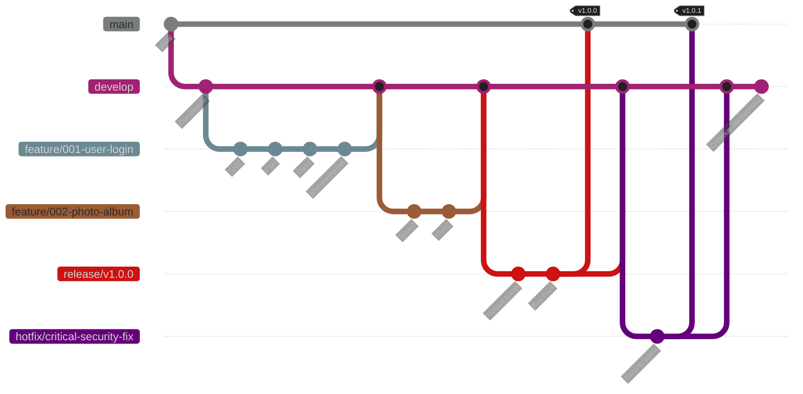

## 推薦的分支策略

**基於 Git Flow 的 SDD 改良版**:



**分支類型**:

| 分支類型 | 命名規範 | 生命週期 | 用途 |
|---------|---------|---------|------|
| `main` | main | 永久 | 生產環境程式碼 |
| `develop` | develop | 永久 | 開發整合分支 |
| `feature/*` | feature/NNN-feature-name | 臨時 | 單一功能開發 |
| `hotfix/*` | hotfix/issue-description | 臨時 | 緊急修復 |
| `release/*` | release/v1.2.0 | 臨時 | 發布準備 |

#### Spec-Kit 自動分支管理

當使用 `/speckit.specify` 時,Spec-Kit 會自動:

1. **掃描現有規格** - 確定下一個功能編號(如 001、002、003)
2. **生成分支名稱** - 從描述產生語義化名稱
3. **建立分支** - 自動 checkout 到新分支
4. **建立目錄** - 在 `specs/NNN-feature-name/` 建立結構

**範例**:

```bash
# 在 develop 分支執行
/speckit.specify Build a photo album management system
```

自動產生:

```bash
git checkout -b feature/001-photo-album-management
mkdir -p specs/001-photo-album-management
# 產生 spec.md 於該目錄
```

#### 規格文件的目錄對應

每個功能分支對應一個規格目錄:

```text
specs/
├── 001-user-authentication/
│   ├── spec.md
│   ├── plan.md
│   ├── tasks.md
│   ├── data-model.md
│   ├── contracts/
│   │   ├── auth-api.yaml
│   │   └── user-events.json
│   ├── research.md
│   └── quickstart.md
├── 002-photo-album/
│   ├── spec.md
│   ├── plan.md
│   └── ...
└── 003-batch-reconciliation/
    └── ...
```

**命名規範**:

- `NNN-` 前綴:三位數編號,確保排序
- `feature-name`:使用 kebab-case(小寫,連字符分隔)
- 對應分支名稱:`feature/NNN-feature-name`

#### 工作流程範例

**完整的功能開發流程**:

```bash
# Step 1: 確保在 develop 分支
git checkout develop
git pull origin develop

# Step 2: 建立規格(自動建立分支)
# 在 AI 助手中執行
/speckit.specify User authentication with email and password

# 此時自動建立 feature/001-user-authentication 分支

# Step 3: 審查並完善規格
# 編輯 specs/001-user-authentication/spec.md
# 若有模糊處,使用 /speckit.clarify

# Step 4: 提交規格
git add specs/001-user-authentication/spec.md
git commit -m "spec: add user authentication specification"

# Step 5: 建立計畫
/speckit.plan Use Spring Security with JWT tokens, PostgreSQL for user storage

# Step 6: 提交計畫
git add specs/001-user-authentication/plan.md
git add specs/001-user-authentication/data-model.md
git add specs/001-user-authentication/contracts/
git commit -m "plan: add implementation plan for user auth"

# Step 7: 拆分任務
/speckit.tasks

git add specs/001-user-authentication/tasks.md
git commit -m "tasks: break down user auth into executable tasks"

# Step 8: 實作
/speckit.implement

# 實作過程中持續提交
git add src/
git add tests/
git commit -m "feat: implement user registration endpoint"
git commit -m "test: add unit tests for user service"
git commit -m "feat: implement login endpoint"

# Step 9: 完成後推送
git push origin feature/001-user-authentication

# Step 10: 建立 Pull Request
# 在 GitHub 網頁介面建立 PR: feature/001-user-authentication → develop

# Step 11: Code Review 與合併
# 經審查通過後合併到 develop
```

#### Commit Message 規範

遵循 **Conventional Commits** 規範:

**格式**:

```text
<type>(<scope>): <subject>

<body>

<footer>
```

**Type 類型**:

| Type | 說明 | 範例 |
|------|-----|------|
| `spec` | 規格相關 | `spec: add photo album specification` |
| `plan` | 計畫相關 | `plan: define database schema for albums` |
| `feat` | 新功能 | `feat: implement drag-and-drop for albums` |
| `fix` | 錯誤修復 | `fix: resolve album sorting issue` |
| `test` | 測試 | `test: add integration tests for album API` |
| `docs` | 文件 | `docs: update API documentation` |
| `refactor` | 重構 | `refactor: extract album service logic` |
| `chore` | 雜項 | `chore: update dependencies` |

**範例**:

```bash
# 規格提交
git commit -m "spec: add batch reconciliation job specification

- Define job schedule: daily at 23:00
- Add SFTP integration requirements
- Specify error handling and retry policy"

# 計畫提交
git commit -m "plan: design batch job architecture

- Use Spring Batch framework
- SFTP client: Apache Commons VFS
- Error notifications via Slack webhook"

# 實作提交
git commit -m "feat: implement reconciliation job reader

- Read CSV files from SFTP server
- Parse transaction records
- Validate data format

Closes #123"
```

