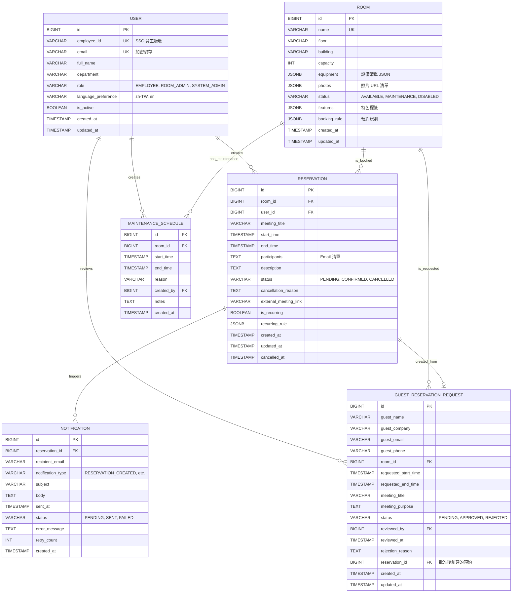

# Data Model: 會議室預約系統

**Feature**: 001-meeting-room-booking  
**Date**: 2025-11-20  
**Phase**: 1 (資料模型設計)

## 概述

本文件定義會議室預約系統的核心資料模型,包含實體關係圖 (ER Diagram)、屬性定義、關聯關係與資料庫設計規範。

---

## 核心實體 (Core Entities)

### 1. User (使用者)

**描述**: 系統使用者,包含員工與管理員。

**屬性**:

| 欄位名 | 型別 | 必填 | 說明 | 約束 |
|--------|------|------|------|------|
| `id` | BIGINT | ✅ | 主鍵 (自增) | PRIMARY KEY |
| `employee_id` | VARCHAR(50) | ✅ | 員工編號 (來自 SSO) | UNIQUE, NOT NULL |
| `email` | VARCHAR(255) | ✅ | Email (加密儲存) | UNIQUE, NOT NULL |
| `full_name` | VARCHAR(100) | ✅ | 全名 | NOT NULL |
| `department` | VARCHAR(100) | ❌ | 部門名稱 | |
| `role` | VARCHAR(20) | ✅ | 角色 (EMPLOYEE, ROOM_ADMIN, SYSTEM_ADMIN) | NOT NULL, CHECK |
| `language_preference` | VARCHAR(5) | ✅ | 語言偏好 (zh-TW, en) | NOT NULL, DEFAULT 'zh-TW' |
| `phone_number` | VARCHAR(20) | ❌ | 聯絡電話 | |
| `is_active` | BOOLEAN | ✅ | 帳號狀態 | NOT NULL, DEFAULT TRUE |
| `created_at` | TIMESTAMP | ✅ | 創建時間 | NOT NULL, DEFAULT CURRENT_TIMESTAMP |
| `updated_at` | TIMESTAMP | ✅ | 更新時間 | NOT NULL, DEFAULT CURRENT_TIMESTAMP |

**索引**:
- `idx_user_employee_id` ON `employee_id` (唯一索引,SSO 查詢用)
- `idx_user_email` ON `email` (唯一索引,Email 查詢用)
- `idx_user_role` ON `role` (權限查詢用)

**業務規則**:
- `employee_id` 由 SSO 系統提供,不可修改
- `email` 必須符合 Email 格式,儲存前使用 AES-256 加密
- `role` 預設為 `EMPLOYEE`,僅 `SYSTEM_ADMIN` 可修改
- 軟刪除: `is_active = FALSE` (保留歷史記錄)

---

### 2. Room (會議室)

**描述**: 可預約的會議室資源。

**屬性**:

| 欄位名 | 型別 | 必填 | 說明 | 約束 |
|--------|------|------|------|------|
| `id` | BIGINT | ✅ | 主鍵 (自增) | PRIMARY KEY |
| `name` | VARCHAR(100) | ✅ | 會議室名稱 | UNIQUE, NOT NULL |
| `floor` | VARCHAR(10) | ✅ | 樓層 (如 "3F", "B1") | NOT NULL |
| `building` | VARCHAR(50) | ❌ | 建築名稱 (多辦公室場景) | |
| `location_description` | VARCHAR(255) | ❌ | 位置描述 (如 "電梯旁") | |
| `capacity` | INT | ✅ | 容納人數 | NOT NULL, CHECK (capacity > 0) |
| `equipment` | JSONB | ✅ | 設備清單 (JSON 格式) | NOT NULL, DEFAULT '[]' |
| `photos` | JSONB | ❌ | 照片 URL 清單 (JSON 格式) | DEFAULT '[]' |
| `status` | VARCHAR(20) | ✅ | 狀態 (AVAILABLE, MAINTENANCE, DISABLED) | NOT NULL, DEFAULT 'AVAILABLE', CHECK |
| `features` | JSONB | ❌ | 特色標籤 (如 ["video_conferencing", "whiteboard"]) | DEFAULT '[]' |
| `booking_rule` | JSONB | ❌ | 預約規則 (如 {"max_duration_hours": 4, "advance_booking_days": 30}) | |
| `created_at` | TIMESTAMP | ✅ | 創建時間 | NOT NULL, DEFAULT CURRENT_TIMESTAMP |
| `updated_at` | TIMESTAMP | ✅ | 更新時間 | NOT NULL, DEFAULT CURRENT_TIMESTAMP |

**JSONB 結構範例**:

```json
// equipment 欄位
[
  {"name": "投影機", "quantity": 1},
  {"name": "白板", "quantity": 2},
  {"name": "視訊會議設備", "quantity": 1, "brand": "Logitech Rally"}
]

// photos 欄位
[
  "https://cdn.example.com/rooms/A01_main.jpg",
  "https://cdn.example.com/rooms/A01_equipment.jpg"
]

// features 欄位
["video_conferencing", "whiteboard", "natural_light", "standing_desk"]

// booking_rule 欄位
{
  "max_duration_hours": 4,
  "advance_booking_days": 30,
  "min_booking_minutes": 30,
  "booking_time_slots": ["09:00", "09:30", "10:00", "..."]
}
```

**索引**:
- `idx_room_name` ON `name` (唯一索引,名稱查詢用)
- `idx_room_capacity` ON `capacity` (容量過濾用)
- `idx_room_status` ON `status` (狀態過濾用)
- `idx_room_building_floor` ON `building, floor` (複合索引,地點過濾用)

**業務規則**:
- `name` 必須唯一 (同一組織內不可重複)
- `capacity` 必須 > 0
- `equipment` 使用 PostgreSQL JSONB,支援靈活查詢 (如 `WHERE equipment @> '[{"name": "投影機"}]'`)
- `status = MAINTENANCE` 時,該會議室不可預約
- 軟刪除: `status = DISABLED` (保留歷史預約記錄)

---

### 3. Reservation (預約)

**描述**: 會議室預約記錄。

**屬性**:

| 欄位名 | 型別 | 必填 | 說明 | 約束 |
|--------|------|------|------|------|
| `id` | BIGINT | ✅ | 主鍵 (自增) | PRIMARY KEY |
| `room_id` | BIGINT | ✅ | 會議室 ID (外鍵) | FOREIGN KEY (rooms.id), NOT NULL |
| `user_id` | BIGINT | ✅ | 預約者 ID (外鍵) | FOREIGN KEY (users.id), NOT NULL |
| `meeting_title` | VARCHAR(200) | ✅ | 會議主題 | NOT NULL |
| `start_time` | TIMESTAMP | ✅ | 開始時間 | NOT NULL |
| `end_time` | TIMESTAMP | ✅ | 結束時間 | NOT NULL, CHECK (end_time > start_time) |
| `participants` | TEXT | ❌ | 參與者 Email 清單 (逗號分隔) | |
| `description` | TEXT | ❌ | 會議描述 | |
| `status` | VARCHAR(20) | ✅ | 狀態 (PENDING, CONFIRMED, CANCELLED) | NOT NULL, DEFAULT 'CONFIRMED', CHECK |
| `cancellation_reason` | TEXT | ❌ | 取消原因 | |
| `external_meeting_link` | VARCHAR(500) | ❌ | 外部會議連結 (Teams/Zoom) | |
| `is_recurring` | BOOLEAN | ✅ | 是否為週期性預約 | NOT NULL, DEFAULT FALSE |
| `recurring_rule` | JSONB | ❌ | 週期規則 (如 {"frequency": "weekly", "days": ["MON", "WED"]}) | |
| `created_at` | TIMESTAMP | ✅ | 創建時間 | NOT NULL, DEFAULT CURRENT_TIMESTAMP |
| `updated_at` | TIMESTAMP | ✅ | 更新時間 | NOT NULL, DEFAULT CURRENT_TIMESTAMP |
| `cancelled_at` | TIMESTAMP | ❌ | 取消時間 | |

**索引**:
- `idx_reservation_room_time` ON `room_id, start_time, end_time` (複合索引,衝突檢測用)
- `idx_reservation_user` ON `user_id` (查詢個人預約用)
- `idx_reservation_status` ON `status` (狀態過濾用)
- `idx_reservation_start_time` ON `start_time` (時間範圍查詢用)

**業務規則**:
- `end_time` 必須 > `start_time`
- **唯一性約束** (防止衝突): 同一 `room_id`,時間區間 `[start_time, end_time)` 不可重疊 (排除 `status = CANCELLED`)
- `participants` 儲存為逗號分隔字串 (如 "alice@example.com,bob@example.com"),發送通知時解析
- `status = PENDING` 用於訪客預約 (需管理員審核)
- `is_recurring = TRUE` 時,`recurring_rule` 定義週期 (未來擴展功能)

**PostgreSQL 時間重疊檢查** (排他約束):
```sql
CREATE EXTENSION IF NOT EXISTS btree_gist;

ALTER TABLE reservations
ADD CONSTRAINT reservations_no_overlap
EXCLUDE USING gist (
  room_id WITH =,
  tsrange(start_time, end_time) WITH &&
)
WHERE (status <> 'CANCELLED');
```

---

### 4. MaintenanceSchedule (維護時程)

**描述**: 會議室維護時段記錄。

**屬性**:

| 欄位名 | 型別 | 必填 | 說明 | 約束 |
|--------|------|------|------|------|
| `id` | BIGINT | ✅ | 主鍵 (自增) | PRIMARY KEY |
| `room_id` | BIGINT | ✅ | 會議室 ID (外鍵) | FOREIGN KEY (rooms.id), NOT NULL |
| `start_time` | TIMESTAMP | ✅ | 開始時間 | NOT NULL |
| `end_time` | TIMESTAMP | ✅ | 結束時間 | NOT NULL, CHECK (end_time > start_time) |
| `reason` | VARCHAR(255) | ✅ | 維護原因 | NOT NULL |
| `created_by` | BIGINT | ✅ | 創建者 ID (外鍵) | FOREIGN KEY (users.id), NOT NULL |
| `notes` | TEXT | ❌ | 備註 | |
| `created_at` | TIMESTAMP | ✅ | 創建時間 | NOT NULL, DEFAULT CURRENT_TIMESTAMP |

**索引**:
- `idx_maintenance_room_time` ON `room_id, start_time, end_time` (時間範圍查詢用)

**業務規則**:
- `end_time` 必須 > `start_time`
- 維護期間,該會議室不可預約 (前端查詢可用性時需排除)
- 僅 `ROOM_ADMIN` 與 `SYSTEM_ADMIN` 可創建維護時程

---

### 5. Notification (通知)

**描述**: 系統發送的通知記錄 (Email/SMS)。

**屬性**:

| 欄位名 | 型別 | 必填 | 說明 | 約束 |
|--------|------|------|------|------|
| `id` | BIGINT | ✅ | 主鍵 (自增) | PRIMARY KEY |
| `reservation_id` | BIGINT | ❌ | 相關預約 ID (外鍵) | FOREIGN KEY (reservations.id) |
| `recipient_email` | VARCHAR(255) | ✅ | 收件人 Email | NOT NULL |
| `notification_type` | VARCHAR(50) | ✅ | 通知類型 | NOT NULL, CHECK |
| `subject` | VARCHAR(255) | ✅ | 郵件主旨 | NOT NULL |
| `body` | TEXT | ✅ | 郵件內容 | NOT NULL |
| `sent_at` | TIMESTAMP | ❌ | 發送時間 | |
| `status` | VARCHAR(20) | ✅ | 狀態 (PENDING, SENT, FAILED) | NOT NULL, DEFAULT 'PENDING', CHECK |
| `error_message` | TEXT | ❌ | 錯誤訊息 (失敗時記錄) | |
| `retry_count` | INT | ✅ | 重試次數 | NOT NULL, DEFAULT 0 |
| `created_at` | TIMESTAMP | ✅ | 創建時間 | NOT NULL, DEFAULT CURRENT_TIMESTAMP |

**通知類型** (`notification_type`):
- `RESERVATION_CREATED`: 預約成功通知
- `RESERVATION_UPDATED`: 預約修改通知
- `RESERVATION_CANCELLED`: 預約取消通知
- `MEETING_REMINDER`: 會議前 30 分鐘提醒
- `GUEST_APPROVAL_REQUEST`: 訪客預約審核通知 (發給管理員)
- `GUEST_APPROVAL_RESULT`: 訪客預約審核結果 (發給訪客)

**索引**:
- `idx_notification_reservation` ON `reservation_id` (查詢預約相關通知用)
- `idx_notification_status` ON `status` (查詢待發送通知用)
- `idx_notification_created_at` ON `created_at` (時間範圍查詢用)

**業務規則**:
- 通知由 RabbitMQ 消費者非同步處理
- `status = PENDING` 的通知會被排程任務定期掃描並發送
- 發送失敗時,`retry_count++`,最多重試 3 次
- 超過 3 次失敗後,`status = FAILED`,記錄 `error_message`

---

### 6. GuestReservationRequest (訪客預約申請)

**描述**: 外部訪客提交的預約申請 (需審核)。

**屬性**:

| 欄位名 | 型別 | 必填 | 說明 | 約束 |
|--------|------|------|------|------|
| `id` | BIGINT | ✅ | 主鍵 (自增) | PRIMARY KEY |
| `guest_name` | VARCHAR(100) | ✅ | 訪客姓名 | NOT NULL |
| `guest_company` | VARCHAR(100) | ✅ | 訪客公司 | NOT NULL |
| `guest_email` | VARCHAR(255) | ✅ | 訪客 Email | NOT NULL |
| `guest_phone` | VARCHAR(20) | ❌ | 訪客電話 | |
| `room_id` | BIGINT | ✅ | 申請的會議室 ID (外鍵) | FOREIGN KEY (rooms.id), NOT NULL |
| `requested_start_time` | TIMESTAMP | ✅ | 期望開始時間 | NOT NULL |
| `requested_end_time` | TIMESTAMP | ✅ | 期望結束時間 | NOT NULL, CHECK (requested_end_time > requested_start_time) |
| `meeting_title` | VARCHAR(200) | ✅ | 會議主題 | NOT NULL |
| `meeting_purpose` | TEXT | ✅ | 會議目的 | NOT NULL |
| `status` | VARCHAR(20) | ✅ | 狀態 (PENDING, APPROVED, REJECTED) | NOT NULL, DEFAULT 'PENDING', CHECK |
| `reviewed_by` | BIGINT | ❌ | 審核者 ID (外鍵) | FOREIGN KEY (users.id) |
| `reviewed_at` | TIMESTAMP | ❌ | 審核時間 | |
| `rejection_reason` | TEXT | ❌ | 拒絕原因 | |
| `reservation_id` | BIGINT | ❌ | 批准後創建的預約 ID (外鍵) | FOREIGN KEY (reservations.id), UNIQUE |
| `created_at` | TIMESTAMP | ✅ | 創建時間 | NOT NULL, DEFAULT CURRENT_TIMESTAMP |
| `updated_at` | TIMESTAMP | ✅ | 更新時間 | NOT NULL, DEFAULT CURRENT_TIMESTAMP |

**索引**:
- `idx_guest_request_status` ON `status` (查詢待審核申請用)
- `idx_guest_request_room` ON `room_id` (查詢特定會議室申請用)
- `idx_guest_request_email` ON `guest_email` (訪客查詢自己的申請用)

**業務規則**:
- 訪客提交申請時,`status = PENDING`
- 管理員批准後,創建 `Reservation` 記錄,並更新 `reservation_id`
- 管理員拒絕時,必須填寫 `rejection_reason`
- 審核後發送通知給訪客 (類型: `GUEST_APPROVAL_RESULT`)

---

## 實體關係圖 (ER Diagram)



---

## 關聯關係說明

### 1. User → Reservation (一對多)

- **關係**: 一個使用者可以創建多筆預約
- **外鍵**: `reservations.user_id` → `users.id`
- **級聯刪除**: `ON DELETE RESTRICT` (使用者有預約記錄時不可刪除)

### 2. Room → Reservation (一對多)

- **關係**: 一個會議室可以有多筆預約
- **外鍵**: `reservations.room_id` → `rooms.id`
- **級聯刪除**: `ON DELETE RESTRICT` (會議室有預約記錄時不可刪除)

### 3. Room → MaintenanceSchedule (一對多)

- **關係**: 一個會議室可以有多筆維護時程
- **外鍵**: `maintenance_schedules.room_id` → `rooms.id`
- **級聯刪除**: `ON DELETE CASCADE` (會議室刪除時,維護時程一併刪除)

### 4. User → MaintenanceSchedule (一對多)

- **關係**: 一個使用者 (管理員) 可以創建多筆維護時程
- **外鍵**: `maintenance_schedules.created_by` → `users.id`
- **級聯刪除**: `ON DELETE RESTRICT`

### 5. Reservation → Notification (一對多)

- **關係**: 一筆預約可以觸發多則通知 (確認、提醒、取消等)
- **外鍵**: `notifications.reservation_id` → `reservations.id`
- **級聯刪除**: `ON DELETE CASCADE` (預約刪除時,通知記錄一併刪除)

### 6. Room → GuestReservationRequest (一對多)

- **關係**: 一個會議室可以有多筆訪客申請
- **外鍵**: `guest_reservation_requests.room_id` → `rooms.id`
- **級聯刪除**: `ON DELETE RESTRICT`

### 7. User → GuestReservationRequest (一對多)

- **關係**: 一個管理員可以審核多筆訪客申請
- **外鍵**: `guest_reservation_requests.reviewed_by` → `users.id`
- **級聯刪除**: `ON DELETE SET NULL` (審核者刪除時,保留記錄但清空審核者 ID)

### 8. Reservation → GuestReservationRequest (一對一)

- **關係**: 訪客申請批准後創建一筆預約
- **外鍵**: `guest_reservation_requests.reservation_id` → `reservations.id`
- **唯一性**: `UNIQUE (reservation_id)` (一筆預約僅能對應一筆訪客申請)
- **級聯刪除**: `ON DELETE SET NULL`

---

## 資料庫設計規範

### 命名規範

- **表名**: 複數形式, snake_case (如 `users`, `reservations`)
- **欄位名**: snake_case (如 `employee_id`, `full_name`)
- **外鍵**: `{referenced_table_singular}_id` (如 `room_id`, `user_id`)
- **索引**: `idx_{table}_{column(s)}` (如 `idx_user_email`)
- **約束**: `{table}_{constraint_type}` (如 `reservations_no_overlap`)

### 資料型別選擇

- **主鍵**: `BIGINT` (支援 9,223,372,036,854,775,807 筆記錄)
- **時間戳**: `TIMESTAMP` (UTC 時區儲存)
- **布林值**: `BOOLEAN` (PostgreSQL 原生支援)
- **JSON 資料**: `JSONB` (二進制 JSON,查詢效能更好)
- **文字欄位**: 
  - 固定長度: `VARCHAR(n)`
  - 不限長度: `TEXT`

### 索引策略

#### 單欄索引

- 經常用於 `WHERE` 條件的欄位
- 唯一性約束欄位 (自動建立唯一索引)

#### 複合索引

- 多欄位組合查詢 (順序重要: 選擇性高的欄位放前面)
- 範例: `idx_reservation_room_time` ON `(room_id, start_time, end_time)`

#### JSONB 索引

- GIN 索引支援 JSONB 查詢:
  ```sql
  CREATE INDEX idx_room_equipment ON rooms USING GIN (equipment);
  ```

### 效能優化

#### 分區表 (Partitioning)

**適用場景**: `reservations` 表 (歷史資料量大)

```sql
-- 按年度分區
CREATE TABLE reservations (
    -- ... 欄位定義
) PARTITION BY RANGE (start_time);

CREATE TABLE reservations_2024 PARTITION OF reservations
FOR VALUES FROM ('2024-01-01') TO ('2025-01-01');

CREATE TABLE reservations_2025 PARTITION OF reservations
FOR VALUES FROM ('2025-01-01') TO ('2026-01-01');
```

#### 快取策略

- 會議室清單: Redis 快取 5 分鐘
- 使用者資料: Redis 快取 1 小時
- 會議室可用性: Redis 快取 30 秒

---

## 資料遷移計畫 (Flyway)

### V1__create_users_table.sql

```sql
CREATE TABLE users (
    id BIGSERIAL PRIMARY KEY,
    employee_id VARCHAR(50) UNIQUE NOT NULL,
    email VARCHAR(255) UNIQUE NOT NULL,
    full_name VARCHAR(100) NOT NULL,
    department VARCHAR(100),
    role VARCHAR(20) NOT NULL CHECK (role IN ('EMPLOYEE', 'ROOM_ADMIN', 'SYSTEM_ADMIN')),
    language_preference VARCHAR(5) NOT NULL DEFAULT 'zh-TW',
    phone_number VARCHAR(20),
    is_active BOOLEAN NOT NULL DEFAULT TRUE,
    created_at TIMESTAMP NOT NULL DEFAULT CURRENT_TIMESTAMP,
    updated_at TIMESTAMP NOT NULL DEFAULT CURRENT_TIMESTAMP
);

CREATE INDEX idx_user_employee_id ON users(employee_id);
CREATE INDEX idx_user_email ON users(email);
CREATE INDEX idx_user_role ON users(role);

COMMENT ON TABLE users IS '系統使用者表';
COMMENT ON COLUMN users.email IS 'Email (AES-256 加密儲存)';
```

### V2__create_rooms_table.sql

```sql
CREATE TABLE rooms (
    id BIGSERIAL PRIMARY KEY,
    name VARCHAR(100) UNIQUE NOT NULL,
    floor VARCHAR(10) NOT NULL,
    building VARCHAR(50),
    location_description VARCHAR(255),
    capacity INT NOT NULL CHECK (capacity > 0),
    equipment JSONB NOT NULL DEFAULT '[]',
    photos JSONB DEFAULT '[]',
    status VARCHAR(20) NOT NULL DEFAULT 'AVAILABLE' CHECK (status IN ('AVAILABLE', 'MAINTENANCE', 'DISABLED')),
    features JSONB DEFAULT '[]',
    booking_rule JSONB,
    created_at TIMESTAMP NOT NULL DEFAULT CURRENT_TIMESTAMP,
    updated_at TIMESTAMP NOT NULL DEFAULT CURRENT_TIMESTAMP
);

CREATE INDEX idx_room_name ON rooms(name);
CREATE INDEX idx_room_capacity ON rooms(capacity);
CREATE INDEX idx_room_status ON rooms(status);
CREATE INDEX idx_room_building_floor ON rooms(building, floor);
CREATE INDEX idx_room_equipment ON rooms USING GIN (equipment);

COMMENT ON TABLE rooms IS '會議室表';
COMMENT ON COLUMN rooms.equipment IS '設備清單 JSON: [{"name": "投影機", "quantity": 1}]';
```

### V3__create_reservations_table.sql

```sql
CREATE EXTENSION IF NOT EXISTS btree_gist;

CREATE TABLE reservations (
    id BIGSERIAL PRIMARY KEY,
    room_id BIGINT NOT NULL REFERENCES rooms(id) ON DELETE RESTRICT,
    user_id BIGINT NOT NULL REFERENCES users(id) ON DELETE RESTRICT,
    meeting_title VARCHAR(200) NOT NULL,
    start_time TIMESTAMP NOT NULL,
    end_time TIMESTAMP NOT NULL CHECK (end_time > start_time),
    participants TEXT,
    description TEXT,
    status VARCHAR(20) NOT NULL DEFAULT 'CONFIRMED' CHECK (status IN ('PENDING', 'CONFIRMED', 'CANCELLED')),
    cancellation_reason TEXT,
    external_meeting_link VARCHAR(500),
    is_recurring BOOLEAN NOT NULL DEFAULT FALSE,
    recurring_rule JSONB,
    created_at TIMESTAMP NOT NULL DEFAULT CURRENT_TIMESTAMP,
    updated_at TIMESTAMP NOT NULL DEFAULT CURRENT_TIMESTAMP,
    cancelled_at TIMESTAMP
);

CREATE INDEX idx_reservation_room_time ON reservations(room_id, start_time, end_time);
CREATE INDEX idx_reservation_user ON reservations(user_id);
CREATE INDEX idx_reservation_status ON reservations(status);
CREATE INDEX idx_reservation_start_time ON reservations(start_time);

-- 時間重疊排他約束
ALTER TABLE reservations
ADD CONSTRAINT reservations_no_overlap
EXCLUDE USING gist (
    room_id WITH =,
    tsrange(start_time, end_time) WITH &&
)
WHERE (status <> 'CANCELLED');

COMMENT ON TABLE reservations IS '會議室預約表';
COMMENT ON CONSTRAINT reservations_no_overlap ON reservations IS '防止同一會議室時間重疊預約';
```

### V4__create_maintenance_schedules_table.sql

```sql
CREATE TABLE maintenance_schedules (
    id BIGSERIAL PRIMARY KEY,
    room_id BIGINT NOT NULL REFERENCES rooms(id) ON DELETE CASCADE,
    start_time TIMESTAMP NOT NULL,
    end_time TIMESTAMP NOT NULL CHECK (end_time > start_time),
    reason VARCHAR(255) NOT NULL,
    created_by BIGINT NOT NULL REFERENCES users(id) ON DELETE RESTRICT,
    notes TEXT,
    created_at TIMESTAMP NOT NULL DEFAULT CURRENT_TIMESTAMP
);

CREATE INDEX idx_maintenance_room_time ON maintenance_schedules(room_id, start_time, end_time);

COMMENT ON TABLE maintenance_schedules IS '會議室維護時程表';
```

### V5__create_notifications_table.sql

```sql
CREATE TABLE notifications (
    id BIGSERIAL PRIMARY KEY,
    reservation_id BIGINT REFERENCES reservations(id) ON DELETE CASCADE,
    recipient_email VARCHAR(255) NOT NULL,
    notification_type VARCHAR(50) NOT NULL CHECK (notification_type IN (
        'RESERVATION_CREATED', 'RESERVATION_UPDATED', 'RESERVATION_CANCELLED',
        'MEETING_REMINDER', 'GUEST_APPROVAL_REQUEST', 'GUEST_APPROVAL_RESULT'
    )),
    subject VARCHAR(255) NOT NULL,
    body TEXT NOT NULL,
    sent_at TIMESTAMP,
    status VARCHAR(20) NOT NULL DEFAULT 'PENDING' CHECK (status IN ('PENDING', 'SENT', 'FAILED')),
    error_message TEXT,
    retry_count INT NOT NULL DEFAULT 0,
    created_at TIMESTAMP NOT NULL DEFAULT CURRENT_TIMESTAMP
);

CREATE INDEX idx_notification_reservation ON notifications(reservation_id);
CREATE INDEX idx_notification_status ON notifications(status);
CREATE INDEX idx_notification_created_at ON notifications(created_at);

COMMENT ON TABLE notifications IS '通知記錄表';
```

### V6__create_guest_reservation_requests_table.sql

```sql
CREATE TABLE guest_reservation_requests (
    id BIGSERIAL PRIMARY KEY,
    guest_name VARCHAR(100) NOT NULL,
    guest_company VARCHAR(100) NOT NULL,
    guest_email VARCHAR(255) NOT NULL,
    guest_phone VARCHAR(20),
    room_id BIGINT NOT NULL REFERENCES rooms(id) ON DELETE RESTRICT,
    requested_start_time TIMESTAMP NOT NULL,
    requested_end_time TIMESTAMP NOT NULL CHECK (requested_end_time > requested_start_time),
    meeting_title VARCHAR(200) NOT NULL,
    meeting_purpose TEXT NOT NULL,
    status VARCHAR(20) NOT NULL DEFAULT 'PENDING' CHECK (status IN ('PENDING', 'APPROVED', 'REJECTED')),
    reviewed_by BIGINT REFERENCES users(id) ON DELETE SET NULL,
    reviewed_at TIMESTAMP,
    rejection_reason TEXT,
    reservation_id BIGINT UNIQUE REFERENCES reservations(id) ON DELETE SET NULL,
    created_at TIMESTAMP NOT NULL DEFAULT CURRENT_TIMESTAMP,
    updated_at TIMESTAMP NOT NULL DEFAULT CURRENT_TIMESTAMP
);

CREATE INDEX idx_guest_request_status ON guest_reservation_requests(status);
CREATE INDEX idx_guest_request_room ON guest_reservation_requests(room_id);
CREATE INDEX idx_guest_request_email ON guest_reservation_requests(guest_email);

COMMENT ON TABLE guest_reservation_requests IS '訪客預約申請表';
COMMENT ON COLUMN guest_reservation_requests.reservation_id IS '批准後創建的預約 ID';
```

---

## 初始資料 (Seed Data)

### 測試使用者

```sql
INSERT INTO users (employee_id, email, full_name, department, role, language_preference) VALUES
('EMP001', 'john.doe@example.com', 'John Doe', 'IT', 'SYSTEM_ADMIN', 'zh-TW'),
('EMP002', 'jane.smith@example.com', 'Jane Smith', 'HR', 'ROOM_ADMIN', 'zh-TW'),
('EMP003', 'bob.johnson@example.com', 'Bob Johnson', 'Sales', 'EMPLOYEE', 'en');
```

### 測試會議室

```sql
INSERT INTO rooms (name, floor, building, capacity, equipment, photos, features) VALUES
('會議室 A', '3F', '總部大樓', 10, 
 '[{"name": "投影機", "quantity": 1}, {"name": "白板", "quantity": 1}]'::jsonb,
 '["https://example.com/room_a_1.jpg"]'::jsonb,
 '["video_conferencing", "whiteboard"]'::jsonb
),
('會議室 B', '5F', '總部大樓', 6,
 '[{"name": "電視", "quantity": 1}, {"name": "視訊會議設備", "quantity": 1}]'::jsonb,
 '[]'::jsonb,
 '["video_conferencing"]'::jsonb
);
```

---

## 總結

### 資料模型特點

1. **符合 Clean Architecture**: 領域模型清晰,不依賴框架
2. **JSONB 靈活性**: 設備清單、照片等使用 JSONB,避免過度規範化
3. **時間重疊防護**: PostgreSQL 排他約束防止預約衝突
4. **審計追蹤**: 所有表包含 `created_at`, `updated_at`
5. **軟刪除設計**: `is_active` (User), `status = DISABLED` (Room)
6. **多語系支援**: `language_preference` 欄位,通知內容根據語言發送

### 下一步

**Phase 1 繼續**:
1. 生成 `contracts/openapi.yaml` (RESTful API 規格)
2. 生成 `quickstart.md` (開發者快速上手指南)

**Phase 2 (由 `/speckit.tasks` 執行)**:
1. 拆解為實作任務 (tasks.md)
2. 按優先級實作 (P1 → P2 → P3)

---

**Data Model 完成日期**: 2025-11-20  
**下一階段**: 生成 API 合約 (OpenAPI 3.0)
