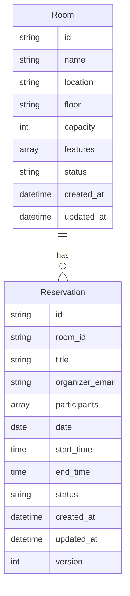
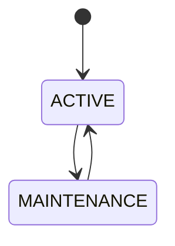
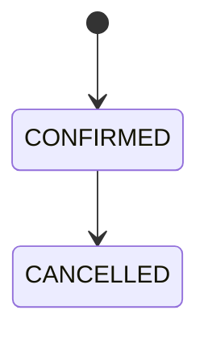

# 資料模型與 JSON 結構設計

## 實體關係圖 (ERD)



## 資料模型（Java Classes）

### Room.java
```java
@Data
@Builder
public class Room {
    private String id;
    private String name;
    private Location location;  // 枚舉：板橋、民生
    private String floor;
    private int capacity;
    private Set<String> features;
    private RoomStatus status;  // 枚舉：ACTIVE, MAINTENANCE
    private LocalDateTime createdAt;
    private LocalDateTime updatedAt;
}
```

### Reservation.java
```java
@Data
@Builder
public class Reservation {
    private String id;
    private String roomId;
    private String title;
    private String organizerEmail;
    private Set<String> participants;
    private LocalDate date;
    private LocalTime startTime;
    private LocalTime endTime;
    private ReservationStatus status;  // 枚舉：CONFIRMED, CANCELLED
    private LocalDateTime createdAt;
    private LocalDateTime updatedAt;
    private int version;
}
```

### Location.java
```java
public enum Location {
    BANQIAO("板橋"),
    MINSHENG("民生");

    private final String displayName;

    Location(String displayName) {
        this.displayName = displayName;
    }

    public String getDisplayName() {
        return displayName;
    }
}
```

## JSON 結構（Storage）

### rooms.json
```json
{
  "schema_version": "1",
  "last_updated": "2025-11-03T10:00:00Z",
  "rooms": [
    {
      "id": "BQ-6F-PACIFIC",
      "name": "太平洋會議室",
      "location": "板橋",
      "floor": "6F",
      "capacity": 20,
      "features": ["投影機", "白板"],
      "status": "active",
      "created_at": "2025-11-03T10:00:00Z",
      "updated_at": "2025-11-03T10:00:00Z"
    }
  ]
}
```

### reservations.json
```json
{
  "schema_version": "1",
  "last_updated": "2025-11-03T10:00:00Z",
  "reservations": [
    {
      "id": "RES-20251103-001",
      "room_id": "BQ-6F-PACIFIC",
      "title": "週會",
      "organizer_email": "organizer@iisi.com.tw",
      "participants": [
        "user1@iisi.com.tw",
        "user2@iisi.com.tw"
      ],
      "date": "2025-11-03",
      "start_time": "10:00",
      "end_time": "11:00",
      "status": "confirmed",
      "created_at": "2025-11-03T09:00:00Z",
      "updated_at": "2025-11-03T09:00:00Z",
      "version": 1
    }
  ]
}
```

## 驗證規則

### Room 驗證
```java
@Validated
public class Room {
    @NotNull @NotEmpty
    private String id;

    @NotNull @NotEmpty
    private String name;

    @NotNull
    private Location location;

    @NotNull @NotEmpty
    private String floor;

    @Min(1) @Max(100)
    private int capacity;
}
```

### Reservation 驗證
```java
@Validated
public class Reservation {
    @NotNull @NotEmpty
    private String id;

    @NotNull @NotEmpty
    private String roomId;

    @NotNull @NotEmpty
    private String title;

    @NotNull @Email
    private String organizerEmail;

    @NotNull
    private LocalDate date;

    @NotNull
    @Future  // 只能預約未來時間
    private LocalTime startTime;

    @NotNull
    private LocalTime endTime;

    @AssertTrue(message = "結束時間必須晚於開始時間")
    private boolean isEndTimeAfterStartTime() {
        return endTime.isAfter(startTime);
    }
}
```

## 狀態轉換

### Room 狀態


### Reservation 狀態


## JSON 檔案存取服務

### JsonStorageService.java
```java
@Service
public class JsonStorageService {
    private final Path dataDir;
    private final ObjectMapper mapper;
    private final FileLock lock;

    public <T> T read(String filename, Class<T> type) {
        Path file = dataDir.resolve(filename);
        try (FileLock lock = acquireLock(file)) {
            return mapper.readValue(file.toFile(), type);
        }
    }

    public <T> void write(String filename, T data) {
        Path file = dataDir.resolve(filename);
        try (FileLock lock = acquireLock(file)) {
            mapper.writeValue(file.toFile(), data);
        }
    }
}
```

## 備註

1. 版本控制
   - schema_version: 結構版本
   - version: 個別記錄版本（用於並發控制）

2. 時間處理
   - 儲存時使用 ISO-8601 格式
   - 應用層使用 Java 時間 API

3. 資料一致性
   - 使用檔案鎖確保並發安全
   - 使用版本號檢測衝突

4. 遷移支援
   - schema_version 追蹤結構變更
   - last_updated 追蹤資料更新時間